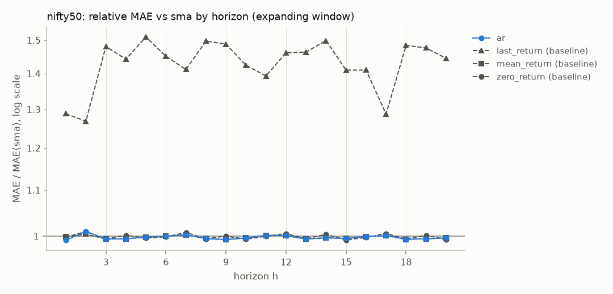
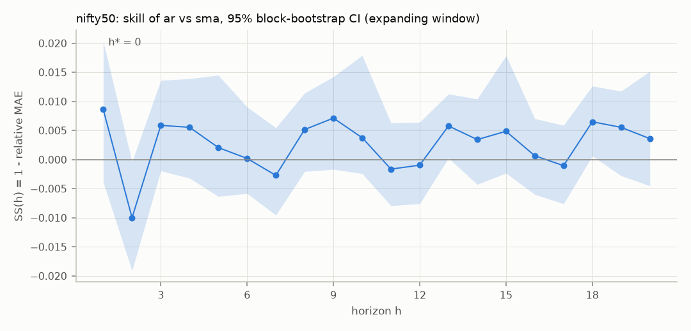
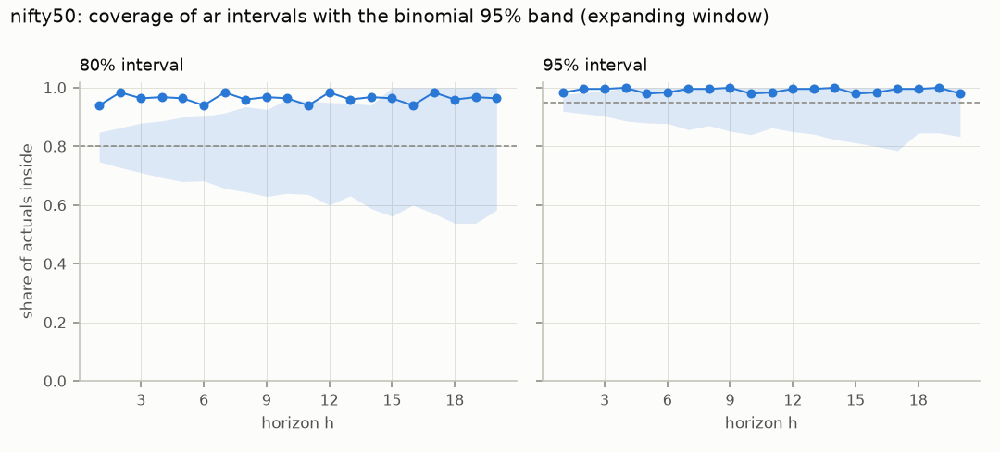
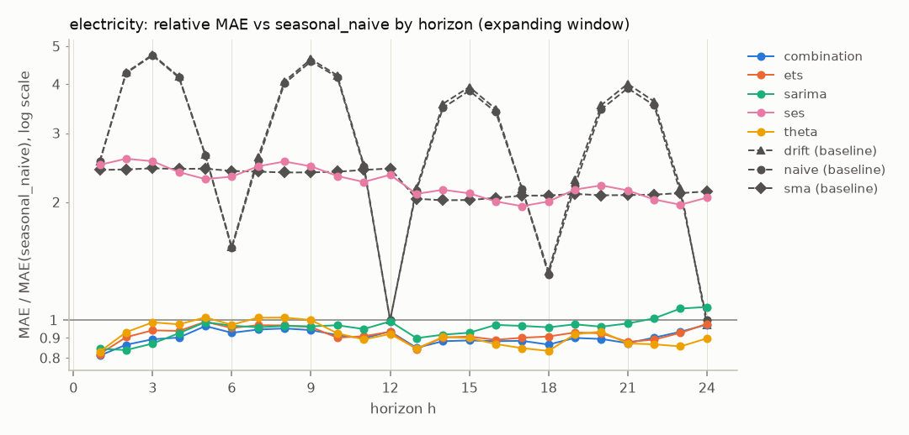
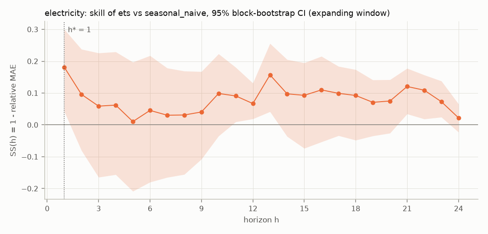
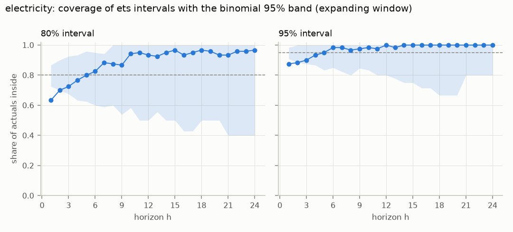

# Phase 1 report: run fe04aa2da050ff5f

Git e267a112f594ea7c30491276cafe8a64df1570dc, created 2026-09-22T23:47:26+00:00, seed 20260922, interval levels 80%, 95%.

Every number comes from the forecast store and the manifest; nothing was refitted. Only test origins are scored; the SMA window, the reference baseline and the best candidate were chosen on dev origins. Leakage tests L1, L2, L4 and L5 run in CI on every push: check that CI passed for commit e267a112f594. L3 (the random-walk canary) is tests/test_canary.py.

Limitations: data revisions are not handled (vintages, leakage source 16). Multi-step errors from overlapping windows are correlated, so n / h is printed next to every statistic.

| Series | RQ1 | RQ2 | RQ3 | RQ4 | RQ5 | RQ6 | Phase 1 exit |
|---|---|---|---|---|---|---|---|
| nifty50 | no | h* = 0 | over-covers | autocorrelation yes, ARCH yes | no significant gap | none (configured) | stop modelling |
| electricity | no | h* = 1 | under-covers | autocorrelation yes, ARCH mixed | no significant gap | log | stop modelling |

## Gate decision (A10)

Pre-registered 2026-09-23 (gate.yaml 22e458d1d926, commit e267a112f594); alpha 0.05, primary window expanding; thresholds: relative MAE below 1.0 up to h*, 80% coverage in [0.75, 0.85], 95% in [0.91, 0.98], at least 3 of 4 sub-periods, leakage audit above 30% over ETS.

| Series | Decision | Registered expectation | Detail |
|---|---|---|---|
| nifty50 | NO-GO | Nothing beats the zero-return forecast on the mean (U5). A win over 30% would be a leakage audit, not a result. | NO-GO: Stop modelling: ship naive plus empirical error quantiles (Phase 2 lite) and look for covariates or a panel before further work. Registered (gate.yaml 22e458d1d926, commit e267a112f594). Criteria: 1 accuracy fail; 3 calibration fail; 5 stability fail. |
| electricity | NO-GO | Seasonal models beat seasonal naive at every horizon (positive control). If they do not, the harness is broken. | NO-GO: Stop modelling: ship naive plus empirical error quantiles (Phase 2 lite) and look for covariates or a panel before further work. Registered (gate.yaml 22e458d1d926, commit e267a112f594). Criteria: 1 accuracy partial; 3 calibration fail; 5 stability pass. |

## nifty50

Source `csv:../data/nifty50.csv`, trading_days, target returns, m = 1, H = 20, test horizons 1, 5, 20. 250 test origins (step 5), 20 dev, 1147 warm-up; windows expanding, rolling; verdicts use the expanding window.

Treated as a price index: dividends are not included (Phase 1 uses the price index, not the total return index). y is the one-period log return at t + h.

Chosen on dev origins only: SMA window k = 250; reference (best baseline) sma; best candidate ar.

| Question | Answer | Detail |
|---|---|---|
| RQ1 | no | No. No candidate beats sma significantly at any testable horizon (1, 5, 20) after Holm correction. |
| RQ2 | h* = 0 | h* = 0 of 20 for ar (dev-chosen). Skill at h = 1: 0.0086 [-0.0039, 0.02]. Horizons 1 to 20 are not forecastable by these models. |
| RQ3 | over-covers | Not calibrated: ar over-covers in very_short 80% (94%); short 80% (97%); very_short 95% (98%); short 95% (100%). |
| RQ4 | autocorrelation yes, ARCH yes | ar: Ljung-Box rejects at 100% of 250 test origins, ARCH-LM at 100%. Residuals are autocorrelated: Phase 2 needs a block bootstrap. Volatility clusters: this confirms U6 (GARCH in Phase 2). |
| RQ5 | no significant gap | No significant gap between rolling and expanding windows for ar at the test horizons. Sub-periods where ar beats sma: 3 of 4 at h = 1; 2 of 4 at h = 5; 1 of 4 at h = 20. |
| RQ6 | none (configured) | Not tested: the config fixes the transform to none; only transform: auto lets each fold choose. |
| Phase 1 exit | stop modelling | Stop modelling: ship naive plus empirical error quantiles (Phase 2 lite) and look for covariates or a panel before further work. Registered (gate.yaml 22e458d1d926, commit e267a112f594). |

### RQ1: does any model beat sma?

No. No candidate beats sma significantly at any testable horizon (1, 5, 20) after Holm correction.

At the test horizons (DM-HLN one-sided: the model is more accurate; Holm over every candidate and test horizon; MCS at alpha 0.10):

| h | model | n | n/h | rel. MAE | DM p | Holm p | in MCS |
|---|---|---|---|---|---|---|---|
| 1 | ar | 250 | 250.0 | 0.991 | 0.083 | 0.250 | yes |
| 1 | last_return | 250 | 250.0 | 1.288 | 1.000 | n/a | no |
| 1 | mean_return | 250 | 250.0 | 0.999 | 0.366 | n/a | yes |
| 1 | zero_return | 250 | 250.0 | 0.998 | 0.356 | n/a | yes |
| 5 | ar | 250 | 50.0 | 0.998 | 0.378 | 0.539 | yes |
| 5 | last_return | 250 | 50.0 | 1.510 | 1.000 | n/a | no |
| 5 | mean_return | 250 | 50.0 | 0.998 | 0.377 | n/a | yes |
| 5 | zero_return | 250 | 50.0 | 0.996 | 0.345 | n/a | yes |
| 20 | ar | 250 | 12.5 | 0.996 | 0.270 | 0.539 | yes |
| 20 | last_return | 250 | 12.5 | 1.445 | 1.000 | n/a | no |
| 20 | mean_return | 250 | 12.5 | 0.996 | 0.269 | n/a | yes |
| 20 | zero_return | 250 | 12.5 | 0.993 | 0.202 | n/a | yes |

Relative MAE vs sma at every h (* = in the MCS at that h):

| h | n | n/h | ar | last_return | mean_return | zero_return |
|---|---|---|---|---|---|---|
| 1 | 250 | 250.0 | 0.99* | 1.29 | 1.00* | 1.00* |
| 2 | 250 | 125.0 | 1.01* | 1.27 | 1.00* | 1.01* |
| 3 | 250 | 83.3 | 0.99* | 1.48 | 0.99* | 0.99* |
| 4 | 250 | 62.5 | 0.99* | 1.44 | 0.99* | 1.00* |
| 5 | 250 | 50.0 | 1.00* | 1.51 | 1.00* | 1.00* |
| 6 | 250 | 41.7 | 1.00* | 1.45 | 1.00* | 1.00* |
| 7 | 250 | 35.7 | 1.00* | 1.41 | 1.00* | 1.01* |
| 8 | 250 | 31.2 | 0.99* | 1.50 | 0.99* | 0.99* |
| 9 | 250 | 27.8 | 0.99* | 1.49 | 0.99* | 1.00* |
| 10 | 250 | 25.0 | 1.00* | 1.42 | 1.00* | 0.99* |
| 11 | 250 | 22.7 | 1.00* | 1.39 | 1.00* | 1.00* |
| 12 | 250 | 20.8 | 1.00* | 1.46 | 1.00* | 1.01* |
| 13 | 250 | 19.2 | 0.99* | 1.46 | 0.99* | 0.99* |
| 14 | 250 | 17.9 | 1.00* | 1.50 | 1.00* | 1.00* |
| 15 | 250 | 16.7 | 1.00* | 1.41 | 1.00* | 0.99* |
| 16 | 250 | 15.6 | 1.00* | 1.41 | 1.00* | 1.00* |
| 17 | 250 | 14.7 | 1.00* | 1.29 | 1.00* | 1.01* |
| 18 | 250 | 13.9 | 0.99* | 1.48 | 0.99* | 0.99* |
| 19 | 250 | 13.2 | 0.99* | 1.48 | 0.99* | 1.00* |
| 20 | 250 | 12.5 | 1.00* | 1.44 | 1.00* | 0.99* |

Named finding, the original idea: SMA(k = 250) vs zero_return.

| h | n | n/h | rel. MAE | DM p (two-sided) | DM p (SMA better) |
|---|---|---|---|---|---|
| 1 | 250 | 250.0 | 1.002 | 0.713 | 0.644 |
| 5 | 250 | 50.0 | 1.004 | 0.690 | 0.655 |
| 20 | 250 | 12.5 | 1.007 | 0.403 | 0.798 |

Rolling window: No. No candidate beats sma significantly at any testable horizon (1, 5, 20) after Holm correction.

### RQ2: what is the predictable horizon h*?

h* = 0 of 20 for ar (dev-chosen). Skill at h = 1: 0.0086 [-0.0039, 0.02]. Horizons 1 to 20 are not forecastable by these models.

Skill of ar vs sma (95% moving-block bootstrap CI, block length h; 'reliable' is no when the block exceeds n / 3, where the CI can miss the estimate):

| h | n | skill | CI low | CI high | reliable |
|---|---|---|---|---|---|
| 1 | 250 | 0.009 | -0.004 | 0.020 | yes |
| 2 | 250 | -0.010 | -0.019 | -0.0004 | yes |
| 3 | 250 | 0.006 | -0.002 | 0.014 | yes |
| 4 | 250 | 0.006 | -0.003 | 0.014 | yes |
| 5 | 250 | 0.002 | -0.006 | 0.014 | yes |
| 6 | 250 | 0.00019 | -0.006 | 0.009 | yes |
| 7 | 250 | -0.003 | -0.010 | 0.005 | yes |
| 8 | 250 | 0.005 | -0.002 | 0.011 | yes |
| 9 | 250 | 0.007 | -0.002 | 0.014 | yes |
| 10 | 250 | 0.004 | -0.002 | 0.018 | yes |
| 11 | 250 | -0.002 | -0.008 | 0.006 | yes |
| 12 | 250 | -0.00096 | -0.008 | 0.006 | yes |
| 13 | 250 | 0.006 | 0.00027 | 0.011 | yes |
| 14 | 250 | 0.003 | -0.004 | 0.010 | yes |
| 15 | 250 | 0.005 | -0.002 | 0.018 | yes |
| 16 | 250 | 0.00066 | -0.006 | 0.007 | yes |
| 17 | 250 | -0.001 | -0.008 | 0.006 | yes |
| 18 | 250 | 0.006 | 0.00062 | 0.013 | yes |
| 19 | 250 | 0.006 | -0.003 | 0.012 | yes |
| 20 | 250 | 0.004 | -0.005 | 0.015 | yes |

h* per candidate:

| model | h_star | H |
|---|---|---|
| ar | 0 | 20 |

### RQ3: are the analytic intervals calibrated?

Not calibrated: ar over-covers in very_short 80% (94%); short 80% (97%); very_short 95% (98%); short 95% (100%).

Coverage per horizon bucket (effective trials n / h for the bucket's last h; the band is the central 95% range for a calibrated interval):

| model | bucket | level | n | n/h | coverage | band low | band high | in band | Kupiec p | winkler |
|---|---|---|---|---|---|---|---|---|---|---|
| ar | very_short | 0.80 | 250 | 250.0 | 0.940 | 0.748 | 0.848 | no | < 0.001 | 0.042 |
| ar | short | 0.80 | 500 | 83.3 | 0.974 | 0.711 | 0.880 | no | < 0.001 | 0.039 |
| ar | long | 0.80 | 4250 | 12.5 | 0.964 | 0.583 | 1.000 | yes | 0.087 | 0.040 |
| ar | very_short | 0.95 | 250 | 250.0 | 0.984 | 0.920 | 0.976 | no | 0.004 | 0.066 |
| ar | short | 0.95 | 500 | 83.3 | 0.996 | 0.904 | 0.988 | no | 0.013 | 0.059 |
| ar | long | 0.95 | 4250 | 12.5 | 0.991 | 0.833 | 1.000 | yes | 0.415 | 0.060 |

### RQ4: are the residuals autocorrelated or heteroskedastic?

ar: Ljung-Box rejects at 100% of 250 test origins, ARCH-LM at 100%. Residuals are autocorrelated: Phase 2 needs a block bootstrap. Volatility clusters: this confirms U6 (GARCH in Phase 2).

Share of test origins where the test rejects at 5%: Ljung-Box at lag 10, ARCH-LM with 4 lags, on each fold's one-step in-sample residuals. Theta and the combination expose no residuals.

| model | origins | median n resid | LB lag 10 | ARCH-LM |
|---|---|---|---|---|
| ar | 250 | 6956 | 1.000 | 1.000 |
| last_return | 250 | 6958 | 1.000 | 1.000 |
| mean_return | 250 | 6958 | 1.000 | 1.000 |
| sma | 250 | 6708 | 1.000 | 1.000 |
| zero_return | 250 | 6958 | 1.000 | 1.000 |

### RQ5: is the series stable, or does a rolling window beat expanding?

No significant gap between rolling and expanding windows for ar at the test horizons. Sub-periods where ar beats sma: 3 of 4 at h = 1; 2 of 4 at h = 5; 1 of 4 at h = 20.

Rolling vs expanding on the same origins (ratio = MAE rolling / MAE expanding; Holm over every model and test horizon):

| model | h | n | n/h | ratio | DM p (two-sided) | Holm p rolling better | Holm p expanding better |
|---|---|---|---|---|---|---|---|
| ar | 1 | 250 | 250.0 | 1.019 | 0.166 | 1.000 | 1.000 |
| ar | 5 | 250 | 50.0 | 0.986 | 0.086 | 0.647 | 1.000 |
| ar | 20 | 250 | 12.5 | 1.001 | 0.796 | 1.000 | 1.000 |
| last_return | 1 | 250 | 250.0 | 1.000 | 1.000 | 1.000 | 1.000 |
| last_return | 5 | 250 | 50.0 | 1.000 | 1.000 | 1.000 | 1.000 |
| last_return | 20 | 250 | 12.5 | 1.000 | 1.000 | 1.000 | 1.000 |
| mean_return | 1 | 250 | 250.0 | 1.003 | 0.214 | 1.000 | 1.000 |
| mean_return | 5 | 250 | 50.0 | 1.000 | 0.991 | 1.000 | 1.000 |
| mean_return | 20 | 250 | 12.5 | 1.001 | 0.887 | 1.000 | 1.000 |
| sma | 1 | 250 | 250.0 | 1.000 | 1.000 | 1.000 | 1.000 |
| sma | 5 | 250 | 50.0 | 1.000 | 1.000 | 1.000 | 1.000 |
| sma | 20 | 250 | 12.5 | 1.000 | 1.000 | 1.000 | 1.000 |
| zero_return | 1 | 250 | 250.0 | 1.000 | 1.000 | 1.000 | 1.000 |
| zero_return | 5 | 250 | 50.0 | 1.000 | 1.000 | 1.000 | 1.000 |
| zero_return | 20 | 250 | 12.5 | 1.000 | 1.000 | 1.000 | 1.000 |

ar vs sma in four consecutive blocks of test origins (relative MAE):

| h | block | first_origin | last_origin | n | rel_mae |
|---|---|---|---|---|---|
| 1 | 1 | 6336 | 6646 | 63 | 0.982 |
| 1 | 2 | 6651 | 6961 | 63 | 0.977 |
| 1 | 3 | 6966 | 7271 | 62 | 0.999 |
| 1 | 4 | 7276 | 7581 | 62 | 1.007 |
| 5 | 1 | 6336 | 6646 | 63 | 0.991 |
| 5 | 2 | 6651 | 6961 | 63 | 0.996 |
| 5 | 3 | 6966 | 7271 | 62 | 1.002 |
| 5 | 4 | 7276 | 7581 | 62 | 1.005 |
| 20 | 1 | 6336 | 6646 | 63 | 0.978 |
| 20 | 2 | 6651 | 6961 | 63 | 1.000 |
| 20 | 3 | 6966 | 7271 | 62 | 1.005 |
| 20 | 4 | 7276 | 7581 | 62 | 1.010 |

### RQ6: is a transform needed, and which?

Not tested: the config fixes the transform to none; only transform: auto lets each fold choose.

| window | transform | test folds | share | lambda_min | lambda_max |
|---|---|---|---|---|---|
| expanding | none | 250 | 1.000 | n/a | n/a |
| rolling | none | 250 | 1.000 | n/a | n/a |

## electricity

Source `fred:IPG2211A2N`, monthly, target level, m = 12, H = 24, test horizons 1, 12, 24. 120 test origins (step 1), 20 dev, 241 warm-up; windows expanding, rolling; verdicts use the expanding window.

Chosen on dev origins only: SMA window k = 12; reference (best baseline) seasonal_naive; best candidate ets.

| Question | Answer | Detail |
|---|---|---|
| RQ1 | no | No. No candidate beats seasonal_naive significantly at any testable horizon (1, 12, 24) after Holm correction. |
| RQ2 | h* = 1 | h* = 1 of 24 for ets (dev-chosen). Skill at h = 1: 0.18 [0.04, 0.30]. Horizons 2 to 24 are not forecastable by these models. |
| RQ3 | under-covers | Not calibrated: ets under-covers in very_short 80% (63%); very_short 95% (88%). Too few effective trials to judge the long bucket. |
| RQ4 | autocorrelation yes, ARCH mixed | ets: Ljung-Box rejects at 100% of 120 test origins, ARCH-LM at 12%. Residuals are autocorrelated: Phase 2 needs a block bootstrap. |
| RQ5 | no significant gap | No significant gap between rolling and expanding windows for ets at the test horizons. Sub-periods where ets beats seasonal_naive: 3 of 4 at h = 1; 4 of 4 at h = 12; 3 of 4 at h = 24. The advantage holds across the test period. |
| RQ6 | log | log in 120 of 120 test folds (configured: auto): log is needed. Counts: log 120. |
| Phase 1 exit | stop modelling | Stop modelling: ship naive plus empirical error quantiles (Phase 2 lite) and look for covariates or a panel before further work. Registered (gate.yaml 22e458d1d926, commit e267a112f594). |

### RQ1: does any model beat seasonal_naive?

No. No candidate beats seasonal_naive significantly at any testable horizon (1, 12, 24) after Holm correction.

At the test horizons (DM-HLN one-sided: the model is more accurate; Holm over every candidate and test horizon; MCS at alpha 0.10):

| h | model | n | n/h | rel. MAE | DM p | Holm p | in MCS |
|---|---|---|---|---|---|---|---|
| 1 | combination | 120 | 120.0 | 0.811 | 0.004 | 0.066 | yes |
| 1 | drift | 120 | 120.0 | 2.542 | 1.000 | n/a | no |
| 1 | ets | 120 | 120.0 | 0.819 | 0.008 | 0.107 | yes |
| 1 | naive | 120 | 120.0 | 2.538 | 1.000 | n/a | no |
| 1 | sarima | 120 | 120.0 | 0.844 | 0.011 | 0.132 | yes |
| 1 | ses | 120 | 120.0 | 2.490 | 1.000 | 1.000 | no |
| 1 | sma | 120 | 120.0 | 2.416 | 1.000 | n/a | no |
| 1 | theta | 120 | 120.0 | 0.830 | 0.012 | 0.137 | yes |
| 12 | combination | 120 | 10.0 | 0.935 | 0.081 | 0.647 | yes |
| 12 | drift | 120 | 10.0 | 0.998 | 0.470 | n/a | yes |
| 12 | ets | 120 | 10.0 | 0.933 | 0.006 | 0.087 | yes |
| 12 | naive | 120 | 10.0 | 1.000 | 0.500 | n/a | yes |
| 12 | sarima | 120 | 10.0 | 0.992 | 0.459 | 1.000 | yes |
| 12 | ses | 120 | 10.0 | 2.348 | 1.000 | 1.000 | no |
| 12 | sma | 120 | 10.0 | 2.437 | 1.000 | n/a | no |
| 12 | theta | 120 | 10.0 | 0.921 | 0.058 | 0.518 | yes |
| 24 | combination | 120 | 5.0 | 0.973 | 0.351 | 1.000 | yes |
| 24 | drift | 120 | 5.0 | 0.973 | 0.311 | n/a | yes |
| 24 | ets | 120 | 5.0 | 0.978 | 0.119 | 0.834 | yes |
| 24 | naive | 120 | 5.0 | 1.000 | 0.500 | n/a | yes |
| 24 | sarima | 120 | 5.0 | 1.080 | 0.677 | 1.000 | yes |
| 24 | ses | 120 | 5.0 | 2.053 | 1.000 | 1.000 | no |
| 24 | sma | 120 | 5.0 | 2.129 | 1.000 | n/a | no |
| 24 | theta | 120 | 5.0 | 0.897 | 0.017 | 0.170 | yes |

Relative MAE vs seasonal_naive at every h (* = in the MCS at that h):

| h | n | n/h | combination | drift | ets | naive | sarima | ses | sma | theta |
|---|---|---|---|---|---|---|---|---|---|---|
| 1 | 120 | 120.0 | 0.81* | 2.54 | 0.82* | 2.54 | 0.84* | 2.49 | 2.42 | 0.83* |
| 2 | 120 | 60.0 | 0.86* | 4.28 | 0.90* | 4.27 | 0.84* | 2.58 | 2.42 | 0.93* |
| 3 | 120 | 40.0 | 0.89* | 4.76 | 0.94* | 4.74 | 0.87* | 2.54 | 2.44 | 0.99* |
| 4 | 120 | 30.0 | 0.90* | 4.18 | 0.94* | 4.16 | 0.93* | 2.39 | 2.43 | 0.97* |
| 5 | 120 | 24.0 | 0.97* | 2.64 | 0.99* | 2.63 | 0.99* | 2.29 | 2.43 | 1.02* |
| 6 | 120 | 20.0 | 0.93* | 1.54 | 0.95* | 1.53 | 0.97* | 2.32 | 2.40 | 0.97* |
| 7 | 120 | 17.1 | 0.95* | 2.61 | 0.97* | 2.56 | 0.96* | 2.47 | 2.39 | 1.01* |
| 8 | 120 | 15.0 | 0.95* | 4.07 | 0.97* | 4.02 | 0.97* | 2.54 | 2.38 | 1.01* |
| 9 | 120 | 13.3 | 0.94* | 4.63 | 0.96* | 4.57 | 0.96* | 2.47 | 2.38 | 1.00* |
| 10 | 120 | 12.0 | 0.91* | 4.21 | 0.90* | 4.17 | 0.97* | 2.33 | 2.39 | 0.92* |
| 11 | 120 | 10.9 | 0.90* | 2.50 | 0.91* | 2.47 | 0.95* | 2.25 | 2.42 | 0.89* |
| 12 | 120 | 10.0 | 0.94* | 1.00* | 0.93* | 1.00* | 0.99* | 2.35 | 2.44 | 0.92* |
| 13 | 120 | 9.2 | 0.85* | 2.17 | 0.84* | 2.14 | 0.90* | 2.10 | 2.04 | 0.85* |
| 14 | 120 | 8.6 | 0.88* | 3.56 | 0.90* | 3.48 | 0.92* | 2.15 | 2.02 | 0.90* |
| 15 | 120 | 8.0 | 0.89* | 3.94 | 0.91* | 3.85 | 0.93* | 2.11 | 2.03 | 0.90* |
| 16 | 120 | 7.5 | 0.88* | 3.46 | 0.89* | 3.40 | 0.97* | 2.01 | 2.05 | 0.87* |
| 17 | 120 | 7.1 | 0.88* | 2.16 | 0.90* | 2.16 | 0.97* | 1.95 | 2.08 | 0.85* |
| 18 | 120 | 6.7 | 0.87* | 1.33 | 0.91* | 1.31 | 0.96* | 2.01 | 2.08 | 0.83* |
| 19 | 120 | 6.3 | 0.90* | 2.29 | 0.93* | 2.20 | 0.97* | 2.15 | 2.10 | 0.92* |
| 20 | 120 | 6.0 | 0.89* | 3.54 | 0.92* | 3.45 | 0.96* | 2.21 | 2.08 | 0.93* |
| 21 | 120 | 5.7 | 0.87* | 4.01 | 0.88* | 3.91 | 0.98* | 2.14 | 2.08 | 0.87* |
| 22 | 120 | 5.5 | 0.90* | 3.61 | 0.89* | 3.54 | 1.01* | 2.03 | 2.09 | 0.87* |
| 23 | 120 | 5.2 | 0.93* | 2.17 | 0.93* | 2.11 | 1.07* | 1.97 | 2.11 | 0.86* |
| 24 | 120 | 5.0 | 0.97* | 0.97* | 0.98* | 1.00* | 1.08* | 2.05 | 2.13 | 0.90* |

Named finding, the original idea: SMA(k = 12) vs naive.

| h | n | n/h | rel. MAE | DM p (two-sided) | DM p (SMA better) |
|---|---|---|---|---|---|
| 1 | 120 | 120.0 | 0.952 | 0.538 | 0.269 |
| 12 | 120 | 10.0 | 2.437 | < 0.001 | 1.000 |
| 24 | 120 | 5.0 | 2.129 | < 0.001 | 1.000 |

Rolling window: No. No candidate beats seasonal_naive significantly at any testable horizon (1, 12, 24) after Holm correction.

### RQ2: what is the predictable horizon h*?

h* = 1 of 24 for ets (dev-chosen). Skill at h = 1: 0.18 [0.04, 0.30]. Horizons 2 to 24 are not forecastable by these models.

Skill of ets vs seasonal_naive (95% moving-block bootstrap CI, block length h; 'reliable' is no when the block exceeds n / 3, where the CI can miss the estimate):

| h | n | skill | CI low | CI high | reliable |
|---|---|---|---|---|---|
| 1 | 120 | 0.181 | 0.042 | 0.300 | yes |
| 2 | 120 | 0.096 | -0.080 | 0.238 | yes |
| 3 | 120 | 0.059 | -0.164 | 0.226 | yes |
| 4 | 120 | 0.062 | -0.156 | 0.229 | yes |
| 5 | 120 | 0.010 | -0.208 | 0.197 | yes |
| 6 | 120 | 0.046 | -0.180 | 0.217 | yes |
| 7 | 120 | 0.030 | -0.165 | 0.179 | yes |
| 8 | 120 | 0.031 | -0.156 | 0.169 | yes |
| 9 | 120 | 0.041 | -0.108 | 0.167 | yes |
| 10 | 120 | 0.099 | -0.035 | 0.223 | yes |
| 11 | 120 | 0.091 | 0.009 | 0.181 | yes |
| 12 | 120 | 0.067 | 0.019 | 0.131 | yes |
| 13 | 120 | 0.157 | 0.041 | 0.256 | yes |
| 14 | 120 | 0.098 | -0.036 | 0.205 | yes |
| 15 | 120 | 0.093 | -0.074 | 0.195 | yes |
| 16 | 120 | 0.110 | -0.053 | 0.215 | yes |
| 17 | 120 | 0.099 | -0.034 | 0.184 | yes |
| 18 | 120 | 0.092 | -0.048 | 0.174 | yes |
| 19 | 120 | 0.071 | -0.035 | 0.141 | yes |
| 20 | 120 | 0.075 | -0.026 | 0.142 | yes |
| 21 | 120 | 0.121 | 0.034 | 0.178 | yes |
| 22 | 120 | 0.109 | 0.019 | 0.157 | yes |
| 23 | 120 | 0.073 | 0.024 | 0.138 | yes |
| 24 | 120 | 0.022 | -0.023 | 0.066 | yes |

h* per candidate:

| model | h_star | H |
|---|---|---|
| combination | 1 | 24 |
| ets | 1 | 24 |
| sarima | 2 | 24 |
| ses | 0 | 24 |
| theta | 1 | 24 |

### RQ3: are the analytic intervals calibrated?

Not calibrated: ets under-covers in very_short 80% (63%); very_short 95% (88%). Too few effective trials to judge the long bucket.

Coverage per horizon bucket (effective trials n / h for the bucket's last h; the band is the central 95% range for a calibrated interval):

| model | bucket | level | n | n/h | coverage | band low | band high | in band | Kupiec p | winkler |
|---|---|---|---|---|---|---|---|---|---|---|
| ets | very_short | 0.80 | 120 | 120.0 | 0.633 | 0.725 | 0.867 | no | < 0.001 | 12.906 |
| ets | short | 0.80 | 240 | 40.0 | 0.713 | 0.675 | 0.925 | yes | 0.187 | 14.487 |
| ets | medium | 0.80 | 1080 | 10.0 | 0.871 | 0.500 | 1.000 | yes | 0.552 | 15.651 |
| ets | long | 0.80 | 1440 | 5.0 | 0.950 | 0.400 | 1.000 | yes | 0.332 | 19.246 |
| ets | very_short | 0.95 | 120 | 120.0 | 0.875 | 0.908 | 0.983 | no | 0.001 | 17.972 |
| ets | short | 0.95 | 240 | 40.0 | 0.892 | 0.875 | 1.000 | yes | 0.140 | 19.713 |
| ets | medium | 0.95 | 1080 | 10.0 | 0.972 | 0.800 | 1.000 | yes | 0.726 | 21.275 |
| ets | long | 0.95 | 1440 | 5.0 | 0.999 | 0.800 | 1.000 | yes | 0.503 | 28.357 |
| seasonal_naive | very_short | 0.80 | 120 | 120.0 | 0.733 | 0.725 | 0.867 | yes | 0.078 | 16.706 |
| seasonal_naive | short | 0.80 | 240 | 40.0 | 0.733 | 0.675 | 0.925 | yes | 0.310 | 16.731 |
| seasonal_naive | medium | 0.80 | 1080 | 10.0 | 0.711 | 0.500 | 1.000 | yes | 0.503 | 17.494 |
| seasonal_naive | long | 0.80 | 1440 | 5.0 | 0.810 | 0.400 | 1.000 | yes | 0.953 | 19.631 |
| seasonal_naive | very_short | 0.95 | 120 | 120.0 | 0.875 | 0.908 | 0.983 | no | 0.001 | 23.477 |
| seasonal_naive | short | 0.95 | 240 | 40.0 | 0.875 | 0.875 | 1.000 | yes | 0.065 | 23.557 |
| seasonal_naive | medium | 0.95 | 1080 | 10.0 | 0.868 | 0.800 | 1.000 | yes | 0.316 | 24.395 |
| seasonal_naive | long | 0.95 | 1440 | 5.0 | 0.912 | 0.800 | 1.000 | yes | 0.727 | 29.495 |

### RQ4: are the residuals autocorrelated or heteroskedastic?

ets: Ljung-Box rejects at 100% of 120 test origins, ARCH-LM at 12%. Residuals are autocorrelated: Phase 2 needs a block bootstrap.

Share of test origins where the test rejects at 5%: Ljung-Box at lags 12 and 24, ARCH-LM with 12 lags, on each fold's one-step in-sample residuals. Theta and the combination expose no residuals.

| model | origins | median n resid | LB lag 12 | LB lag 24 | ARCH-LM |
|---|---|---|---|---|---|
| drift | 120 | 356 | 1.000 | 1.000 | 1.000 |
| ets | 120 | 356 | 1.000 | 1.000 | 0.117 |
| naive | 120 | 356 | 1.000 | 1.000 | 1.000 |
| sarima | 120 | 335 | 0.725 | 0.967 | 0.342 |
| seasonal_naive | 120 | 344 | 1.000 | 1.000 | 1.000 |
| ses | 120 | 356 | 1.000 | 1.000 | 1.000 |
| sma | 120 | 344 | 1.000 | 1.000 | 1.000 |

### RQ5: is the series stable, or does a rolling window beat expanding?

No significant gap between rolling and expanding windows for ets at the test horizons. Sub-periods where ets beats seasonal_naive: 3 of 4 at h = 1; 4 of 4 at h = 12; 3 of 4 at h = 24. The advantage holds across the test period.

Rolling vs expanding on the same origins (ratio = MAE rolling / MAE expanding; Holm over every model and test horizon):

| model | h | n | n/h | ratio | DM p (two-sided) | Holm p rolling better | Holm p expanding better |
|---|---|---|---|---|---|---|---|
| combination | 1 | 120 | 120.0 | 1.121 | 0.043 | 1.000 | 0.407 |
| combination | 12 | 120 | 10.0 | 1.107 | 0.006 | 1.000 | 0.062 |
| combination | 24 | 120 | 5.0 | 1.103 | 0.177 | 1.000 | 1.000 |
| drift | 1 | 120 | 120.0 | 1.026 | < 0.001 | 1.000 | < 0.001 |
| drift | 12 | 120 | 10.0 | 1.362 | < 0.001 | 1.000 | < 0.001 |
| drift | 24 | 120 | 5.0 | 1.808 | < 0.001 | 1.000 | < 0.001 |
| ets | 1 | 120 | 120.0 | 1.092 | 0.136 | 1.000 | 1.000 |
| ets | 12 | 120 | 10.0 | 1.012 | 0.670 | 1.000 | 1.000 |
| ets | 24 | 120 | 5.0 | 0.961 | 0.112 | 1.000 | 1.000 |
| naive | 1 | 120 | 120.0 | 1.000 | 1.000 | 1.000 | 1.000 |
| naive | 12 | 120 | 10.0 | 1.000 | 1.000 | 1.000 | 1.000 |
| naive | 24 | 120 | 5.0 | 1.000 | 1.000 | 1.000 | 1.000 |
| sarima | 1 | 120 | 120.0 | 1.234 | 0.003 | 1.000 | 0.039 |
| sarima | 12 | 120 | 10.0 | 1.232 | 0.037 | 1.000 | 0.369 |
| sarima | 24 | 120 | 5.0 | 1.311 | 0.132 | 1.000 | 1.000 |
| seasonal_naive | 1 | 120 | 120.0 | 1.000 | 1.000 | 1.000 | 1.000 |
| seasonal_naive | 12 | 120 | 10.0 | 1.000 | 1.000 | 1.000 | 1.000 |
| seasonal_naive | 24 | 120 | 5.0 | 1.000 | 1.000 | 1.000 | 1.000 |
| ses | 1 | 120 | 120.0 | 0.961 | 0.074 | 0.995 | 1.000 |
| ses | 12 | 120 | 10.0 | 1.021 | 0.394 | 1.000 | 1.000 |
| ses | 24 | 120 | 5.0 | 1.032 | 0.043 | 1.000 | 0.407 |
| sma | 1 | 120 | 120.0 | 1.003 | 0.742 | 1.000 | 1.000 |
| sma | 12 | 120 | 10.0 | 1.003 | 0.710 | 1.000 | 1.000 |
| sma | 24 | 120 | 5.0 | 0.990 | 0.368 | 1.000 | 1.000 |
| theta | 1 | 120 | 120.0 | 1.179 | 0.004 | 1.000 | 0.048 |
| theta | 12 | 120 | 10.0 | 1.145 | < 0.001 | 1.000 | 0.011 |
| theta | 24 | 120 | 5.0 | 1.189 | 0.063 | 1.000 | 0.539 |

ets vs seasonal_naive in four consecutive blocks of test origins (relative MAE):

| h | block | first_origin | last_origin | n | rel_mae |
|---|---|---|---|---|---|
| 1 | 1 | 296 | 325 | 30 | 1.021 |
| 1 | 2 | 326 | 355 | 30 | 0.581 |
| 1 | 3 | 356 | 385 | 30 | 0.903 |
| 1 | 4 | 386 | 415 | 30 | 0.816 |
| 12 | 1 | 296 | 325 | 30 | 0.980 |
| 12 | 2 | 326 | 355 | 30 | 0.979 |
| 12 | 3 | 356 | 385 | 30 | 0.855 |
| 12 | 4 | 386 | 415 | 30 | 0.918 |
| 24 | 1 | 296 | 325 | 30 | 0.958 |
| 24 | 2 | 326 | 355 | 30 | 0.978 |
| 24 | 3 | 356 | 385 | 30 | 1.031 |
| 24 | 4 | 386 | 415 | 30 | 0.951 |

### RQ6: is a transform needed, and which?

log in 120 of 120 test folds (configured: auto): log is needed. Counts: log 120.

| window | transform | test folds | share | lambda_min | lambda_max |
|---|---|---|---|---|---|
| expanding | log | 120 | 1.000 | n/a | n/a |
| rolling | log | 61 | 0.508 | n/a | n/a |
| rolling | none | 59 | 0.492 | n/a | n/a |

