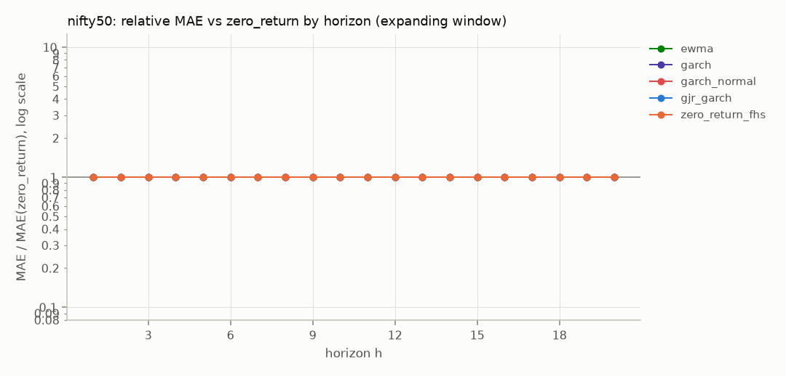
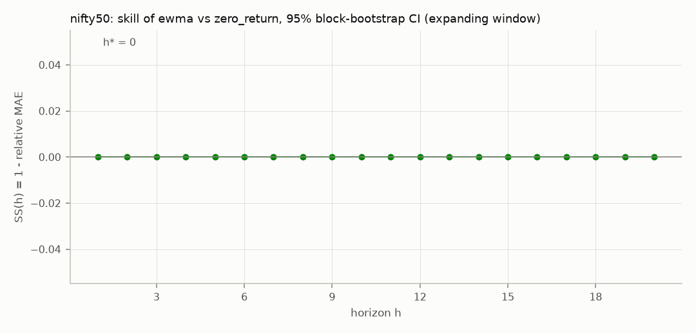
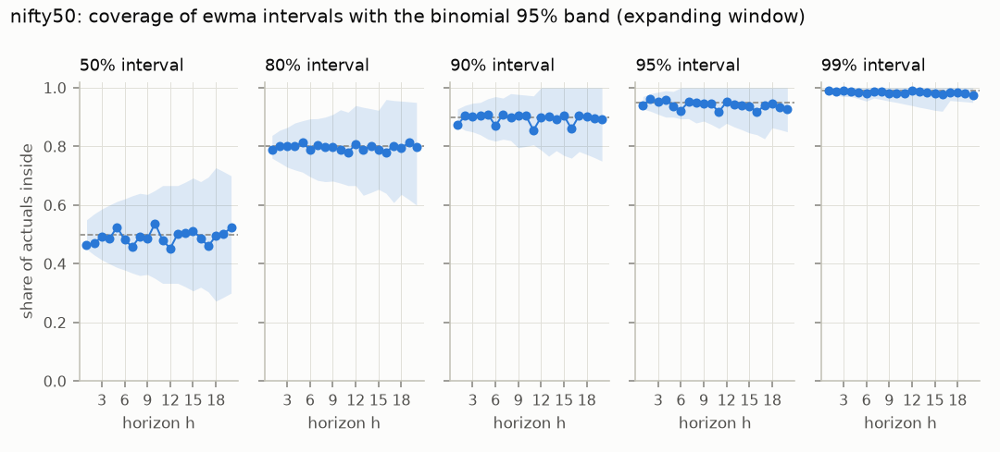

# Phase 1 report: run 9260b33a46f88d81

Git d62deac04562b1a029a42a86c0e8b8952ad148d1-dirty-ac702ce0, created 2026-09-26T08:05:43+00:00, seed 20260925, interval levels 50%, 80%, 90%, 95%, 99%.

Every number comes from the forecast store and the manifest; nothing was refitted. Only test origins are scored; the SMA window, the reference baseline and the best candidate were chosen on dev origins. Leakage tests L1, L2, L4 and L5 run in CI on every push: check that CI passed for commit d62deac04562. L3 (the random-walk canary) is tests/test_canary.py.

Limitations: data revisions are not handled (vintages, leakage source 16). Multi-step errors from overlapping windows are correlated, so n / h is printed next to every statistic.

| Series | RQ1 | RQ2 | RQ3 | RQ4 | RQ5 | RQ6 | Phase 1 exit |
|---|---|---|---|---|---|---|---|
| nifty50 | no | h* = 0 | calibrated | autocorrelation yes, ARCH yes | no significant gap | none (configured) | stop modelling |

## Gate decision (A10)

**No gate decision: gate.yaml is a phase 2 registration: this report does not issue its decision, see the phase 2 report.**

## nifty50

Source `csv:../../data/nifty50.csv`, trading_days, target returns, m = 1, H = 20, test horizons 1, 5. 400 test origins (step 5), 200 dev, 817 warm-up; windows expanding, rolling; verdicts use the expanding window.

Treated as a price index: dividends are not included (Phase 1 uses the price index, not the total return index). y is the one-period log return at t + h.

Chosen on dev origins only: SMA window k = n/a; reference (best baseline) zero_return; best candidate ewma.

| Question | Answer | Detail |
|---|---|---|
| RQ1 | no | No. No candidate beats zero_return significantly at any testable horizon (1, 5) after Holm correction. |
| RQ2 | h* = 0 | h* = 0 of 20 for ewma (dev-chosen). Skill at h = 1: 0.00 [0.00, 0.00]. Horizons 1 to 20 are not forecastable by these models. |
| RQ3 | calibrated | Calibrated where testable: the 80% and 95% intervals of ewma are inside the binomial band and Kupiec does not reject at 5%. |
| RQ4 | autocorrelation yes, ARCH yes | ewma: Ljung-Box rejects at 100% of 400 test origins, ARCH-LM at 100%. Residuals are autocorrelated: Phase 2 needs a block bootstrap. Volatility clusters: this confirms U6 (GARCH in Phase 2). |
| RQ5 | no significant gap | No significant gap between rolling and expanding windows for ewma at the test horizons. Sub-periods where ewma beats zero_return: 0 of 4 at h = 1; 0 of 4 at h = 5. |
| RQ6 | none (configured) | Not tested: the config fixes the transform to none; only transform: auto lets each fold choose. |
| Phase 1 exit | stop modelling | Stop modelling: ship naive plus empirical error quantiles (Phase 2 lite) and look for covariates or a panel before further work. Provisional (gate.yaml is a phase 2 registration: this report does not issue its decision, see the phase 2 report). |

### RQ1: does any model beat zero_return?

No. No candidate beats zero_return significantly at any testable horizon (1, 5) after Holm correction.

At the test horizons (DM-HLN one-sided: the model is more accurate; Holm over every candidate and test horizon; MCS at alpha 0.10):

| h | model | n | n/h | rel. MAE | DM p | Holm p | in MCS |
|---|---|---|---|---|---|---|---|
| 1 | ewma | 400 | 400.0 | 1.000 | 0.500 | 1.000 | yes |
| 1 | garch | 400 | 400.0 | 1.000 | 0.500 | 1.000 | yes |
| 1 | garch_normal | 400 | 400.0 | 1.000 | 0.500 | 1.000 | yes |
| 1 | gjr_garch | 400 | 400.0 | 1.000 | 0.500 | 1.000 | yes |
| 1 | zero_return_fhs | 400 | 400.0 | 1.000 | 0.500 | 1.000 | yes |
| 5 | ewma | 400 | 80.0 | 1.000 | 0.500 | 1.000 | yes |
| 5 | garch | 400 | 80.0 | 1.000 | 0.500 | 1.000 | yes |
| 5 | garch_normal | 400 | 80.0 | 1.000 | 0.500 | 1.000 | yes |
| 5 | gjr_garch | 400 | 80.0 | 1.000 | 0.500 | 1.000 | yes |
| 5 | zero_return_fhs | 400 | 80.0 | 1.000 | 0.500 | 1.000 | yes |

Relative MAE vs zero_return at every h (* = in the MCS at that h):

| h | n | n/h | ewma | garch | garch_normal | gjr_garch | zero_return_fhs |
|---|---|---|---|---|---|---|---|
| 1 | 400 | 400.0 | 1.00* | 1.00* | 1.00* | 1.00* | 1.00* |
| 2 | 400 | 200.0 | 1.00* | 1.00* | 1.00* | 1.00* | 1.00* |
| 3 | 400 | 133.3 | 1.00* | 1.00* | 1.00* | 1.00* | 1.00* |
| 4 | 400 | 100.0 | 1.00* | 1.00* | 1.00* | 1.00* | 1.00* |
| 5 | 400 | 80.0 | 1.00* | 1.00* | 1.00* | 1.00* | 1.00* |
| 6 | 400 | 66.7 | 1.00* | 1.00* | 1.00* | 1.00* | 1.00* |
| 7 | 400 | 57.1 | 1.00* | 1.00* | 1.00* | 1.00* | 1.00* |
| 8 | 400 | 50.0 | 1.00* | 1.00* | 1.00* | 1.00* | 1.00* |
| 9 | 400 | 44.4 | 1.00* | 1.00* | 1.00* | 1.00* | 1.00* |
| 10 | 400 | 40.0 | 1.00* | 1.00* | 1.00* | 1.00* | 1.00* |
| 11 | 400 | 36.4 | 1.00* | 1.00* | 1.00* | 1.00* | 1.00* |
| 12 | 400 | 33.3 | 1.00* | 1.00* | 1.00* | 1.00* | 1.00* |
| 13 | 400 | 30.8 | 1.00* | 1.00* | 1.00* | 1.00* | 1.00* |
| 14 | 400 | 28.6 | 1.00* | 1.00* | 1.00* | 1.00* | 1.00* |
| 15 | 400 | 26.7 | 1.00* | 1.00* | 1.00* | 1.00* | 1.00* |
| 16 | 400 | 25.0 | 1.00* | 1.00* | 1.00* | 1.00* | 1.00* |
| 17 | 400 | 23.5 | 1.00* | 1.00* | 1.00* | 1.00* | 1.00* |
| 18 | 400 | 22.2 | 1.00* | 1.00* | 1.00* | 1.00* | 1.00* |
| 19 | 400 | 21.1 | 1.00* | 1.00* | 1.00* | 1.00* | 1.00* |
| 20 | 400 | 20.0 | 1.00* | 1.00* | 1.00* | 1.00* | 1.00* |

Rolling window: No. No candidate beats zero_return significantly at any testable horizon (1, 5) after Holm correction.

### RQ2: what is the predictable horizon h*?

h* = 0 of 20 for ewma (dev-chosen). Skill at h = 1: 0.00 [0.00, 0.00]. Horizons 1 to 20 are not forecastable by these models.

Skill of ewma vs zero_return (95% moving-block bootstrap CI, block length h; 'reliable' is no when the block exceeds n / 3, where the CI can miss the estimate):

| h | n | skill | CI low | CI high | reliable |
|---|---|---|---|---|---|
| 1 | 400 | 0.000 | 0.000 | 0.000 | yes |
| 2 | 400 | 0.000 | 0.000 | 0.000 | yes |
| 3 | 400 | 0.000 | 0.000 | 0.000 | yes |
| 4 | 400 | 0.000 | 0.000 | 0.000 | yes |
| 5 | 400 | 0.000 | 0.000 | 0.000 | yes |
| 6 | 400 | 0.000 | 0.000 | 0.000 | yes |
| 7 | 400 | 0.000 | 0.000 | 0.000 | yes |
| 8 | 400 | 0.000 | 0.000 | 0.000 | yes |
| 9 | 400 | 0.000 | 0.000 | 0.000 | yes |
| 10 | 400 | 0.000 | 0.000 | 0.000 | yes |
| 11 | 400 | 0.000 | 0.000 | 0.000 | yes |
| 12 | 400 | 0.000 | 0.000 | 0.000 | yes |
| 13 | 400 | 0.000 | 0.000 | 0.000 | yes |
| 14 | 400 | 0.000 | 0.000 | 0.000 | yes |
| 15 | 400 | 0.000 | 0.000 | 0.000 | yes |
| 16 | 400 | 0.000 | 0.000 | 0.000 | yes |
| 17 | 400 | 0.000 | 0.000 | 0.000 | yes |
| 18 | 400 | 0.000 | 0.000 | 0.000 | yes |
| 19 | 400 | 0.000 | 0.000 | 0.000 | yes |
| 20 | 400 | 0.000 | 0.000 | 0.000 | yes |

h* per candidate:

| model | h_star | H |
|---|---|---|
| ewma | 0 | 20 |
| garch | 0 | 20 |
| garch_normal | 0 | 20 |
| gjr_garch | 0 | 20 |
| zero_return_fhs | 0 | 20 |

### RQ3: are the analytic intervals calibrated?

Calibrated where testable: the 80% and 95% intervals of ewma are inside the binomial band and Kupiec does not reject at 5%.

Coverage per horizon bucket (effective trials n / h for the bucket's last h; the band is the central 95% range for a calibrated interval):

| model | bucket | level | n | n/h | coverage | band low | band high | in band | Kupiec p | winkler |
|---|---|---|---|---|---|---|---|---|---|---|
| ewma | very_short | 0.50 | 400 | 400.0 | 0.465 | 0.450 | 0.550 | yes | 0.161 | 0.025 |
| ewma | short | 0.50 | 800 | 133.3 | 0.481 | 0.414 | 0.586 | yes | 0.665 | 0.023 |
| ewma | long | 0.50 | 6800 | 20.0 | 0.493 | 0.300 | 0.700 | yes | 0.952 | 0.024 |
| ewma | very_short | 0.80 | 400 | 400.0 | 0.787 | 0.760 | 0.838 | yes | 0.535 | 0.037 |
| ewma | short | 0.80 | 800 | 133.3 | 0.802 | 0.729 | 0.865 | yes | 0.942 | 0.034 |
| ewma | long | 0.80 | 6800 | 20.0 | 0.797 | 0.600 | 0.950 | yes | 0.971 | 0.037 |
| ewma | very_short | 0.90 | 400 | 400.0 | 0.873 | 0.870 | 0.927 | yes | 0.077 | 0.047 |
| ewma | short | 0.90 | 800 | 133.3 | 0.904 | 0.850 | 0.947 | yes | 0.885 | 0.042 |
| ewma | long | 0.90 | 6800 | 20.0 | 0.895 | 0.750 | 1.000 | yes | 0.939 | 0.047 |
| ewma | very_short | 0.95 | 400 | 400.0 | 0.940 | 0.927 | 0.970 | yes | 0.373 | 0.057 |
| ewma | short | 0.95 | 800 | 133.3 | 0.958 | 0.910 | 0.985 | yes | 0.684 | 0.051 |
| ewma | long | 0.95 | 6800 | 20.0 | 0.940 | 0.850 | 1.000 | yes | 0.835 | 0.060 |
| ewma | very_short | 0.99 | 400 | 400.0 | 0.990 | 0.980 | 0.998 | yes | 1.000 | 0.090 |
| ewma | short | 0.99 | 800 | 133.3 | 0.989 | 0.970 | 1.000 | yes | 0.887 | 0.077 |
| ewma | long | 0.99 | 6800 | 20.0 | 0.984 | 0.950 | 1.000 | yes | 0.795 | 0.106 |
| zero_return | very_short | 0.50 | 400 | 400.0 | 0.755 | 0.450 | 0.550 | no | < 0.001 | 0.028 |
| zero_return | short | 0.50 | 800 | 133.3 | 0.770 | 0.414 | 0.586 | no | < 0.001 | 0.026 |
| zero_return | long | 0.50 | 6800 | 20.0 | 0.776 | 0.300 | 0.700 | no | 0.011 | 0.027 |
| zero_return | very_short | 0.80 | 400 | 400.0 | 0.920 | 0.760 | 0.838 | no | < 0.001 | 0.045 |
| zero_return | short | 0.80 | 800 | 133.3 | 0.956 | 0.729 | 0.865 | no | < 0.001 | 0.043 |
| zero_return | long | 0.80 | 6800 | 20.0 | 0.945 | 0.600 | 0.950 | yes | 0.062 | 0.044 |
| zero_return | very_short | 0.90 | 400 | 400.0 | 0.968 | 0.870 | 0.927 | no | < 0.001 | 0.059 |
| zero_return | short | 0.90 | 800 | 133.3 | 0.979 | 0.850 | 0.947 | no | < 0.001 | 0.056 |
| zero_return | long | 0.90 | 6800 | 20.0 | 0.970 | 0.750 | 1.000 | yes | 0.223 | 0.057 |
| zero_return | very_short | 0.95 | 400 | 400.0 | 0.975 | 0.927 | 0.970 | no | 0.011 | 0.073 |
| zero_return | short | 0.95 | 800 | 133.3 | 0.986 | 0.910 | 0.985 | no | 0.024 | 0.069 |
| zero_return | long | 0.95 | 6800 | 20.0 | 0.980 | 0.850 | 1.000 | yes | 0.481 | 0.071 |
| zero_return | very_short | 0.99 | 400 | 400.0 | 0.983 | 0.980 | 0.998 | yes | 0.173 | 0.118 |
| zero_return | short | 0.99 | 800 | 133.3 | 0.994 | 0.970 | 1.000 | yes | 0.640 | 0.109 |
| zero_return | long | 0.99 | 6800 | 20.0 | 0.991 | 0.950 | 1.000 | yes | 0.957 | 0.117 |

### RQ4: are the residuals autocorrelated or heteroskedastic?

ewma: Ljung-Box rejects at 100% of 400 test origins, ARCH-LM at 100%. Residuals are autocorrelated: Phase 2 needs a block bootstrap. Volatility clusters: this confirms U6 (GARCH in Phase 2).

Share of test origins where the test rejects at 5%: Ljung-Box at lag 10, ARCH-LM with 4 lags, on each fold's one-step in-sample residuals. Theta and the combination expose no residuals.

| model | origins | median n resid | LB lag 10 | ARCH-LM |
|---|---|---|---|---|
| ewma | 400 | 6584 | 1.000 | 1.000 |
| garch | 400 | 6584 | 1.000 | 0.000 |
| garch_normal | 400 | 6584 | 1.000 | 0.000 |
| gjr_garch | 400 | 6584 | 1.000 | 0.000 |
| zero_return | 400 | 6584 | 1.000 | 1.000 |
| zero_return_fhs | 400 | 6584 | 1.000 | 1.000 |

### RQ5: is the series stable, or does a rolling window beat expanding?

No significant gap between rolling and expanding windows for ewma at the test horizons. Sub-periods where ewma beats zero_return: 0 of 4 at h = 1; 0 of 4 at h = 5.

Rolling vs expanding on the same origins (ratio = MAE rolling / MAE expanding; Holm over every model and test horizon):

| model | h | n | n/h | ratio | DM p (two-sided) | Holm p rolling better | Holm p expanding better |
|---|---|---|---|---|---|---|---|
| ewma | 1 | 400 | 400.0 | 1.000 | 1.000 | 1.000 | 1.000 |
| ewma | 5 | 400 | 80.0 | 1.000 | 1.000 | 1.000 | 1.000 |
| garch | 1 | 399 | 399.0 | 1.000 | 1.000 | 1.000 | 1.000 |
| garch | 5 | 399 | 79.8 | 1.000 | 1.000 | 1.000 | 1.000 |
| garch_normal | 1 | 399 | 399.0 | 1.000 | 1.000 | 1.000 | 1.000 |
| garch_normal | 5 | 399 | 79.8 | 1.000 | 1.000 | 1.000 | 1.000 |
| gjr_garch | 1 | 400 | 400.0 | 1.000 | 1.000 | 1.000 | 1.000 |
| gjr_garch | 5 | 400 | 80.0 | 1.000 | 1.000 | 1.000 | 1.000 |
| zero_return | 1 | 400 | 400.0 | 1.000 | 1.000 | 1.000 | 1.000 |
| zero_return | 5 | 400 | 80.0 | 1.000 | 1.000 | 1.000 | 1.000 |
| zero_return_fhs | 1 | 400 | 400.0 | 1.000 | 1.000 | 1.000 | 1.000 |
| zero_return_fhs | 5 | 400 | 80.0 | 1.000 | 1.000 | 1.000 | 1.000 |

ewma vs zero_return in four consecutive blocks of test origins (relative MAE):

| h | block | first_origin | last_origin | n | rel_mae |
|---|---|---|---|---|---|
| 1 | 1 | 5586 | 6081 | 100 | 1.000 |
| 1 | 2 | 6086 | 6581 | 100 | 1.000 |
| 1 | 3 | 6586 | 7081 | 100 | 1.000 |
| 1 | 4 | 7086 | 7581 | 100 | 1.000 |
| 5 | 1 | 5586 | 6081 | 100 | 1.000 |
| 5 | 2 | 6086 | 6581 | 100 | 1.000 |
| 5 | 3 | 6586 | 7081 | 100 | 1.000 |
| 5 | 4 | 7086 | 7581 | 100 | 1.000 |

### RQ6: is a transform needed, and which?

Not tested: the config fixes the transform to none; only transform: auto lets each fold choose.

| window | transform | test folds | share | lambda_min | lambda_max |
|---|---|---|---|---|---|
| expanding | none | 400 | 1.000 | n/a | n/a |
| rolling | none | 400 | 1.000 | n/a | n/a |

