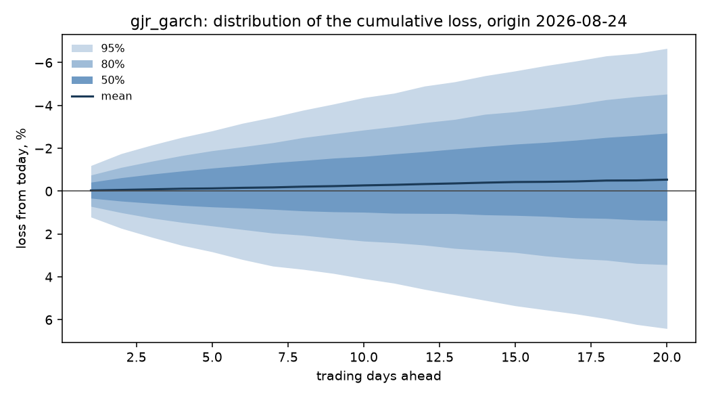

# Holding-period risk: nifty50

Run `4259d18205518ed9`, git `31a987f80192`, expanding window, 10,000 simulated paths per origin.

The quantity forecast is the cumulative move over h trading days, log(p_t+h / p_t), converted to a loss as 1 - exp(r). Phase 1 established that the mean of this series is not forecastable, so the point forecast is fixed at zero and everything below is about the spread.

## Gate decision: NO-GO

Primary model `gjr_garch`, registered as 2026-09-26 (gate.yaml 6bb36f41d45d, commit e14c51e0bc21).

| check | h | level | result | detail |
|---|---|---|---|---|
| coverage | 1 | 80% | pass | 0.825 against [0.75, 0.85] |
| kupiec | 1 | 80% | pass | p = 0.3689 against alpha 0.0043 |
| independence | 1 | 80% | pass | p = 0.1811 against alpha 0.0043 |
| coverage | 1 | 95% | pass | 0.950 against [0.91, 0.98] |
| kupiec | 1 | 95% | pass | p = 1.0000 against alpha 0.0043 |
| independence | 1 | 95% | pass | p = 0.5092 against alpha 0.0043 |
| crps | 1 | - | pass | 0.9378 of zero_return_fhs, must be below 1.0 |
| coverage | 5 | 80% | pass | 0.840 against [0.75, 0.85] |
| kupiec | 5 | 80% | pass | p = 0.1461 against alpha 0.0043 |
| independence | 5 | 80% | pass | p = 0.6590 against alpha 0.0043 |
| coverage | 5 | 95% | pass | 0.980 against [0.91, 0.98] |
| kupiec | 5 | 95% | pass | p = 0.0275 against alpha 0.0043 |
| independence | 5 | 95% | pass | p = 0.6854 against alpha 0.0043 |
| crps | 5 | - | pass | 0.9068 of zero_return_fhs, must be below 1.0 |
| coverage | 20 | 80% | FAIL | 0.865 against [0.75, 0.85] |
| kupiec | 20 | 80% | pass | p = 0.0160 against alpha 0.0043 |
| independence | 20 | 80% | pass | p = 0.0776 against alpha 0.0043 |
| coverage | 20 | 95% | pass | 0.975 against [0.91, 0.98] |
| kupiec | 20 | 95% | pass | p = 0.0737 against alpha 0.0043 |
| independence | 20 | 95% | pass | p = 0.6117 against alpha 0.0043 |
| crps | 20 | - | pass | 0.9111 of zero_return_fhs, must be below 1.0 |

## Calibration of the loss distribution

| model | h | n | cov_80 | kupiec_p_80 | ind_p_80 | cov_95 | kupiec_p_95 | crps |
|---|---|---|---|---|---|---|---|---|
| ewma | 1 | 200 | 0.7850 | 0.5992 | 0.1315 | 0.9250 | 0.1296 | 0.0049 |
| garch | 1 | 200 | 0.8150 | 0.5923 | 0.3336 | 0.9500 | 1.0000 | 0.0049 |
| garch_normal | 1 | 200 | 0.8300 | 0.2792 | 0.9241 | 0.9500 | 1.0000 | 0.0049 |
| gjr_garch | 1 | 200 | 0.8250 | 0.3689 | 0.1811 | 0.9500 | 1.0000 | 0.0048 |
| zero_return_fhs | 1 | 200 | 0.9000 | 0.0001 | 0.9937 | 0.9900 | 0.0017 | 0.0052 |
| ewma | 5 | 200 | 0.7650 | 0.2253 | 0.6628 | 0.9500 | 1.0000 | 0.0107 |
| garch | 5 | 200 | 0.8300 | 0.2792 | 0.6809 | 0.9800 | 0.0275 | 0.0106 |
| garch_normal | 5 | 200 | 0.8300 | 0.2792 | 0.9241 | 0.9800 | 0.0275 | 0.0106 |
| gjr_garch | 5 | 200 | 0.8400 | 0.1461 | 0.6590 | 0.9800 | 0.0275 | 0.0105 |
| zero_return_fhs | 5 | 200 | 0.9450 | 0.0000 | 0.1229 | 1.0000 | 0.0000 | 0.0116 |
| ewma | 20 | 200 | 0.7800 | 0.4848 | 0.0482 | 0.9250 | 0.1296 | 0.0230 |
| garch | 20 | 200 | 0.8500 | 0.0671 | 0.1483 | 0.9650 | 0.3047 | 0.0228 |
| garch_normal | 20 | 200 | 0.8450 | 0.1007 | 0.3377 | 0.9750 | 0.0737 | 0.0228 |
| gjr_garch | 20 | 200 | 0.8650 | 0.0160 | 0.0776 | 0.9750 | 0.0737 | 0.0228 |
| zero_return_fhs | 20 | 200 | 0.9500 | 0.0000 | 0.0811 | 0.9950 | 0.0002 | 0.0250 |

## Value at risk and expected shortfall

Losses are fractions of the position, so 0.05 is a 5% loss. `var_mean_loss` is the average VaR the model quoted; `es_mean_loss` is the average loss it expected given a breach. `es_ok` is whether a bootstrap interval on realised minus predicted covers zero: NO, with a negative bias, means breaches were worse than the model said. `not tested` means fewer than ten breaches, which is not a pass: at these sample sizes most tail rows say nothing either way.

| model | h | var_p | var_mean_loss | es_mean_loss | breaches | expected | kupiec_p | es_breaches | es_bias | es_ok |
|---|---|---|---|---|---|---|---|---|---|---|
| ewma | 1 | 0.9500 | 0.0156 | 0.0220 | 10 | 10.0000 | 1.0000 | 10 | -0.0014 | yes |
| garch | 1 | 0.9500 | 0.0164 | 0.0230 | 9 | 10.0000 | 0.7416 | 9 | not tested | not tested |
| garch_normal | 1 | 0.9500 | 0.0164 | 0.0231 | 9 | 10.0000 | 0.7416 | 9 | not tested | not tested |
| gjr_garch | 1 | 0.9500 | 0.0167 | 0.0232 | 9 | 10.0000 | 0.7416 | 9 | not tested | not tested |
| zero_return_fhs | 1 | 0.9500 | 0.0235 | 0.0358 | 2 | 10.0000 | 0.0017 | 2 | not tested | not tested |
| ewma | 1 | 0.9750 | 0.0195 | 0.0267 | 8 | 5.0000 | 0.2107 | 8 | not tested | not tested |
| garch | 1 | 0.9750 | 0.0205 | 0.0277 | 5 | 5.0000 | 1.0000 | 5 | not tested | not tested |
| garch_normal | 1 | 0.9750 | 0.0206 | 0.0279 | 5 | 5.0000 | 1.0000 | 5 | not tested | not tested |
| gjr_garch | 1 | 0.9750 | 0.0206 | 0.0277 | 5 | 5.0000 | 1.0000 | 5 | not tested | not tested |
| zero_return_fhs | 1 | 0.9750 | 0.0313 | 0.0448 | 1 | 5.0000 | 0.0274 | 1 | not tested | not tested |
| ewma | 1 | 0.9950 | 0.0306 | 0.0400 | 1 | 1.0000 | 1.0000 | 1 | not tested | not tested |
| garch | 1 | 0.9950 | 0.0322 | 0.0410 | 0 | 1.0000 | 0.1568 | 0 | not tested | not tested |
| garch_normal | 1 | 0.9950 | 0.0325 | 0.0412 | 0 | 1.0000 | 0.1568 | 0 | not tested | not tested |
| gjr_garch | 1 | 0.9950 | 0.0330 | 0.0411 | 0 | 1.0000 | 0.1568 | 0 | not tested | not tested |
| zero_return_fhs | 1 | 0.9950 | 0.0517 | 0.0686 | 0 | 1.0000 | 0.1568 | 0 | not tested | not tested |
| ewma | 5 | 0.9500 | 0.0339 | 0.0464 | 10 | 10.0000 | 1.0000 | 10 | 0.0024 | yes |
| garch | 5 | 0.9500 | 0.0362 | 0.0500 | 8 | 10.0000 | 0.5020 | 8 | not tested | not tested |
| garch_normal | 5 | 0.9500 | 0.0362 | 0.0501 | 8 | 10.0000 | 0.5020 | 8 | not tested | not tested |
| gjr_garch | 5 | 0.9500 | 0.0373 | 0.0527 | 9 | 10.0000 | 0.7416 | 9 | not tested | not tested |
| zero_return_fhs | 5 | 0.9500 | 0.0530 | 0.0723 | 1 | 10.0000 | 0.0002 | 1 | not tested | not tested |
| ewma | 5 | 0.9750 | 0.0424 | 0.0550 | 5 | 5.0000 | 1.0000 | 5 | not tested | not tested |
| garch | 5 | 0.9750 | 0.0454 | 0.0597 | 3 | 5.0000 | 0.3283 | 3 | not tested | not tested |
| garch_normal | 5 | 0.9750 | 0.0455 | 0.0597 | 3 | 5.0000 | 0.3283 | 3 | not tested | not tested |
| gjr_garch | 5 | 0.9750 | 0.0474 | 0.0634 | 3 | 5.0000 | 0.3283 | 3 | not tested | not tested |
| zero_return_fhs | 5 | 0.9750 | 0.0659 | 0.0856 | 0 | 5.0000 | 0.0015 | 0 | not tested | not tested |
| ewma | 5 | 0.9950 | 0.0621 | 0.0755 | 1 | 1.0000 | 1.0000 | 1 | not tested | not tested |
| garch | 5 | 0.9950 | 0.0677 | 0.0836 | 0 | 1.0000 | 0.1568 | 0 | not tested | not tested |
| garch_normal | 5 | 0.9950 | 0.0677 | 0.0832 | 0 | 1.0000 | 0.1568 | 0 | not tested | not tested |
| gjr_garch | 5 | 0.9950 | 0.0724 | 0.0907 | 0 | 1.0000 | 0.1568 | 0 | not tested | not tested |
| zero_return_fhs | 5 | 0.9950 | 0.0969 | 0.1177 | 0 | 1.0000 | 0.1568 | 0 | not tested | not tested |
| ewma | 20 | 0.9500 | 0.0642 | 0.0885 | 11 | 10.0000 | 0.7493 | 11 | -0.0189 | yes |
| garch | 20 | 0.9500 | 0.0715 | 0.1002 | 10 | 10.0000 | 1.0000 | 10 | -0.0086 | yes |
| garch_normal | 20 | 0.9500 | 0.0714 | 0.1001 | 10 | 10.0000 | 1.0000 | 10 | -0.0085 | yes |
| gjr_garch | 20 | 0.9500 | 0.0750 | 0.1103 | 9 | 10.0000 | 0.7416 | 9 | not tested | not tested |
| zero_return_fhs | 20 | 0.9500 | 0.1003 | 0.1300 | 4 | 10.0000 | 0.0275 | 4 | not tested | not tested |
| ewma | 20 | 0.9750 | 0.0807 | 0.1050 | 9 | 5.0000 | 0.1027 | 9 | not tested | not tested |
| garch | 20 | 0.9750 | 0.0906 | 0.1199 | 6 | 5.0000 | 0.6604 | 6 | not tested | not tested |
| garch_normal | 20 | 0.9750 | 0.0904 | 0.1198 | 4 | 5.0000 | 0.6391 | 4 | not tested | not tested |
| gjr_garch | 20 | 0.9750 | 0.0976 | 0.1347 | 4 | 5.0000 | 0.6391 | 4 | not tested | not tested |
| zero_return_fhs | 20 | 0.9750 | 0.1221 | 0.1493 | 1 | 5.0000 | 0.0274 | 1 | not tested | not tested |
| ewma | 20 | 0.9950 | 0.1185 | 0.1444 | 4 | 1.0000 | 0.0234 | 4 | not tested | not tested |
| garch | 20 | 0.9950 | 0.1358 | 0.1688 | 1 | 1.0000 | 1.0000 | 1 | not tested | not tested |
| garch_normal | 20 | 0.9950 | 0.1358 | 0.1684 | 2 | 1.0000 | 0.3779 | 2 | not tested | not tested |
| gjr_garch | 20 | 0.9950 | 0.1539 | 0.1970 | 1 | 1.0000 | 1.0000 | 1 | not tested | not tested |
| zero_return_fhs | 20 | 0.9950 | 0.1655 | 0.1892 | 1 | 1.0000 | 1.0000 | 1 | not tested | not tested |

## The distribution from the latest origin

## What this does not tell you

- The distribution is conditional on the volatility state at the origin and on the assumption that tomorrow's shocks resemble the standardised residuals of the training window. A shock unlike anything in the sample is outside it.
- Expected shortfall is estimated from simulated paths, so its tail accuracy is bounded by the number of paths and by the empirical residual sample behind them.
- Coverage is measured over the test origins as a whole. Calibration over a long sample does not guarantee calibration in any particular month.