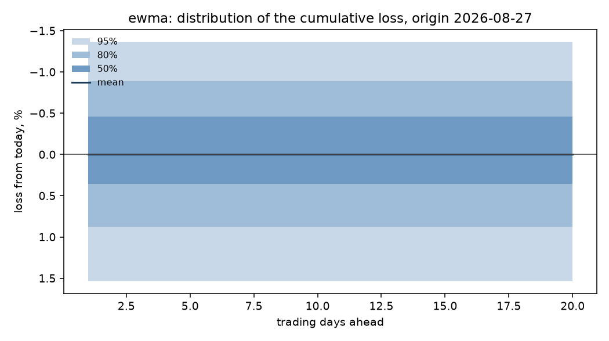

# Single-period risk: sp500

Run `93af45770cfd562b`, git `b76eba38e27f`, expanding window, 10,000 simulated paths per origin.

The quantity forecast is the single-period return at t + h, log(p_t+h / p_t+h-1), converted to a loss as 1 - exp(r). Phase 1 established that the mean of this series is not forecastable, so the point forecast is fixed at zero and everything below is about the spread.

## Gate decision: NO-GO

Primary model `ewma`, registered as 2026-09-26 (gate.yaml 9e05b0027254, commit b76eba38e27f).

| check | h | level | result | detail |
|---|---|---|---|---|
| coverage | 1 | 80% | pass | 0.805 against [0.75, 0.85] |
| kupiec | 1 | 80% | pass | p = 0.8020 against alpha 0.0064 |
| independence | 1 | 80% | pass | p = 0.0757 against alpha 0.0064 |
| coverage | 1 | 95% | pass | 0.965 against [0.91, 0.98] |
| kupiec | 1 | 95% | pass | p = 0.1466 against alpha 0.0064 |
| independence | 1 | 95% | pass | p = 0.5054 against alpha 0.0064 |
| crps | 1 | - | pass | 0.9369 of zero_return, must be below 1.0 |
| coverage | 5 | 80% | pass | 0.795 against [0.75, 0.85] |
| kupiec | 5 | 80% | pass | p = 0.8032 against alpha 0.0064 |
| independence | 5 | 80% | FAIL | p = 0.0056 against alpha 0.0064 |
| coverage | 5 | 95% | pass | 0.925 against [0.91, 0.98] |
| kupiec | 5 | 95% | pass | p = 0.0321 against alpha 0.0064 |
| independence | 5 | 95% | pass | p = 0.6072 against alpha 0.0064 |
| crps | 5 | - | pass | 0.9514 of zero_return, must be below 1.0 |

## Calibration of the loss distribution

| model | h | n | cov_80 | kupiec_p_80 | ind_p_80 | cov_95 | kupiec_p_95 | crps |
|---|---|---|---|---|---|---|---|---|
| ewma | 1 | 400 | 0.8050 | 0.8020 | 0.0757 | 0.9650 | 0.1466 | 0.0051 |
| garch | 1 | 400 | 0.8050 | 0.8020 | 0.9369 | 0.9700 | 0.0481 | 0.0050 |
| garch_normal | 1 | 400 | 0.8275 | 0.1614 | 0.7111 | 0.9675 | 0.0871 | 0.0050 |
| gjr_garch | 1 | 400 | 0.8150 | 0.4489 | 0.8093 | 0.9700 | 0.0481 | 0.0049 |
| zero_return | 1 | 400 | 0.8800 | 0.0000 | 0.0005 | 0.9575 | 0.4804 | 0.0054 |
| zero_return_fhs | 1 | 400 | 0.8075 | 0.7063 | 0.0050 | 0.9625 | 0.2309 | 0.0053 |
| ewma | 5 | 400 | 0.7950 | 0.8032 | 0.0056 | 0.9250 | 0.0321 | 0.0058 |
| garch | 5 | 400 | 0.8000 | 1.0000 | 0.0300 | 0.9425 | 0.5010 | 0.0057 |
| garch_normal | 5 | 400 | 0.8175 | 0.3762 | 0.1153 | 0.9350 | 0.1874 | 0.0057 |
| gjr_garch | 5 | 400 | 0.8025 | 0.9004 | 0.0093 | 0.9275 | 0.0523 | 0.0056 |
| zero_return | 5 | 400 | 0.8375 | 0.0544 | 0.0001 | 0.9500 | 1.0000 | 0.0061 |
| zero_return_fhs | 5 | 400 | 0.7925 | 0.7089 | 0.0045 | 0.9475 | 0.8199 | 0.0059 |

## Value at risk and expected shortfall

Losses are fractions of the position, so 0.05 is a 5% loss. `var_mean_loss` is the average VaR the model quoted; `es_mean_loss` is the average loss it expected given a breach. `es_ok` is whether a bootstrap interval on realised minus predicted covers zero: NO, with a negative bias, means breaches were worse than the model said. `not tested` means fewer than ten breaches, which is not a pass: at these sample sizes most tail rows say nothing either way.

| model | h | var_p | var_mean_loss | es_mean_loss | breaches | expected | kupiec_p | es_breaches | es_bias | es_ok |
|---|---|---|---|---|---|---|---|---|---|---|
| ewma | 1 | 0.9500 | 0.0181 | not tested | 18 | 20.0000 | 0.6409 | 0 | not tested | not tested |
| garch | 1 | 0.9500 | 0.0177 | not tested | 17 | 20.0000 | 0.4804 | 0 | not tested | not tested |
| garch_normal | 1 | 0.9500 | 0.0175 | not tested | 18 | 20.0000 | 0.6409 | 0 | not tested | not tested |
| gjr_garch | 1 | 0.9500 | 0.0178 | not tested | 17 | 20.0000 | 0.4804 | 0 | not tested | not tested |
| zero_return | 1 | 0.9500 | 0.0197 | not tested | 16 | 20.0000 | 0.3424 | 0 | not tested | not tested |
| zero_return_fhs | 1 | 0.9500 | 0.0184 | not tested | 19 | 20.0000 | 0.8171 | 0 | not tested | not tested |
| ewma | 1 | 0.9750 | 0.0237 | not tested | 8 | 10.0000 | 0.5072 | 0 | not tested | not tested |
| garch | 1 | 0.9750 | 0.0229 | not tested | 8 | 10.0000 | 0.5072 | 0 | not tested | not tested |
| garch_normal | 1 | 0.9750 | 0.0208 | not tested | 10 | 10.0000 | 1.0000 | 0 | not tested | not tested |
| gjr_garch | 1 | 0.9750 | 0.0223 | not tested | 7 | 10.0000 | 0.3103 | 0 | not tested | not tested |
| zero_return | 1 | 0.9750 | 0.0235 | not tested | 12 | 10.0000 | 0.5344 | 0 | not tested | not tested |
| zero_return_fhs | 1 | 0.9750 | 0.0247 | not tested | 9 | 10.0000 | 0.7447 | 0 | not tested | not tested |
| ewma | 1 | 0.9950 | 0.0368 | not tested | 1 | 2.0000 | 0.4325 | 0 | not tested | not tested |
| garch | 1 | 0.9950 | 0.0333 | not tested | 1 | 2.0000 | 0.4325 | 0 | not tested | not tested |
| garch_normal | 1 | 0.9950 | 0.0272 | not tested | 4 | 2.0000 | 0.2124 | 0 | not tested | not tested |
| gjr_garch | 1 | 0.9950 | 0.0334 | not tested | 1 | 2.0000 | 0.4325 | 0 | not tested | not tested |
| zero_return | 1 | 0.9950 | 0.0307 | not tested | 6 | 2.0000 | 0.0223 | 0 | not tested | not tested |
| zero_return_fhs | 1 | 0.9950 | 0.0429 | not tested | 3 | 2.0000 | 0.5094 | 0 | not tested | not tested |
| ewma | 5 | 0.9500 | 0.0181 | not tested | 28 | 20.0000 | 0.0826 | 0 | not tested | not tested |
| garch | 5 | 0.9500 | 0.0180 | not tested | 23 | 20.0000 | 0.5010 | 0 | not tested | not tested |
| garch_normal | 5 | 0.9500 | 0.0177 | not tested | 25 | 20.0000 | 0.2687 | 0 | not tested | not tested |
| gjr_garch | 5 | 0.9500 | 0.0181 | not tested | 20 | 20.0000 | 1.0000 | 0 | not tested | not tested |
| zero_return | 5 | 0.9500 | 0.0197 | not tested | 15 | 20.0000 | 0.2309 | 0 | not tested | not tested |
| zero_return_fhs | 5 | 0.9500 | 0.0184 | not tested | 18 | 20.0000 | 0.6409 | 0 | not tested | not tested |
| ewma | 5 | 0.9750 | 0.0237 | not tested | 17 | 10.0000 | 0.0412 | 0 | not tested | not tested |
| garch | 5 | 0.9750 | 0.0232 | not tested | 14 | 10.0000 | 0.2266 | 0 | not tested | not tested |
| garch_normal | 5 | 0.9750 | 0.0211 | not tested | 19 | 10.0000 | 0.0102 | 0 | not tested | not tested |
| gjr_garch | 5 | 0.9750 | 0.0227 | not tested | 17 | 10.0000 | 0.0412 | 0 | not tested | not tested |
| zero_return | 5 | 0.9750 | 0.0235 | not tested | 10 | 10.0000 | 1.0000 | 0 | not tested | not tested |
| zero_return_fhs | 5 | 0.9750 | 0.0247 | not tested | 9 | 10.0000 | 0.7447 | 0 | not tested | not tested |
| ewma | 5 | 0.9950 | 0.0368 | not tested | 5 | 2.0000 | 0.0743 | 0 | not tested | not tested |
| garch | 5 | 0.9950 | 0.0338 | not tested | 5 | 2.0000 | 0.0743 | 0 | not tested | not tested |
| garch_normal | 5 | 0.9950 | 0.0276 | not tested | 9 | 2.0000 | 0.0003 | 0 | not tested | not tested |
| gjr_garch | 5 | 0.9950 | 0.0339 | not tested | 5 | 2.0000 | 0.0743 | 0 | not tested | not tested |
| zero_return | 5 | 0.9950 | 0.0307 | not tested | 5 | 2.0000 | 0.0743 | 0 | not tested | not tested |
| zero_return_fhs | 5 | 0.9950 | 0.0429 | not tested | 2 | 2.0000 | 1.0000 | 0 | not tested | not tested |

## The distribution from the latest origin

## What this does not tell you

- The distribution is conditional on the volatility state at the origin and on the assumption that tomorrow's shocks resemble the standardised residuals of the training window. A shock unlike anything in the sample is outside it.
- Expected shortfall is estimated from simulated paths, so its tail accuracy is bounded by the number of paths and by the empirical residual sample behind them.
- Coverage is measured over the test origins as a whole. Calibration over a long sample does not guarantee calibration in any particular month.