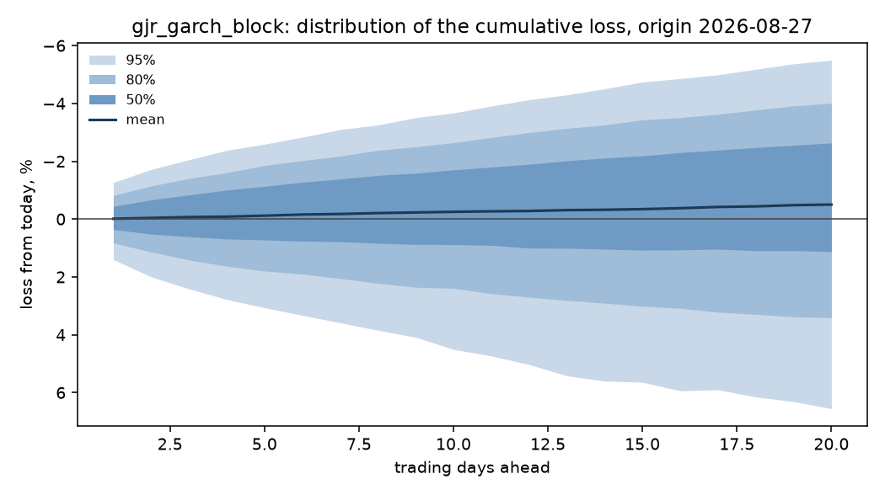

# Holding-period risk: sp500

Run `d887e82f18d7501b`, git `4d98769c4595`, expanding window, 10,000 simulated paths per origin.

Acceptance check A4: 1.30% of the run's rows are typed failures against a 1% limit, and 0.00% on the expanding window this decision is read from. A failure on the other window cannot reach the numbers below, but it is stated here rather than left in the manifest.

The quantity forecast is the cumulative move over h trading days, log(p_t+h / p_t), converted to a loss as 1 - exp(r). Phase 1 established that the mean of this series is not forecastable, so the point forecast is fixed at zero and everything below is about the spread.

## Gate decision: NO-GO

Primary model `gjr_garch_block`, registered as 2026-09-26 (gate.yaml 4eb094fd614a, commit 4d98769c4595).

| check | h | level | result | detail |
|---|---|---|---|---|
| coverage | 1 | 80% | pass | 0.800 against [0.75, 0.85] |
| kupiec | 1 | 80% | pass | p = 1.0000 against alpha 0.0043 |
| independence | 1 | 80% | pass | p = 0.2044 against alpha 0.0043 |
| coverage | 1 | 95% | pass | 0.960 against [0.91, 0.98] |
| kupiec | 1 | 95% | pass | p = 0.5020 against alpha 0.0043 |
| independence | 1 | 95% | pass | p = 0.3083 against alpha 0.0043 |
| crps | 1 | - | pass | 0.9093 of zero_return_fhs, must be below 1.0 |
| coverage | 5 | 80% | pass | 0.775 against [0.75, 0.85] |
| kupiec | 5 | 80% | pass | p = 0.3838 against alpha 0.0043 |
| independence | 5 | 80% | pass | p = 0.2231 against alpha 0.0043 |
| coverage | 5 | 95% | FAIL | 0.905 against [0.91, 0.98] |
| kupiec | 5 | 95% | pass | p = 0.0090 against alpha 0.0043 |
| independence | 5 | 95% | FAIL | p = 0.0028 against alpha 0.0043 |
| crps | 5 | - | pass | 0.9451 of zero_return_fhs, must be below 1.0 |
| coverage | 20 | 80% | pass | 0.760 against [0.75, 0.85] |
| kupiec | 20 | 80% | pass | p = 0.1670 against alpha 0.0043 |
| independence | 20 | 80% | pass | p = 0.3551 against alpha 0.0043 |
| coverage | 20 | 95% | pass | 0.980 against [0.91, 0.98] |
| kupiec | 20 | 95% | pass | p = 0.0275 against alpha 0.0043 |
| independence | 20 | 95% | pass | p = 0.0552 against alpha 0.0043 |
| crps | 20 | - | pass | 0.8986 of zero_return_fhs, must be below 1.0 |

## Calibration of the loss distribution

| model | h | n | cov_80 | kupiec_p_80 | ind_p_80 | cov_95 | kupiec_p_95 | crps |
|---|---|---|---|---|---|---|---|---|
| ewma | 1 | 200 | 0.8000 | 1.0000 | 0.6751 | 0.9500 | 1.0000 | 0.0049 |
| ewma_block | 1 | 200 | 0.8050 | 0.8592 | 0.5479 | 0.9500 | 1.0000 | 0.0049 |
| garch | 1 | 200 | 0.8000 | 1.0000 | 0.2044 | 0.9600 | 0.5020 | 0.0049 |
| garch_block | 1 | 200 | 0.8000 | 1.0000 | 0.2044 | 0.9500 | 1.0000 | 0.0049 |
| garch_normal | 1 | 200 | 0.8000 | 1.0000 | 0.2044 | 0.9600 | 0.5020 | 0.0049 |
| gjr_garch | 1 | 200 | 0.7950 | 0.8601 | 0.1358 | 0.9550 | 0.7416 | 0.0048 |
| gjr_garch_block | 1 | 200 | 0.8000 | 1.0000 | 0.2044 | 0.9600 | 0.5020 | 0.0048 |
| zero_return_fhs | 1 | 200 | 0.8150 | 0.5923 | 0.0232 | 0.9500 | 1.0000 | 0.0053 |
| ewma | 5 | 200 | 0.7700 | 0.2974 | 0.3051 | 0.9200 | 0.0722 | 0.0111 |
| ewma_block | 5 | 200 | 0.7650 | 0.2253 | 0.2236 | 0.8900 | 0.0007 | 0.0111 |
| garch | 5 | 200 | 0.8000 | 1.0000 | 0.0747 | 0.9550 | 0.7416 | 0.0110 |
| garch_block | 5 | 200 | 0.7700 | 0.2974 | 0.3051 | 0.9150 | 0.0381 | 0.0110 |
| garch_normal | 5 | 200 | 0.8000 | 1.0000 | 0.0747 | 0.9500 | 1.0000 | 0.0110 |
| gjr_garch | 5 | 200 | 0.7850 | 0.5992 | 0.2283 | 0.9350 | 0.3512 | 0.0109 |
| gjr_garch_block | 5 | 200 | 0.7750 | 0.3838 | 0.2231 | 0.9050 | 0.0090 | 0.0109 |
| zero_return_fhs | 5 | 200 | 0.8700 | 0.0092 | 0.8015 | 0.9650 | 0.3047 | 0.0116 |
| ewma | 20 | 200 | 0.8200 | 0.4737 | 0.8047 | 0.9650 | 0.3047 | 0.0199 |
| ewma_block | 20 | 200 | 0.8100 | 0.7220 | 0.9061 | 0.9500 | 1.0000 | 0.0196 |
| garch | 20 | 200 | 0.8450 | 0.1007 | 0.5379 | 0.9900 | 0.0017 | 0.0196 |
| garch_block | 20 | 200 | 0.7950 | 0.8601 | 0.8118 | 0.9700 | 0.1622 | 0.0193 |
| garch_normal | 20 | 200 | 0.8500 | 0.0671 | 0.4284 | 0.9950 | 0.0002 | 0.0196 |
| gjr_garch | 20 | 200 | 0.8100 | 0.7220 | 0.7353 | 0.9850 | 0.0080 | 0.0194 |
| gjr_garch_block | 20 | 200 | 0.7600 | 0.1670 | 0.3551 | 0.9800 | 0.0275 | 0.0193 |
| zero_return_fhs | 20 | 200 | 0.9300 | 0.0000 | 0.0678 | 0.9900 | 0.0017 | 0.0215 |

## Value at risk and expected shortfall

Losses are fractions of the position, so 0.05 is a 5% loss. `var_mean_loss` is the average VaR the model quoted; `es_mean_loss` is the average loss it expected given a breach. `es_ok` is whether a bootstrap interval on realised minus predicted covers zero: NO, with a negative bias, means breaches were worse than the model said. `not tested` means fewer than ten breaches, which is not a pass: at these sample sizes most tail rows say nothing either way.

| model | h | var_p | var_mean_loss | es_mean_loss | breaches | expected | kupiec_p | es_breaches | es_bias | es_ok |
|---|---|---|---|---|---|---|---|---|---|---|
| ewma | 1 | 0.9500 | 0.0160 | 0.0229 | 9 | 10.0000 | 0.7416 | 9 | not tested | not tested |
| ewma_block | 1 | 0.9500 | 0.0160 | 0.0229 | 9 | 10.0000 | 0.7416 | 9 | not tested | not tested |
| garch | 1 | 0.9500 | 0.0160 | 0.0226 | 8 | 10.0000 | 0.5020 | 8 | not tested | not tested |
| garch_block | 1 | 0.9500 | 0.0161 | 0.0226 | 8 | 10.0000 | 0.5020 | 8 | not tested | not tested |
| garch_normal | 1 | 0.9500 | 0.0160 | 0.0226 | 7 | 10.0000 | 0.3047 | 7 | not tested | not tested |
| gjr_garch | 1 | 0.9500 | 0.0163 | 0.0223 | 8 | 10.0000 | 0.5020 | 8 | not tested | not tested |
| gjr_garch_block | 1 | 0.9500 | 0.0163 | 0.0223 | 9 | 10.0000 | 0.7416 | 9 | not tested | not tested |
| zero_return_fhs | 1 | 0.9500 | 0.0188 | 0.0292 | 9 | 10.0000 | 0.7416 | 9 | not tested | not tested |
| ewma | 1 | 0.9750 | 0.0206 | 0.0276 | 5 | 5.0000 | 1.0000 | 5 | not tested | not tested |
| ewma_block | 1 | 0.9750 | 0.0206 | 0.0276 | 5 | 5.0000 | 1.0000 | 5 | not tested | not tested |
| garch | 1 | 0.9750 | 0.0207 | 0.0268 | 4 | 5.0000 | 0.6391 | 4 | not tested | not tested |
| garch_block | 1 | 0.9750 | 0.0207 | 0.0268 | 5 | 5.0000 | 1.0000 | 5 | not tested | not tested |
| garch_normal | 1 | 0.9750 | 0.0207 | 0.0268 | 4 | 5.0000 | 0.6391 | 4 | not tested | not tested |
| gjr_garch | 1 | 0.9750 | 0.0203 | 0.0265 | 5 | 5.0000 | 1.0000 | 5 | not tested | not tested |
| gjr_garch_block | 1 | 0.9750 | 0.0204 | 0.0264 | 5 | 5.0000 | 1.0000 | 5 | not tested | not tested |
| zero_return_fhs | 1 | 0.9750 | 0.0249 | 0.0367 | 6 | 5.0000 | 0.6604 | 6 | not tested | not tested |
| ewma | 1 | 0.9950 | 0.0313 | 0.0405 | 1 | 1.0000 | 1.0000 | 1 | not tested | not tested |
| ewma_block | 1 | 0.9950 | 0.0315 | 0.0406 | 1 | 1.0000 | 1.0000 | 1 | not tested | not tested |
| garch | 1 | 0.9950 | 0.0297 | 0.0379 | 1 | 1.0000 | 1.0000 | 1 | not tested | not tested |
| garch_block | 1 | 0.9950 | 0.0296 | 0.0380 | 1 | 1.0000 | 1.0000 | 1 | not tested | not tested |
| garch_normal | 1 | 0.9950 | 0.0297 | 0.0382 | 1 | 1.0000 | 1.0000 | 1 | not tested | not tested |
| gjr_garch | 1 | 0.9950 | 0.0299 | 0.0376 | 1 | 1.0000 | 1.0000 | 1 | not tested | not tested |
| gjr_garch_block | 1 | 0.9950 | 0.0300 | 0.0373 | 1 | 1.0000 | 1.0000 | 1 | not tested | not tested |
| zero_return_fhs | 1 | 0.9950 | 0.0436 | 0.0597 | 1 | 1.0000 | 1.0000 | 1 | not tested | not tested |
| ewma | 5 | 0.9500 | 0.0347 | 0.0480 | 17 | 10.0000 | 0.0381 | 17 | -0.0016 | yes |
| ewma_block | 5 | 0.9500 | 0.0342 | 0.0495 | 17 | 10.0000 | 0.0381 | 17 | -0.0014 | yes |
| garch | 5 | 0.9500 | 0.0345 | 0.0477 | 16 | 10.0000 | 0.0722 | 16 | -0.0013 | yes |
| garch_block | 5 | 0.9500 | 0.0344 | 0.0481 | 17 | 10.0000 | 0.0381 | 17 | -0.0006 | yes |
| garch_normal | 5 | 0.9500 | 0.0345 | 0.0477 | 17 | 10.0000 | 0.0381 | 17 | -0.0011 | yes |
| gjr_garch | 5 | 0.9500 | 0.0359 | 0.0511 | 17 | 10.0000 | 0.0381 | 17 | 0.0012 | yes |
| gjr_garch_block | 5 | 0.9500 | 0.0350 | 0.0485 | 17 | 10.0000 | 0.0381 | 17 | -0.0006 | yes |
| zero_return_fhs | 5 | 0.9500 | 0.0427 | 0.0595 | 5 | 10.0000 | 0.0737 | 5 | not tested | not tested |
| ewma | 5 | 0.9750 | 0.0435 | 0.0571 | 9 | 5.0000 | 0.1027 | 9 | not tested | not tested |
| ewma_block | 5 | 0.9750 | 0.0435 | 0.0604 | 10 | 5.0000 | 0.0457 | 10 | 0.0000 | yes |
| garch | 5 | 0.9750 | 0.0434 | 0.0567 | 5 | 5.0000 | 1.0000 | 5 | not tested | not tested |
| garch_block | 5 | 0.9750 | 0.0424 | 0.0577 | 8 | 5.0000 | 0.2107 | 8 | not tested | not tested |
| garch_normal | 5 | 0.9750 | 0.0433 | 0.0568 | 6 | 5.0000 | 0.6604 | 6 | not tested | not tested |
| gjr_garch | 5 | 0.9750 | 0.0459 | 0.0617 | 6 | 5.0000 | 0.6604 | 6 | not tested | not tested |
| gjr_garch_block | 5 | 0.9750 | 0.0429 | 0.0582 | 8 | 5.0000 | 0.2107 | 8 | not tested | not tested |
| zero_return_fhs | 5 | 0.9750 | 0.0540 | 0.0711 | 5 | 5.0000 | 1.0000 | 5 | not tested | not tested |
| ewma | 5 | 0.9950 | 0.0646 | 0.0798 | 2 | 1.0000 | 0.3779 | 2 | not tested | not tested |
| ewma_block | 5 | 0.9950 | 0.0702 | 0.0920 | 2 | 1.0000 | 0.3779 | 2 | not tested | not tested |
| garch | 5 | 0.9950 | 0.0643 | 0.0789 | 2 | 1.0000 | 0.3779 | 2 | not tested | not tested |
| garch_block | 5 | 0.9950 | 0.0659 | 0.0859 | 2 | 1.0000 | 0.3779 | 2 | not tested | not tested |
| garch_normal | 5 | 0.9950 | 0.0644 | 0.0791 | 2 | 1.0000 | 0.3779 | 2 | not tested | not tested |
| gjr_garch | 5 | 0.9950 | 0.0704 | 0.0885 | 2 | 1.0000 | 0.3779 | 2 | not tested | not tested |
| gjr_garch_block | 5 | 0.9950 | 0.0647 | 0.0833 | 2 | 1.0000 | 0.3779 | 2 | not tested | not tested |
| zero_return_fhs | 5 | 0.9950 | 0.0818 | 0.0981 | 1 | 1.0000 | 1.0000 | 1 | not tested | not tested |
| ewma | 20 | 0.9500 | 0.0667 | 0.0927 | 14 | 10.0000 | 0.2197 | 14 | -0.0064 | yes |
| ewma_block | 20 | 0.9500 | 0.0643 | 0.0945 | 13 | 10.0000 | 0.3512 | 13 | -0.0089 | yes |
| garch | 20 | 0.9500 | 0.0667 | 0.0938 | 11 | 10.0000 | 0.7493 | 11 | -0.0038 | yes |
| garch_block | 20 | 0.9500 | 0.0636 | 0.0922 | 14 | 10.0000 | 0.2197 | 14 | -0.0008 | yes |
| garch_normal | 20 | 0.9500 | 0.0668 | 0.0937 | 10 | 10.0000 | 1.0000 | 10 | -0.0068 | yes |
| gjr_garch | 20 | 0.9500 | 0.0721 | 0.1086 | 9 | 10.0000 | 0.7416 | 9 | not tested | not tested |
| gjr_garch_block | 20 | 0.9500 | 0.0658 | 0.0971 | 12 | 10.0000 | 0.5287 | 12 | 0.0016 | yes |
| zero_return_fhs | 20 | 0.9500 | 0.0826 | 0.1075 | 4 | 10.0000 | 0.0275 | 4 | not tested | not tested |
| ewma | 20 | 0.9750 | 0.0840 | 0.1104 | 6 | 5.0000 | 0.6604 | 6 | not tested | not tested |
| ewma_block | 20 | 0.9750 | 0.0840 | 0.1153 | 6 | 5.0000 | 0.6604 | 6 | not tested | not tested |
| garch | 20 | 0.9750 | 0.0847 | 0.1124 | 2 | 5.0000 | 0.1228 | 2 | not tested | not tested |
| garch_block | 20 | 0.9750 | 0.0825 | 0.1119 | 4 | 5.0000 | 0.6391 | 4 | not tested | not tested |
| garch_normal | 20 | 0.9750 | 0.0847 | 0.1122 | 1 | 5.0000 | 0.0274 | 1 | not tested | not tested |
| gjr_garch | 20 | 0.9750 | 0.0952 | 0.1338 | 1 | 5.0000 | 0.0274 | 1 | not tested | not tested |
| gjr_garch_block | 20 | 0.9750 | 0.0860 | 0.1187 | 1 | 5.0000 | 0.0274 | 1 | not tested | not tested |
| zero_return_fhs | 20 | 0.9750 | 0.1007 | 0.1238 | 1 | 5.0000 | 0.0274 | 1 | not tested | not tested |
| ewma | 20 | 0.9950 | 0.1247 | 0.1538 | 1 | 1.0000 | 1.0000 | 1 | not tested | not tested |
| ewma_block | 20 | 0.9950 | 0.1327 | 0.1660 | 1 | 1.0000 | 1.0000 | 1 | not tested | not tested |
| garch | 20 | 0.9950 | 0.1274 | 0.1582 | 1 | 1.0000 | 1.0000 | 1 | not tested | not tested |
| garch_block | 20 | 0.9950 | 0.1278 | 0.1603 | 1 | 1.0000 | 1.0000 | 1 | not tested | not tested |
| garch_normal | 20 | 0.9950 | 0.1269 | 0.1578 | 1 | 1.0000 | 1.0000 | 1 | not tested | not tested |
| gjr_garch | 20 | 0.9950 | 0.1532 | 0.1986 | 1 | 1.0000 | 1.0000 | 1 | not tested | not tested |
| gjr_garch_block | 20 | 0.9950 | 0.1360 | 0.1727 | 1 | 1.0000 | 1.0000 | 1 | not tested | not tested |
| zero_return_fhs | 20 | 0.9950 | 0.1377 | 0.1579 | 1 | 1.0000 | 1.0000 | 1 | not tested | not tested |

## The distribution from the latest origin

## What this does not tell you

- The distribution is conditional on the volatility state at the origin and on the assumption that tomorrow's shocks resemble the standardised residuals of the training window. A shock unlike anything in the sample is outside it.
- Expected shortfall is estimated from simulated paths, so its tail accuracy is bounded by the number of paths and by the empirical residual sample behind them.
- Coverage is measured over the test origins as a whole. Calibration over a long sample does not guarantee calibration in any particular month.