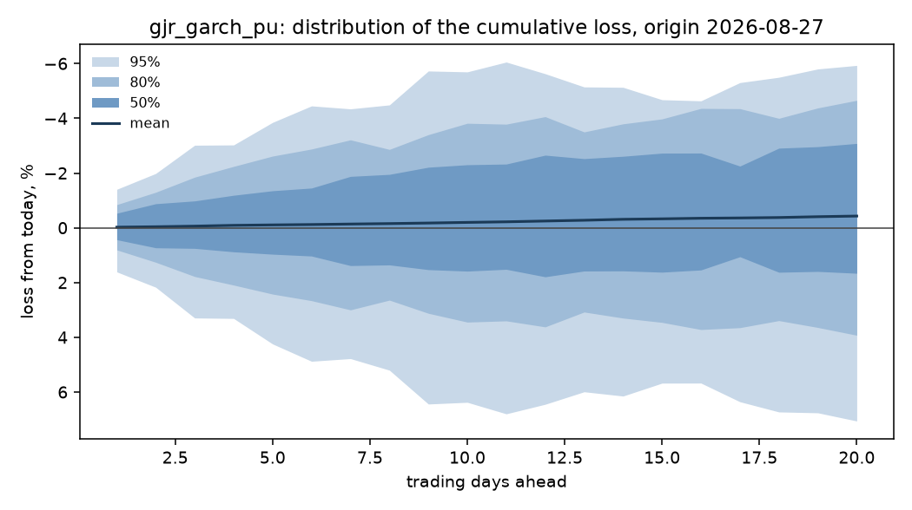

# Holding-period risk: sp500

Run `912cedb84dabf730`, git `aedb84903990`, expanding window, 10,000 simulated paths per origin.

Acceptance check A4: 1.63% of the run's rows are typed failures against a 1% limit, and 0.00% on the expanding window this decision is read from. A failure on the other window cannot reach the numbers below, but it is stated here rather than left in the manifest.

The quantity forecast is the cumulative move over h trading days, log(p_t+h / p_t), converted to a loss as 1 - exp(r). Phase 1 established that the mean of this series is not forecastable, so the point forecast is fixed at zero and everything below is about the spread.

## Conformal calibration (P4), window 60

Interval widths are corrected from the most recent 60 eligible past origins, eligible meaning origins whose h-step outcome had already landed by the origin being corrected. The correction is applied to the expanding window only, which is the window the decision is read from. Rows from the other window are dropped below; they were never scored either way, so the row count falls by about half without any evidence being discarded.

All 20000 scored test rows had the full calibration set available, so none were excluded.

## Gate decision: GO

Primary model `gjr_garch_pu`, registered as 2026-09-26 (gate.yaml b3df56cd2577, commit aedb84903990).

| check | h | level | result | detail |
|---|---|---|---|---|
| coverage | 1 | 80% | pass | 0.830 against [0.75, 0.85] |
| kupiec | 1 | 80% | pass | p = 0.2792 against alpha 0.0043 |
| independence | 1 | 80% | pass | p = 0.1274 against alpha 0.0043 |
| coverage | 1 | 95% | pass | 0.970 against [0.91, 0.98] |
| kupiec | 1 | 95% | pass | p = 0.1622 against alpha 0.0043 |
| independence | 1 | 95% | pass | p = 0.5413 against alpha 0.0043 |
| crps | 1 | - | pass | 0.9077 of zero_return_fhs, must be below 1.0 |
| coverage | 5 | 80% | pass | 0.805 against [0.75, 0.85] |
| kupiec | 5 | 80% | pass | p = 0.8592 against alpha 0.0043 |
| independence | 5 | 80% | pass | p = 0.2595 against alpha 0.0043 |
| coverage | 5 | 95% | pass | 0.970 against [0.91, 0.98] |
| kupiec | 5 | 95% | pass | p = 0.1622 against alpha 0.0043 |
| independence | 5 | 95% | pass | p = 0.5776 against alpha 0.0043 |
| crps | 5 | - | pass | 0.9592 of zero_return_fhs, must be below 1.0 |
| coverage | 20 | 80% | pass | 0.825 against [0.75, 0.85] |
| kupiec | 20 | 80% | pass | p = 0.3689 against alpha 0.0043 |
| independence | 20 | 80% | pass | p = 0.3801 against alpha 0.0043 |
| coverage | 20 | 95% | pass | 0.935 against [0.91, 0.98] |
| kupiec | 20 | 95% | pass | p = 0.3512 against alpha 0.0043 |
| independence | 20 | 95% | pass | p = 0.8643 against alpha 0.0043 |
| crps | 20 | - | pass | 0.9508 of zero_return_fhs, must be below 1.0 |

## Calibration of the loss distribution

| model | h | n | cov_80 | kupiec_p_80 | ind_p_80 | cov_95 | kupiec_p_95 | crps |
|---|---|---|---|---|---|---|---|---|
| garch | 1 | 200 | 0.8200 | 0.4737 | 0.2495 | 0.9650 | 0.3047 | 0.0049 |
| garch_pu | 1 | 200 | 0.8150 | 0.5923 | 0.3336 | 0.9650 | 0.3047 | 0.0049 |
| gjr_garch | 1 | 200 | 0.8300 | 0.2792 | 0.2892 | 0.9750 | 0.0737 | 0.0048 |
| gjr_garch_pu | 1 | 200 | 0.8300 | 0.2792 | 0.1274 | 0.9700 | 0.1622 | 0.0048 |
| zero_return_fhs | 1 | 200 | 0.8400 | 0.1461 | 0.0178 | 0.9850 | 0.0080 | 0.0053 |
| garch | 5 | 200 | 0.7950 | 0.8601 | 0.4499 | 0.9600 | 0.5020 | 0.0111 |
| garch_pu | 5 | 200 | 0.8050 | 0.8592 | 0.8030 | 0.9600 | 0.5020 | 0.0111 |
| gjr_garch | 5 | 200 | 0.8000 | 1.0000 | 0.1724 | 0.9650 | 0.3047 | 0.0111 |
| gjr_garch_pu | 5 | 200 | 0.8050 | 0.8592 | 0.2595 | 0.9700 | 0.1622 | 0.0111 |
| zero_return_fhs | 5 | 200 | 0.8400 | 0.1461 | 0.3464 | 0.9550 | 0.7416 | 0.0115 |
| garch | 20 | 200 | 0.8250 | 0.3689 | 0.6837 | 0.9600 | 0.5020 | 0.0197 |
| garch_pu | 20 | 200 | 0.8150 | 0.5923 | 0.9550 | 0.9600 | 0.5020 | 0.0197 |
| gjr_garch | 20 | 200 | 0.8150 | 0.5923 | 0.6052 | 0.9600 | 0.5020 | 0.0196 |
| gjr_garch_pu | 20 | 200 | 0.8250 | 0.3689 | 0.3801 | 0.9350 | 0.3512 | 0.0196 |
| zero_return_fhs | 20 | 200 | 0.8650 | 0.0160 | 0.0625 | 0.9650 | 0.3047 | 0.0206 |

## Value at risk and expected shortfall

Losses are fractions of the position, so 0.05 is a 5% loss. `var_mean_loss` is the average VaR the model quoted; `es_mean_loss` is the average loss it expected given a breach. `es_ok` is whether a bootstrap interval on realised minus predicted covers zero: NO, with a negative bias, means breaches were worse than the model said. `not tested` means fewer than ten breaches, which is not a pass: at these sample sizes most tail rows say nothing either way.

| model | h | var_p | var_mean_loss | es_mean_loss | breaches | expected | kupiec_p | es_breaches | es_bias | es_ok |
|---|---|---|---|---|---|---|---|---|---|---|
| garch | 1 | 0.9500 | 0.0173 | 0.0226 | 7 | 10.0000 | 0.3047 | 7 | not tested | not tested |
| garch_pu | 1 | 0.9500 | 0.0173 | 0.0226 | 7 | 10.0000 | 0.3047 | 7 | not tested | not tested |
| gjr_garch | 1 | 0.9500 | 0.0168 | 0.0223 | 8 | 10.0000 | 0.5020 | 8 | not tested | not tested |
| gjr_garch_pu | 1 | 0.9500 | 0.0170 | 0.0224 | 8 | 10.0000 | 0.5020 | 8 | not tested | not tested |
| zero_return_fhs | 1 | 0.9500 | 0.0222 | 0.0292 | 7 | 10.0000 | 0.3047 | 7 | not tested | not tested |
| garch | 1 | 0.9750 | 0.0235 | 0.0268 | 4 | 5.0000 | 0.6391 | 4 | not tested | not tested |
| garch_pu | 1 | 0.9750 | 0.0233 | 0.0268 | 4 | 5.0000 | 0.6391 | 4 | not tested | not tested |
| gjr_garch | 1 | 0.9750 | 0.0228 | 0.0265 | 4 | 5.0000 | 0.6391 | 4 | not tested | not tested |
| gjr_garch_pu | 1 | 0.9750 | 0.0227 | 0.0266 | 4 | 5.0000 | 0.6391 | 4 | not tested | not tested |
| zero_return_fhs | 1 | 0.9750 | 0.0305 | 0.0367 | 3 | 5.0000 | 0.3283 | 3 | not tested | not tested |
| garch | 1 | 0.9950 | 0.0321 | 0.0379 | 2 | 1.0000 | 0.3779 | 2 | not tested | not tested |
| garch_pu | 1 | 0.9950 | 0.0319 | 0.0382 | 2 | 1.0000 | 0.3779 | 2 | not tested | not tested |
| gjr_garch | 1 | 0.9950 | 0.0303 | 0.0376 | 3 | 1.0000 | 0.1061 | 3 | not tested | not tested |
| gjr_garch_pu | 1 | 0.9950 | 0.0306 | 0.0377 | 3 | 1.0000 | 0.1061 | 3 | not tested | not tested |
| zero_return_fhs | 1 | 0.9950 | 0.0435 | 0.0597 | 3 | 1.0000 | 0.1061 | 3 | not tested | not tested |
| garch | 5 | 0.9500 | 0.0387 | 0.0477 | 13 | 10.0000 | 0.3512 | 13 | -0.0031 | yes |
| garch_pu | 5 | 0.9500 | 0.0385 | 0.0476 | 13 | 10.0000 | 0.3512 | 13 | -0.0032 | yes |
| gjr_garch | 5 | 0.9500 | 0.0391 | 0.0511 | 12 | 10.0000 | 0.5287 | 12 | -0.0023 | yes |
| gjr_garch_pu | 5 | 0.9500 | 0.0394 | 0.0515 | 12 | 10.0000 | 0.5287 | 12 | -0.0017 | yes |
| zero_return_fhs | 5 | 0.9500 | 0.0406 | 0.0595 | 7 | 10.0000 | 0.3047 | 7 | not tested | not tested |
| garch | 5 | 0.9750 | 0.0532 | 0.0567 | 4 | 5.0000 | 0.6391 | 4 | not tested | not tested |
| garch_pu | 5 | 0.9750 | 0.0530 | 0.0568 | 3 | 5.0000 | 0.3283 | 3 | not tested | not tested |
| gjr_garch | 5 | 0.9750 | 0.0555 | 0.0617 | 3 | 5.0000 | 0.3283 | 3 | not tested | not tested |
| gjr_garch_pu | 5 | 0.9750 | 0.0552 | 0.0624 | 2 | 5.0000 | 0.1228 | 2 | not tested | not tested |
| zero_return_fhs | 5 | 0.9750 | 0.0584 | 0.0711 | 5 | 5.0000 | 1.0000 | 5 | not tested | not tested |
| garch | 5 | 0.9950 | 0.0675 | 0.0789 | 2 | 1.0000 | 0.3779 | 2 | not tested | not tested |
| garch_pu | 5 | 0.9950 | 0.0669 | 0.0792 | 2 | 1.0000 | 0.3779 | 2 | not tested | not tested |
| gjr_garch | 5 | 0.9950 | 0.0732 | 0.0885 | 2 | 1.0000 | 0.3779 | 2 | not tested | not tested |
| gjr_garch_pu | 5 | 0.9950 | 0.0723 | 0.0904 | 2 | 1.0000 | 0.3779 | 2 | not tested | not tested |
| zero_return_fhs | 5 | 0.9950 | 0.0709 | 0.0981 | 3 | 1.0000 | 0.1061 | 3 | not tested | not tested |
| garch | 20 | 0.9500 | 0.0655 | 0.0938 | 12 | 10.0000 | 0.5287 | 12 | -0.0010 | yes |
| garch_pu | 20 | 0.9500 | 0.0645 | 0.0937 | 12 | 10.0000 | 0.5287 | 12 | -0.0012 | yes |
| gjr_garch | 20 | 0.9500 | 0.0681 | 0.1086 | 11 | 10.0000 | 0.7493 | 11 | 0.0133 | yes |
| gjr_garch_pu | 20 | 0.9500 | 0.0679 | 0.1100 | 11 | 10.0000 | 0.7493 | 11 | 0.0127 | yes |
| zero_return_fhs | 20 | 0.9500 | 0.0703 | 0.1075 | 9 | 10.0000 | 0.7416 | 9 | not tested | not tested |
| garch | 20 | 0.9750 | 0.0790 | 0.1124 | 7 | 5.0000 | 0.3925 | 7 | not tested | not tested |
| garch_pu | 20 | 0.9750 | 0.0797 | 0.1124 | 7 | 5.0000 | 0.3925 | 7 | not tested | not tested |
| gjr_garch | 20 | 0.9750 | 0.0858 | 0.1338 | 2 | 5.0000 | 0.1228 | 2 | not tested | not tested |
| gjr_garch_pu | 20 | 0.9750 | 0.0855 | 0.1361 | 6 | 5.0000 | 0.6604 | 6 | not tested | not tested |
| zero_return_fhs | 20 | 0.9750 | 0.0896 | 0.1238 | 4 | 5.0000 | 0.6391 | 4 | not tested | not tested |
| garch | 20 | 0.9950 | 0.1491 | 0.1582 | 2 | 1.0000 | 0.3779 | 2 | not tested | not tested |
| garch_pu | 20 | 0.9950 | 0.1510 | 0.1584 | 2 | 1.0000 | 0.3779 | 2 | not tested | not tested |
| gjr_garch | 20 | 0.9950 | 0.1720 | 0.1986 | 1 | 1.0000 | 1.0000 | 1 | not tested | not tested |
| gjr_garch_pu | 20 | 0.9950 | 0.1756 | 0.2052 | 1 | 1.0000 | 1.0000 | 1 | not tested | not tested |
| zero_return_fhs | 20 | 0.9950 | 0.1580 | 0.1579 | 2 | 1.0000 | 0.3779 | 2 | not tested | not tested |

## The distribution from the latest origin

## What this does not tell you

- The distribution is conditional on the volatility state at the origin and on the assumption that tomorrow's shocks resemble the standardised residuals of the training window. A shock unlike anything in the sample is outside it.
- Expected shortfall is estimated from simulated paths, so its tail accuracy is bounded by the number of paths and by the empirical residual sample behind them.
- Coverage is measured over the test origins as a whole. Calibration over a long sample does not guarantee calibration in any particular month.