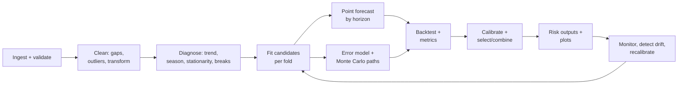

# Multi-Horizon Forecasting and Uncertainty System: Research Review and Design

> Snapshot of the Claude Docs page https://claude.ai/code/artifact/0c667958-fdfe-4001-a11e-2fba23f66803 (revision 17), exported 22 Sep 2026.
> The Claude Docs page is where this document is edited; refresh this file when it changes.

2026-09-22 · Kislay Kumar

## 1. Executive summary

**Verdict: the idea is worth building, but not as proposed.** Moving averages should be a baseline and a trend-extraction tool, not the forecasting engine. The accuracy targets (MAE 3%, MAPE 35%) cannot be judged without a dataset, horizon and baseline, and MAPE should not be the headline metric. Monte Carlo is useful only if the model it simulates is calibrated; 1,000 paths is enough for medians and 80% bands, not for 1% tails.

**What to build instead**

| Layer | Original proposal | Recommended |
|---|---|---|
| Point forecast | Moving averages | ETS (incl. damped trend) + ARIMA + Theta, selected or combined by rolling-origin backtest; MA and naive as baselines |
| Trend | MA smoothing | STL / local-level-trend state (ETS or Kalman); MA only for descriptive plots |
| Uncertainty | Monte Carlo on residuals | Simulate from the fitted state-space model, with bootstrapped (block) forecast errors; add GARCH-type variance only if tests show volatility clustering |
| Trials | 1,000 | 1,000 for exploration; 10,000 for production quantiles to 5/95%; 100,000+ for probabilities below 1% |
| Accuracy target | MAE 3%, MAPE 35% | MASE < 1 vs. seasonal-naive at every horizon, significant by Diebold-Mariano (HLN), plus calibrated intervals (80% PI covers 75-85%) and lower CRPS than baselines |
| Long-horizon uncertainty | Target 35% MAPE | Report whatever the backtest shows: an error-vs-horizon curve and interval-width-vs-horizon curve, not a fixed number |
| Validation | Unspecified | Rolling-origin walk-forward, many origins, horizon-by-horizon scoring, no look-ahead in preprocessing |

**Why, in three sentences.** Forecasting competitions with thousands of series (M3, M4, M5) show simple exponential-smoothing-family methods and their combinations are hard to beat, and that moving averages add little over them. Prediction intervals from classical models are known to be too narrow out of sample, so uncertainty must be validated by empirical coverage, not assumed. The distinction between short-term accuracy and long-term uncertainty is coherent only when both are measured on the same backtest as functions of horizon.

**Before any modelling, three things are required:** the actual series (frequency, length, units), the decision the forecast feeds (and its cost of over- vs. under-forecasting), and the horizons that decision needs. Section 2 lists these as open questions.

## 2. Problem definition

The system should produce, for a univariate (or small set of) time series y_1..y_T, a **predictive distribution** of y_{T+h} for every horizon h = 1..H, plus the joint distribution of the path y_{T+1..T+H}, and prove by backtest that both are better than simple baselines.

**Precise meaning of "trend forecasting".** In decomposition terms y_t = T_t + S_t + R_t (trend-cycle, seasonal, remainder). Trend forecasting means forecasting the future path of T_t, the slowly varying local level and slope. It is different from (a) describing the past trend, which is what a centred moving average does, and (b) forecasting y itself, which also needs S_t and the distribution of R_t. The proposal conflates all three.

**Two separate deliverables, often confused**

| Deliverable | Question it answers | Scored by |
|---|---|---|
| Point forecast | What single number minimises expected loss at horizon h? | MAE / RMSE / MASE (the loss decides which point: median for MAE, mean for RMSE) |
| Probabilistic forecast | What is the full distribution of outcomes at h, and of the path? | CRPS, pinball loss, interval coverage and width |
| Scenario simulation (Monte Carlo) | What is the distribution of a path-dependent quantity (cumulative total, max drawdown, first time below a threshold)? | Calibration of those derived probabilities on backtest |

Monte Carlo is only strictly needed for the third row. For marginal quantiles at each h, many models have closed-form intervals.

**Open questions that change the design** (answers needed before Phase 1)

| Question | Why it matters |
|---|---|
| What is the series, its frequency and length? | Sets seasonality period m, feasible horizons, whether ML is viable (needs many series or long history) |
| Is it strictly positive and far from zero? | MAPE is undefined or explosive near zero; decides log vs. Box-Cox transform |
| What decision consumes the forecast, at what lead time? | Defines the horizons that matter and the loss function (asymmetric costs imply a quantile, not the mean) |
| One series or many related series? | Many series makes global models (LightGBM, N-HiTS) competitive; one series usually does not |
| Are there known drivers (price, promotions, macro variables)? | Enables regression/ARIMAX; also creates leakage risk if drivers are not known at forecast time |
| What threshold events matter for risk? | Defines P(y > u), P(y < l), expected shortfall targets for the MC layer |

**Assumption used below:** a single positive series at monthly or weekly frequency with 5+ years of history, which is the typical case for this kind of proposal. Where a different frequency changes the answer, the document says so.

## 3. Critical assessment of the original idea

Six of the proposal's assumptions fail under scrutiny; none is fatal once replaced. The table lists each, then a small experiment backs the two biggest claims with numbers.

| # | Assumption in the proposal | Problem | Replacement |
|---|---|---|---|
| 1 | Moving averages give robust trend forecasts | A trailing k-period SMA lags a linear trend by (k-1)/2 periods and its flat forecast ignores slope, so bias grows linearly with h. A centred MA is a descriptive smoother: its last (k-1)/2 values need future data (end-point problem). SMA is optimal only for a constant mean plus i.i.d. noise. SES dominates it for the common random-walk-plus-noise case (Muth, 1960). | MA as baseline and descriptive trend; ETS / ARIMA / Theta as forecasters |
| 2 | Monte Carlo produces uncertainty analysis | MC samples from whatever model it is given. It reduces sampling noise, not model error. 1,000 paths from a misspecified model are 1,000 wrong paths. | Validate coverage and CRPS on backtest first; then simulate |
| 3 | 1,000 trials is enough | Enough for the median and 80% band; too few for 1% tails or rare threshold probabilities (numbers below) | Choose N from the Monte Carlo standard error you can tolerate |
| 4 | Short-term MAE 3% and long-term MAPE 35% are targets | Two different metrics, no stated scale, horizon, or baseline. A 3% error is trivial for a smooth aggregate and impossible for a volatile one. MAPE is undefined at zero, explodes near zero, and rewards under-forecasting. | MASE and skill vs. baselines per horizon, plus CRPS and coverage |
| 5 | "Long-term uncertainty" equals a large MAPE | MAPE is a point-accuracy measure, not a measure of uncertainty. Uncertainty is the spread of the predictive distribution, judged by calibration and sharpness. | Report interval width vs. h and coverage vs. h |
| 6 | A single pipeline works across horizons | The best model differs by horizon (short: level/noise; long: trend damping, regime, mean reversion). | Horizon-specific model selection or combination |

**Hidden leakage risks in the proposal's steps.** Centred moving averages, STL fitted on the whole series, scaling or outlier rules estimated on all data, choosing the MA window or the differencing order using the test period, and tuning on the same origins used for final scoring. Each lets future information shape past forecasts and inflates accuracy.

**Overfitting risks.** Picking k (MA window), smoothing parameters and model family by test error is a search over many hypotheses; the winner's score is optimistically biased. Use nested rolling-origin validation and report the full comparison, not only the winner.

### Evidence from a small experiment

I ran a rolling-origin backtest on synthetic monthly series (240 points, level about 100, 8 replicates per process, 13 origins each, horizons 1 to 24) to test the proposal's core claims. MASE is scaled by in-sample seasonal-naive MAE; below 1 beats that benchmark.

**Point accuracy, MASE by horizon, local-linear-trend process**

| Method | h=1 | h=2-3 | h=4-12 | h=13-24 |
|---|---|---|---|---|
| Naive (last value) | 0.36 | 0.42 | 0.75 | 1.48 |
| SMA-12 (flat) | 0.58 | 0.66 | 1.03 | 1.77 |
| SMA-12 + slope | 0.51 | 0.57 | 0.92 | 1.54 |
| SES | 0.35 | 0.42 | 0.77 | 1.50 |
| Holt damped (ETS A,Ad,N) | 0.34 | 0.41 | 0.69 | 1.25 |
| ARIMA(1,1,1)+drift | 0.35 | 0.41 | 0.71 | 1.25 |

- **SMA-12 was 61% worse than the naive forecast at h=1** (0.58 vs. 0.36) and never beat it at any horizon.
- On the seasonal process, only the seasonal model (Holt-Winters damped) beat seasonal-naive (MASE 0.42 at h=1, 0.90 at h=13-24). SMA scored 0.59 to 2.14.
- After a trend reversal, ARIMA with drift was worst at long horizons (MASE 2.51) because it kept extrapolating the old slope; damped trend degraded least (1.65).
- The same processes gave MAPE of 1-6%, purely because the level sits near 100. Moving the level to 10 would multiply MAPE roughly tenfold with identical forecasts. That is why a percentage target without a scale means nothing.

**Calibration of nominal 80% intervals (ETS A,Ad,N)**

| Process | h=1 | h=2-3 | h=4-12 | h=13-24 |
|---|---|---|---|---|
| Local linear trend (model roughly right) | 82% | 84% | 81% | 77% |
| Trend reversal + variance jump | 56% | 58% | 53% | 46% |
| Seasonal, model ignores seasonality | 66% | 80% | 99% | 100% |

Bootstrapped Monte Carlo (1,000 paths per origin) gave almost the same coverage as the analytic intervals in every row. **Simulation did not fix a wrong model.** In the misspecified seasonal case, intervals were both too narrow at h=1 and useless (width 79% of the level) at long horizons.

**Monte Carlo sampling error, by contrast, is small and predictable.** Standard error of an estimated quantile, as a share of the interval half-width:

| Paths N | 95th pct, Normal | 99th pct, Normal | 99th pct, Student-t(3) | P(exceed) SE at p=1% | P(exceed) SE at p=0.1% |
|---|---|---|---|---|---|
| 1,000 | 3.9% | 5.0% | 11.1% | ±32% relative | ±100% relative |
| 10,000 | 1.3% | 1.7% | 3.5% | ±10% relative | ±32% relative |
| 100,000 | 0.4% | 0.5% | 1.2% | ±3% relative | ±10% relative |

Conclusion: model error (coverage 46% instead of 80%) is an order of magnitude larger than Monte Carlo error at N = 1,000. Spend effort on the model and its validation first; raise N only for tail quantities.

*These are synthetic results that illustrate mechanisms. They are not evidence about the user's real series.*

## 4. Literature review

The evidence from large forecasting competitions is consistent: for single series with modest history, exponential smoothing, ARIMA, Theta and their combinations are the methods to beat; ML wins mainly with many related series and exogenous drivers. Items marked **[est.]** are established results; **[rec.]** are my recommendations.

### 4.1 What the large-scale evidence says

| Study | Setting | Finding relevant here |
|---|---|---|
| [M4, Makridakis et al. 2020](https://www.sciencedirect.com/science/article/pii/S0169207019301128) | 100,000 series, 61 methods | [est.] Top methods were combinations of mostly statistical methods. Simple Comb (mean of SES, Holt, damped) had OWA 0.898. Winner (ES-RNN hybrid) 0.821, about 9% better. Pure ML benchmarks ranked near the bottom (MLP 59th). Winner's 95% PIs covered 94.8%; naive's covered 86.4%. |
| [M5 accuracy, Makridakis et al. 2022](https://www.sciencedirect.com/science/article/pii/S0169207021001874) | 42,840 hierarchical Walmart series with prices, events | [est.] LightGBM ensembles won, 22.4% better than the best exponential-smoothing benchmark. Gains came from cross-series learning and exogenous variables, and shrank to about 3% at the most disaggregated level. |
| [M5 uncertainty](https://www.sciencedirect.com/science/article/pii/S0169207021001722) | Same data, 9 quantiles | [est.] Probabilistic forecasts scored with scaled pinball loss; quantile-based ML again led at aggregated levels. |
| [Makridakis et al. 2018, PLOS ONE](https://journals.plos.org/plosone/article?id=10.1371/journal.pone.0194889) | 1,045 M3 monthly series | [est.] Eight statistical methods beat eight ML methods (MLP, RNN, LSTM, etc.) at all horizons, at far lower compute. |
| [Zeng et al. 2023, AAAI](https://ojs.aaai.org/index.php/AAAI/article/view/26317) | Long-horizon benchmarks | [est.] A one-layer linear model (DLinear) beat several published Transformer forecasters. |
| [Petropoulos et al. 2022](https://research.monash.edu/en/publications/forecasting-theory-and-practice) | 80-author review | [est.] Encyclopaedic reference; supports combinations, proper scoring, and rolling-origin evaluation. |

**Disagreement in the literature.** M4/M3 favour statistical methods for single series; M5 shows ML dominance when there are many related series and covariates. Both are right in their setting. The deciding variable is data volume and covariates, not model fashion. Foundation models (e.g. [Chronos](https://arxiv.org/abs/2403.07815)) report strong zero-shot results, but benchmark leakage and evaluation protocol are actively debated, so they must be tested on this data like any other challenger.

### 4.2 Classical point-forecasting methods

| Method | What it assumes | Strength | Weakness | Role here [rec.] |
|---|---|---|---|---|
| Simple MA (trailing, k) | Constant mean + i.i.d. noise | Transparent, robust to single outliers when k large | Lags trend by (k-1)/2; flat forecast; equal weights; hard window cutoff | Baseline only |
| Weighted MA | Same, recency matters | Less lag than SMA | Weights ad hoc, no likelihood, no intervals | Skip (dominated by EMA/SES) |
| Centred MA / MA of MA (2x12) | Local polynomial trend | Classical trend-cycle estimate ([fpp3 3.3](https://otexts.com/fpp3/moving-averages.html)) | Needs future data at end: not a forecaster | Descriptive trend plots only |
| EMA = SES | Random walk + noise (local level) | Optimal for ARIMA(0,1,1); has a state-space form with likelihood and intervals | No trend or seasonality | Baseline + short-horizon candidate |
| Holt linear | Local level + local slope | Captures trend | Extrapolates trend forever: over-forecasts at long h | Use damped version instead |
| Damped trend (Gardner-McKenzie) | Slope decays by phi^h | Repeatedly one of the most accurate single methods in M-competitions | phi near 1 behaves like Holt | Primary candidate |
| Holt-Winters / ETS | Level, trend, season with additive or multiplicative errors (30 variants) | Automatic selection by AICc; exact simulation paths (Hyndman et al. 2002; [fpp3 ch. 8](https://otexts.com/fpp3/expsmooth.html)) | Single seasonality; struggles with breaks | Primary candidate |
| ARIMA / SARIMA | Stationary after differencing | Captures autocorrelation ETS misses | Order selection noisy; drift term can extrapolate badly after breaks (seen in Section 3) | Primary candidate |
| Theta | SES + half the linear trend | Won M3; equivalent to SES with drift | Few knobs | Candidate and combination member |
| Structural state-space / Kalman | Explicit latent level, slope, season with Gaussian noise | Handles missing data natively; smoothed trend estimates; parameter uncertainty via Bayesian variants | More setup | Trend extraction, missing data, and the Bayesian option |

### 4.3 Probabilistic methods

| Method | Key idea | When appropriate |
|---|---|---|
| Analytic PIs | y-hat +/- c x sigma_h; sigma_h = sigma sqrt(h) for random walk ([fpp3 5.5](https://otexts.com/fpp3/prediction-intervals.html)) | Gaussian, homoskedastic residuals |
| Model-based simulation | Simulate the state-space recursion with sampled errors | Any ETS/ARIMA; gives full paths |
| Residual bootstrap | Resample in-sample residuals into the simulation | Non-Gaussian but i.i.d. errors |
| Block / stationary bootstrap (Kunsch 1989; Politis-Romano 1994) | Resample blocks to keep dependence | Autocorrelated residuals |
| Empirical forecast-error quantiles | Use out-of-sample h-step errors from the backtest directly | Most honest when many origins exist |
| Conformal (split / adaptive, Gibbs-Candes 2021) | Calibrate interval width on recent out-of-sample errors | Coverage guarantees under weak exchangeability; adaptive version tracks drift |
| GARCH on residuals (Engle 1982; Bollerslev 1986) | Time-varying conditional variance | Volatility clustering (ARCH-LM test significant) |
| Regime switching (Hamilton 1989) | Parameters depend on a hidden Markov state | Recurring, identifiable regimes with enough episodes |
| Bayesian state space | Posterior over parameters and states | Short series, need for parameter uncertainty, prior knowledge |

Classical PIs are known to be too narrow out of sample because they ignore parameter and model uncertainty ([Chatfield 1993](https://www.tandfonline.com/doi/abs/10.1080/07350015.1993.10509938)). The M4 naive benchmark's 86% coverage for a nominal 95% is a concrete example. Calibration must therefore be checked empirically.

### 4.4 Modern methods: do they belong here?

| Method | Needs | Verdict for a single series [rec.] |
|---|---|---|
| Prophet ([Taylor & Letham 2018](https://peerj.com/preprints/3190/)) | Daily data with holidays, multiple seasonalities | Only if data are daily/sub-daily with calendar effects. Its piecewise-linear trend extrapolates the last slope and its intervals assume the future has the same average changepoint rate. Test as a challenger, do not default to it. |
| Gradient-boosted trees (LightGBM) | Many series or rich covariates; lag features | Strong in M5 setting; weak for one short series (cannot extrapolate trends beyond training range without detrending). Add in Phase 3 only if covariates exist. |
| Random forests | As GBT | Same limitation, usually weaker than GBT. Skip. |
| RNN / LSTM / GRU / TCN | Thousands of series or very long history | Not justified for one series. |
| Transformers (Informer, Autoformer, PatchTST) | Large datasets | Not justified; DLinear result shows gains are fragile. |
| N-BEATS / N-HiTS | Many series (global training) | Strong on M4, but trained across 100k series. Justified only for a panel. |
| DeepAR, TFT | Panels with covariates | Probabilistic by design; overkill for one series. |
| Foundation models (Chronos, TimesFM, Moirai) | Nothing at fit time (zero-shot) | Cheap to try as a challenger. Keep only if it beats the ETS/ARIMA combination on the same backtest. |

**Bottom line.** Moving averages are one component (baseline and descriptive trend), not the forecasting engine. The engine is a small, well-validated ensemble of state-space methods, with modern models admitted only through the same backtest gate.

## 5. Recommended methodology and mathematical formulation

The recommended method is a backtest-gated ensemble of state-space forecasters, with uncertainty from simulated paths whose error distribution is taken from out-of-sample forecast errors and recalibrated per horizon.

### 5.1 Methodology in seven steps [rec.]

1. Transform to a scale where errors are roughly additive and homoskedastic (log or Box-Cox with lambda chosen on training data only).
2. Fit a candidate set: naive, seasonal naive, SMA, SES, damped trend ETS (auto-selected), SARIMA (auto-selected), Theta.
3. Run rolling-origin backtests; score each method per horizon bucket with MASE and CRPS.
4. Build the point forecast as the equal-weight mean (or median) of the top 2-4 methods per horizon bucket. Equal weights are hard to beat and do not overfit ([Wang et al. 2023 review](https://www.sciencedirect.com/science/article/pii/S0169207022001480)).
5. Simulate N paths from each member model, drawing errors by block bootstrap of residuals; pool paths across members (a mixture, which adds model uncertainty).
6. Check coverage per horizon on the backtest; if miscalibrated, widen or shrink by an empirical (conformal) correction factor per horizon.
7. Compute quantiles, threshold probabilities and path risk metrics from the calibrated paths.

### 5.2 Moving averages and their bias

Simple, weighted and exponential moving averages with window k, weights w_j, smoothing alpha:

```math
\text{SMA}_T=\frac{1}{k}\sum_{j=0}^{k-1}y_{T-j},\qquad \text{WMA}_T=\sum_{j=0}^{k-1}w_jy_{T-j},\ \sum_j w_j=1,\qquad \ell_T=\alpha y_T+(1-\alpha)\ell_{T-1}=\sum_{j\ge0}\alpha(1-\alpha)^j y_{T-j}
```

For a series with linear trend y_t = a + b t, the MA forecast bias at horizon h is:

```math
\mathbb{E}[y_{T+h}-\text{SMA}_T]=b\left(h+\frac{k-1}{2}\right)
```

With k = 12 and slope b, the error at h = 1 is already 6.5b. This is the mechanism behind the poor SMA scores in Section 3.

### 5.3 Trend component and forecast function

Use the additive damped-trend ETS state-space model (innovations form), where epsilon_t are the one-step innovations:

```math
\begin{aligned}
y_t&=\ell_{t-1}+\phi b_{t-1}+s_{t-m}+\varepsilon_t\\
\ell_t&=\ell_{t-1}+\phi b_{t-1}+\alpha\varepsilon_t\\
b_t&=\phi b_{t-1}+\beta\varepsilon_t\\
s_t&=s_{t-m}+\gamma\varepsilon_t
\end{aligned}
```

The trend component is T_t = l_t (level) with local slope b_t. The h-step forecast function, with phi in (0.8, 0.98) typically:

```math
\hat y_{T+h|T}=\ell_T+(\phi+\phi^2+\cdots+\phi^h)\,b_T+s_{T+h-m(\lfloor (h-1)/m\rfloor+1)}
```

As h grows, the trend contribution converges to phi b_T / (1 - phi) instead of growing without limit. That is why damped trend is safer at long horizons.

### 5.4 Residual process and error distribution

One-step residuals and h-step forecast errors from the backtest:

```math
e_t=y_t-\hat y_{t|t-1},\qquad e_{t+h|t}=y_{t+h}-\hat y_{t+h|t}
```

Assumed innovation law, from simplest to most flexible: Gaussian N(0, sigma^2); scaled Student-t with nu degrees of freedom (heavy tails); the empirical distribution of residuals (bootstrap). For conditional heteroskedasticity, GARCH(1,1):

```math
\varepsilon_t=\sigma_t z_t,\quad z_t\sim\text{i.i.d.}(0,1),\qquad \sigma_t^2=\omega+a\,\varepsilon_{t-1}^2+g\,\sigma_{t-1}^2
```

For ETS(A,N,N) the analytic h-step variance, showing how uncertainty grows with horizon:

```math
\sigma_h^2=\sigma^2\left[1+(h-1)\alpha^2\right]
```

### 5.5 Monte Carlo trajectory generation

For path i = 1..N, starting from the filtered state x_T = (l_T, b_T, s_T..s_{T-m+1}):

```math
\theta^{(i)}\sim p(\theta\mid y_{1:T})\ \text{(optional)},\quad \varepsilon^{(i)}_{T+1:T+H}\sim F,\quad x^{(i)}_{T+j}=f\!\left(x^{(i)}_{T+j-1},\varepsilon^{(i)}_{T+j};\theta^{(i)}\right),\quad y^{(i)}_{T+j}=g\!\left(x^{(i)}_{T+j-1},\varepsilon^{(i)}_{T+j}\right)
```

Errors enter the state, so a shock at T+1 moves the level for every later step. That propagation is what makes path simulation different from adding independent noise to a point forecast.

### 5.6 Prediction intervals, quantiles, risk metrics

With order statistics of simulated values at horizon h, the central (1 - a) interval and threshold probabilities are:

```math
\text{PI}_{1-a}(h)=\left[\hat Q_{a/2}(h),\ \hat Q_{1-a/2}(h)\right],\qquad \hat P(y_{T+h}>u)=\frac1N\sum_{i=1}^N\mathbf 1\{y^{(i)}_{T+h}>u\}
```

Downside risk at level q (VaR as a quantile; Expected Shortfall as the mean beyond it; path-level barrier probability):

```math
\text{VaR}_q=\hat Q_q,\qquad \text{ES}_q=\mathbb E\left[y\mid y\le \hat Q_q\right],\qquad P_{\text{hit}}(l)=\frac1N\sum_i\mathbf 1\left\{\min_{j\le H}y^{(i)}_{T+j}<l\right\}
```

Monte Carlo standard errors, which set N:

```math
\text{SE}(\hat P)=\sqrt{\frac{p(1-p)}{N}},\qquad \text{SE}(\hat Q_p)\approx\frac{1}{f(Q_p)}\sqrt{\frac{p(1-p)}{N}}
```

### 5.7 Accuracy and calibration metrics

Point metrics over n evaluated forecasts, with MASE scaled by in-sample seasonal-naive MAE (m = 1 for non-seasonal):

```math
\begin{aligned}
\text{MAE}&=\tfrac1n\sum|e_t|,\quad \text{RMSE}=\sqrt{\tfrac1n\sum e_t^2},\quad \text{WAPE}=\frac{\sum|e_t|}{\sum|y_t|}\\
\text{MAPE}&=\tfrac{100}{n}\sum\left|\frac{e_t}{y_t}\right|,\quad \text{sMAPE}=\tfrac{100}{n}\sum\frac{2|e_t|}{|y_t|+|\hat y_t|}\\
\text{MASE}&=\frac{\tfrac1n\sum|e_t|}{\tfrac{1}{T-m}\sum_{t=m+1}^{T}|y_t-y_{t-m}|}
\end{aligned}
```

Probabilistic metrics: pinball loss for quantile q, CRPS (estimated from the N simulated values), interval (Winkler) score, and empirical coverage:

```math
\begin{aligned}
L_q(y,\hat Q_q)&=(\mathbf 1\{y<\hat Q_q\}-q)(\hat Q_q-y)\\
\text{CRPS}(F,y)&\approx\tfrac1N\sum_i|y^{(i)}-y|-\tfrac{1}{2N^2}\sum_{i,j}|y^{(i)}-y^{(j)}|\\
S_a(l,u;y)&=(u-l)+\tfrac2a(l-y)\mathbf 1\{y<l\}+\tfrac2a(y-u)\mathbf 1\{y>u\}\\
\widehat{\text{Cov}}(h)&=\tfrac1{n_h}\sum\mathbf 1\{l_{t,h}\le y_{t+h}\le u_{t,h}\}
\end{aligned}
```

### 5.8 Four kinds of uncertainty

Total predictive variance splits by the law of total variance over model M and parameters theta:

```math
\operatorname{Var}(y_{T+h}\mid\mathcal D)=\underbrace{\mathbb E_{M}\mathbb E_{\theta}\operatorname{Var}(y\mid\theta,M)}_{\text{irreducible}}+\underbrace{\mathbb E_M\operatorname{Var}_{\theta}\mathbb E(y\mid\theta,M)}_{\text{parameter}}+\underbrace{\operatorname{Var}_M\mathbb E(y\mid M)}_{\text{model}}
```

| Type | Meaning | How the system represents it |
|---|---|---|
| Irreducible (random) | Future shocks even with the true model and parameters | Sampling innovations in each path |
| Parameter | Estimated alpha, beta, phi, sigma are uncertain | Bootstrap refits or Bayesian posterior draws per path |
| Model | The functional form itself may be wrong | Mixture of paths across ensemble members; regime checks |
| Forecast uncertainty | The total above, as seen by the user | The simulated predictive distribution, validated by coverage |
| Monte Carlo (numerical) | Noise from finite N, not about the world | Standard errors in 5.6; reduce with larger N |

Only the last one shrinks when N increases. Standard classical intervals capture only the first.

## 6. System architecture, data pipeline and horizons

The pipeline has nineteen components in five stages; the one rule that binds them is that every step fitted on data runs inside each backtest fold, never on the full history.



The loop from monitoring back to fitting is what makes the system adapt to regime change instead of silently degrading.

### 6.1 Why every component exists

| # | Component | Why it exists | Leakage rule |
|---|---|---|---|
| 1 | Ingestion | Single typed, timestamped source of truth; record data vintage | Store as-of timestamps so revised data are not used before they existed |
| 2 | Validation | Catch duplicate/missing timestamps, wrong frequency, negative values, unit changes before they poison fits | Rules are static, safe |
| 3 | Missing values | Most models need regular spacing; bad imputation fakes smoothness | Impute with past-only methods (Kalman smoother within fold, or forward-fill) |
| 4 | Outliers | One spike biases level and inflates sigma | Detect with rolling robust z-score (median/MAD) on past data only; flag, do not delete, and keep an indicator |
| 5 | Transformation | Stabilise variance, make errors additive, keep forecasts positive | Choose Box-Cox lambda per fold |
| 6 | Trend extraction | Describe and diagnose the trend; feed the damped-trend decision | STL / centred MA are for diagnosis only; the forecaster uses the filtered (one-sided) state |
| 7 | Seasonality detection | Decide m and whether a seasonal model is needed (Section 3: ignoring it broke calibration) | STL seasonal strength F_s (fpp3 sec. 4.3) and a significant ACF at lag m (the M4 benchmarks used a 90% ACF test), on training data; confirm by backtest |
| 8 | Stationarity | Decide differencing, and whether long-horizon uncertainty grows without bound (unit root) or saturates (mean reversion) | KPSS + ADF on training data per fold |
| 9 | Model fitting | Estimate parameters by likelihood | Per fold |
| 10 | Short-horizon forecast | Level and noise dominate; needs fast adaptation |  |
| 11 | Long-horizon forecast | Trend damping and mean reversion dominate |  |
| 12 | Residual/error model | Describe the distribution and dependence of errors: the input to simulation | Use out-of-sample errors from inner folds, not in-sample residuals alone |
| 13 | Probabilistic estimation | Turn point forecasts into distributions |  |
| 14 | Monte Carlo | Joint paths for path-dependent quantities; combine uncertainty sources | Seeded, reproducible |
| 15 | Risk metrics | Convert distributions into decisions (exceedance, shortfall) |  |
| 16 | Backtesting | The only honest estimate of future performance | Rolling origin, Section 8 |
| 17 | Evaluation | Compare to baselines with significance tests |  |
| 18 | Visualization | Fan charts and calibration plots reveal what summary metrics hide |  |
| 19 | Monitoring and recalibration | Detect drift, coverage decay and breaks in production |  |

### 6.2 Data pipeline details

- **Frequency regularisation.** Reindex to a complete calendar; record gaps as NaN; never silently aggregate mixed frequencies.
- **Gaps.** Short gaps (at most 2 periods): state-space models skip the update (Kalman handles NaN natively). Long gaps: flag, forecast only from the post-gap segment if the level shifted.
- **Outliers.** Flag |y_t - median| / (1.4826 x MAD) > 4 over a trailing window of 2m; confirm against the one-step residual. Treat as additive outlier (replace for fitting, keep for evaluation) or level shift (a break, see Section 11).
- **Transform.** Log if the series is positive and its variance grows with level; else Box-Cox with lambda estimated per fold; else none. Back-transform simulated paths, not the mean, so bias correction is automatic for quantiles.
- **Reproducibility.** Hash the input data, the config and the random seed into every forecast record.

### 6.3 How to choose horizons

Do not choose horizons by fixed labels. Choose them from four inputs, in this order:

1. **Decision lead times.** The horizons the business actually acts on (e.g. reorder lead time, budget cycle). These are mandatory.
2. **Data frequency and seasonal period m.** Horizons inside one season behave differently from those spanning several seasons.
3. **Autocorrelation structure.** For the stationary part (after differencing or detrending), the lag where the ACF falls inside +/- 2/sqrt(T) marks where conditional information stops helping over the unconditional mean.
4. **Empirical forecastability.** From the backtest, compute the skill of the best model against a reference at each h. The **predictability horizon** h* is the largest h where skill is significantly above zero. Beyond h*, report scenarios and climatological (unconditional) ranges, not forecasts.

```math
\text{SS}(h)=1-\frac{\overline{\text{CRPS}}_{\text{model}}(h)}{\overline{\text{CRPS}}_{\text{ref}}(h)},\qquad h^*=\max\{h:\ \text{SS}(h)>0\ \text{significantly}\}
```

### 6.4 Multi-horizon framework

Buckets are defined relative to m, with a monthly series (m = 12) as the worked example. Final boundaries come from 6.3.

| Bucket | Monthly example | Model [rec.] | Features | Uncertainty | Recalibrate | Metrics |
|---|---|---|---|---|---|---|
| Very short | h = 1 | SES / ETS / ARIMA combination; naive as floor | Last values, level state, AR terms, known calendar effects | One-step residual distribution; GARCH if volatility clusters | Refit every period | MASE, RMSE, pinball at 10/50/90, coverage |
| Short | h = 2 to m/4 (2-3) | ETS + ARIMA combination | Level, slope, AR dynamics | Simulated paths with block-bootstrap errors | Refit every period, re-select monthly | MASE, CRPS, coverage |
| Medium | h up to m (4-12) | Seasonal damped ETS + SARIMA + Theta combination | Season, damped slope | Paths + empirical per-horizon recalibration | Re-select model quarterly | MASE, CRPS, interval score |
| Long | m+1 to 2-3m (13-36), up to h* | Damped trend or mean-reverting model; equal-weight combination | Trend state, season; optionally slow external drivers | Mixture of model paths + parameter uncertainty + widened by backtest coverage | Re-select semi-annually; recalibrate after breaks | CRPS, coverage, width, bias; MASE secondary |
| Beyond h* | past predictability horizon | No forecast; scenario analysis | Explicit assumptions | Scenario ranges and stress paths | On demand | Not scored as a forecast |

## 7. Probabilistic uncertainty and Monte Carlo methodology

Recommended default: simulate paths from each ensemble member's state-space model, drawing innovations by stationary block bootstrap of standardised residuals, pool the paths, then apply a per-horizon empirical calibration factor learned in the backtest. Add GARCH or Bayesian layers only when a diagnostic says they are needed.

### 7.1 Candidate uncertainty models

| Approach | Assumptions | Advantages | Limitations / failure modes | Compute (N paths, H steps) | Use when |
|---|---|---|---|---|---|
| A. i.i.d. residual bootstrap | Errors i.i.d., model correct, future errors like past | No distribution assumption; captures skew and fat tails seen in sample | Misses autocorrelation and volatility clustering; cannot produce errors larger than seen; ignores parameter uncertainty | O(NH), trivial | Ljung-Box and ARCH-LM on residuals pass |
| B. Parametric (Normal, Student-t, skew-t) | Correct family; i.i.d. | Smooth tails, extrapolates beyond sample extremes; closed forms for some models | Normal badly understates tails if kurtosis > 3; family choice drives tail risk | O(NH) + one MLE fit | Short residual history; t chosen when kurtosis high |
| C. Block / stationary bootstrap | Errors stationary and weakly dependent | Keeps short-range dependence and local volatility bursts | Block length choice (use Politis-White 2004 automatic rule); still bounded by observed history; needs many residuals (> 100) | O(NH) | Residual autocorrelation significant |
| D. Conditional volatility (GARCH(1,1) on residuals) | Variance clusters; GARCH form correct | Intervals widen after turbulent periods, narrow in calm ones | Needs long series (hundreds of points); unstable fits on short data; misleading if variance change is a one-off break | O(NH) + GARCH fit | ARCH-LM significant and clustering visible |
| E. Bayesian state-space (PyMC or conjugate Kalman) | Priors and likelihood | Parameter uncertainty is built in; handles missing data; priors help short series | Slow (MCMC minutes per fit x every backtest fold); prior sensitivity; still misses model uncertainty | High: MCMC per fold | Short series, parameter uncertainty material, need to encode expert priors |
| F. Empirical h-step errors + conformal calibration | Future errors exchangeable with recent backtest errors | Directly targets coverage; model-agnostic; adaptive versions track drift | Needs many origins; gives marginal intervals, not joint paths | Low | Always, as the final calibration layer |

**Recommendation [rec.].** C for the paths, with parameter uncertainty added by refitting on a few hundred bootstrap replicates (a cheaper substitute for E), mixed across ensemble members for model uncertainty, then F to calibrate. D replaces C's error draws when volatility clustering is detected. E is reserved for short series (under about 3 seasonal cycles).

**Diagnostics that decide between them**

| Test | On | Triggers |
|---|---|---|
| Ljung-Box at lags m and 2m | One-step residuals | Significant: use block bootstrap (C) |
| ARCH-LM (Engle) | Squared residuals | Significant: add GARCH (D) |
| Jarque-Bera + QQ plot | Residuals | Heavy tails: bootstrap or Student-t, never Normal |
| Rolling residual SD | Residuals | Step change in variance: a break, not GARCH (Section 11) |

### 7.2 Monte Carlo framework

Each path follows the six steps requested, made precise:

1. **Start state.** The filtered state x_T at the forecast origin, not a smoothed value (smoothing uses future data).
2. **Expected trajectory.** Computed separately from the forecast function (5.3); used only as a check that the path mean converges to it.
3. **Sample uncertainty.** Draw theta^(i) (optional parameter draw), then an innovation sequence of length H by block bootstrap.
4. **Propagate.** Run the state recursion so each shock updates level, slope and season, affecting all later steps.
5. **Back-transform** each path to the original scale; clip to feasible range only if physically required, and record how often clipping occurs.
6. **Repeat N times**, in batches, with a seeded generator; stop when Monte Carlo standard errors meet tolerance.

**Choosing N.** Pick the precision needed, then solve the formulas in 5.6. From Section 3's measurements:

| Output needed | N = 1,000 | N = 10,000 | N = 100,000 | Recommended |
|---|---|---|---|---|
| Median, 25-75% band | adequate | ample | wasteful | 1,000 |
| 5th/95th percentiles (SE about 4% vs 1.3% of half-width) | marginal | good | ample | 10,000 |
| 1st/99th percentiles, heavy tails (SE 11% vs 3.5%) | poor | acceptable | good | 10,000-100,000 |
| P(event) = 1% (relative SE 32% vs 10%) | poor | acceptable | good | 10,000+ |
| P(event) = 0.1% | useless | poor | acceptable | 100,000+ or importance sampling |

Compute is rarely the constraint: 100,000 paths x 36 steps is 3.6 million recursion steps, well under a second vectorised in NumPy. The constraint is the backtest, which repeats simulation at every origin; use 1,000-2,000 paths in the backtest and 10,000+ for the production forecast. For path comparisons between scenarios, reuse the same random draws (common random numbers) to cut variance of the difference.

### 7.3 Outputs and why each is useful

| Output | Why it is useful |
|---|---|
| Median (P50) | Optimal point under absolute loss; robust to skew |
| Mean | Optimal under squared loss; needed for totals and budgets (means add, medians do not) |
| P5, P10, P25, P75, P90, P95 | Fan chart; inputs to pinball loss and coverage checks; service-level planning (e.g. stock to P90) |
| 50%, 80%, 95% prediction intervals | Communicate plausible ranges at several confidence levels |
| P(y_{T+h} > u), P(y_{T+h} < l) | Directly answers threshold questions (capacity, budget breach) |
| Barrier probability over the path | Chance of crossing a limit at any time before H: needs paths, not marginals |
| Expected shortfall below l / expected excess above u | Size of the loss when the bad case happens, not only its chance |
| Distribution of cumulative total over horizon | Needed for budgets and inventory; its spread is not the sum of per-step spreads when errors correlate |
| Max drawdown distribution | For cumulative or value series where peak-to-trough losses matter |

### 7.4 How uncertainty grows with horizon

For a random-walk-type process the forecast SD grows as sqrt(h); for damped or mean-reverting processes it grows then saturates at the unconditional SD. Which one applies is an empirical question the backtest answers. The system should report, per horizon h:

| Diagnostic | Computed from | Healthy pattern |
|---|---|---|
| Forecast variance (simulated) | Path spread at h | Increasing, shape consistent with the model class |
| Interval width | Q95 - Q5 per origin, averaged | Increases with h; ratio to empirical error spread near 1 |
| Error vs horizon | MAE, RMSE, CRPS per h | Increases; below baseline at every h up to h* |
| Bias vs horizon | Mean signed error per h | Near 0; a growing bias signals trend extrapolation error |
| Coverage | Share of outcomes inside the nominal interval | Within binomial tolerance of nominal (e.g. 80% +/- 2 SE) |
| PIT histogram | F(y) of each outcome under its forecast | Flat; U-shape = too narrow, hump = too wide |
| Sharpness | Mean width, among calibrated forecasts | As narrow as possible **given** calibration ([Gneiting et al. 2007](https://academic.oup.com/jrsssb/article/69/2/243/7109375)) |

**The 35% MAPE target has no sound interpretation as uncertainty.** MAPE measures the average size of point errors, not the width or calibration of a distribution. The coherent reformulation: "At the long horizon, the 80% interval should cover 80% of outcomes, and its relative half-width is whatever the backtest shows." If the process yields 12%, the system should say 12%; if it yields 60%, it should say 60%. Forcing a number would require artificially widening or narrowing intervals, which breaks calibration.

## 8. Backtesting, evaluation metrics and success criteria

Evaluate with rolling-origin (walk-forward) forecasts at many origins, score each horizon separately against naive, seasonal-naive, SMA and SES baselines, and declare success only when the gain is significant, calibrated and stable across periods.

### 8.1 Data split

| Segment | Share (for about 10 years monthly) | Used for | Touched |
|---|---|---|---|
| Initial training window | First 4-5 years (at least 3 seasonal cycles) | First fit | Every fold |
| Development origins | Next 3-4 years | Model selection, combination weights, calibration factors, block length, window length | Repeatedly (inner loop) |
| Final test origins | Last 1.5-2 years | One final unbiased score of the frozen pipeline | Once |

Random K-fold is valid only for purely autoregressive models with uncorrelated errors ([Bergmeir, Hyndman & Koo 2018](https://robjhyndman.com/publications/cv-time-series/)); for trend/state-space models with a forecasting goal, use the rolling origin ([Tashman 2000](https://www.sciencedirect.com/science/article/abs/pii/S0169207000000650); [Hewamalage et al. 2023](https://arxiv.org/abs/2203.10716)).

### 8.2 Rolling-origin procedure

| Design choice | Options | Recommendation |
|---|---|---|
| Window | Expanding (all history to origin) vs. rolling (last W points) | Run both. Expanding is more efficient under stability; rolling adapts to breaks. The gap between them is itself a drift diagnostic ([Pesaran & Timmermann 2007](https://www.sciencedirect.com/science/article/abs/pii/S0304407606000418)). |
| Origin step | Every period vs. every k | Every period if affordable; otherwise every m/4. More origins = tighter test statistics. |
| Horizons | 1..H at every origin | Score each h separately; never average h = 1 with h = 24 into one number |
| Refit | Every origin vs. update state only | Refit parameters every origin for evaluation fidelity; production may refit less often, and the backtest should mimic production |
| Minimum origins |  | At least 30 per horizon for coverage tests to have power; 50+ preferred |
| Evaluation periods |  | Report metrics separately for distinct eras (e.g. pre/post a known shock) |

**Leakage checklist, applied inside every fold:** transforms, outlier thresholds, imputation, seasonal decomposition, differencing tests, feature scaling, model order, hyperparameters and calibration factors are all fitted using data up to the origin only; any external regressor must be the value that was known at the origin (vintage data), or a forecast of it.

### 8.3 Metrics: which to use and why

| Metric | Measures | Use | Pitfalls |
|---|---|---|---|
| MAE (units) | Average absolute error | Decision cost in natural units; optimal point is the median | Not comparable across series |
| RMSE | Penalises large errors; optimal point is the mean | When big misses cost disproportionately | Dominated by outliers |
| "Percentage MAE" = WAPE (sum abs error / sum actuals) | Scale-free MAE | Business reporting when level is positive and far from zero | Undefined near zero-sum; weighted towards high-volume periods |
| MAPE | Mean of per-point percentage errors | Only for strictly positive series far from zero, and only as a secondary report | Infinite at zero; heavier penalty on over-forecasts, so minimising it biases forecasts low ([Tofallis 2015](https://link.springer.com/article/10.1057/jors.2014.103); [Kolassa 2020](https://www.sciencedirect.com/science/article/abs/pii/S0169207019301359)) |
| sMAPE | Symmetrised MAPE | Comparability with M3/M4 literature only | Not actually symmetric, unstable near zero ([Goodwin & Lawton 1999](https://www.sciencedirect.com/science/article/abs/pii/S0169207099000072)) |
| MASE | MAE relative to in-sample (seasonal) naive | **Primary point metric.** Scale-free, defined at zero, interpretable (below 1 beats naive in-sample) ([Hyndman & Koehler 2006](https://robjhyndman.com/publications/another-look-at-measures-of-forecast-accuracy/)) | Denominator depends on training window; report relative MAE vs. out-of-sample naive too |
| Pinball loss | Quantile accuracy | Per quantile (10/50/90) | One quantile at a time |
| CRPS | Whole predictive distribution; reduces to MAE for a point forecast | **Primary probabilistic metric**; strictly proper ([Gneiting & Raftery 2007](https://www.tandfonline.com/doi/abs/10.1198/016214506000001437)) | Scale-dependent: report as skill vs. baseline |
| Interval (Winkler) score / MSIS | Width + penalty for misses | Compare intervals at one level; M4 used MSIS | Level-specific |
| Coverage | Fraction inside interval | Calibration check, per horizon and level | Coverage alone rewards absurdly wide intervals; pair with width |

**On the proposal's targets.** Percentage MAE and MAPE are both scale-bound, so 3% and 35% can only be judged against the same metric for naive on the same data. Accuracy should be expressed as relative skill: "MASE 0.85 at h = 1, i.e. 15% better than naive". For reference, the M4 winner was about 18% better than the Naive2 benchmark on the combined OWA measure, and the M5 winner 22% better than exponential smoothing. Single-series improvements over a good ETS baseline of 0-10% are typical; claims far above that deserve a leakage audit.

### 8.4 Testing whether an improvement is real

| Question | Test | Notes |
|---|---|---|
| Is model A more accurate than B at horizon h? | Diebold-Mariano with Harvey-Leybourne-Newbold small-sample correction ([HLN 1997](https://www.sciencedirect.com/science/article/abs/pii/S0169207096007194)) on loss differentials, HAC variance with h-1 lags | Run per horizon bucket; use CRPS or absolute error as the loss |
| Nested models or estimated parameters matter? | Giacomini-White (2006) conditional predictive ability | Valid with rolling windows |
| Which of many models are indistinguishable from the best? | Model Confidence Set (Hansen, Lunde & Nason 2011), or Holm-corrected pairwise DM | Controls for testing many candidates |
| Are intervals correctly calibrated? | Kupiec unconditional coverage (binomial LR); Christoffersen independence test (misses should not cluster) | Per horizon; multi-step errors overlap, so use a block bootstrap for the SE when h > 1 |
| Many series? | Friedman + Nemenyi on per-series ranks | Standard for panels |
| Robust CI on metric difference | Moving-block bootstrap of the per-origin loss differences | Distribution-free |

### 8.5 Success criteria [rec.]

A configuration is accepted only if **all** hold on the final test origins:

| # | Criterion | Threshold |
|---|---|---|
| 1 | Beats best simple baseline (naive, seasonal naive, SMA, SES: whichever is best per horizon) | Relative MAE or MASE ratio below 1 at every horizon up to h*; significant (HLN-DM p < 0.05) at the decision horizons |
| 2 | Probabilistic skill | CRPS skill > 0 vs. baseline's bootstrap distribution at every h up to h* |
| 3 | Calibration | 80% PI coverage within [75%, 85%] and 95% within [91%, 98%] per horizon bucket; Kupiec not rejected at 5% |
| 4 | Bias | Mean signed error not significantly different from 0 at short horizons |
| 5 | Stability across periods | Criterion 1 holds in at least 3 of 4 sub-periods of the test set |
| 6 | Robustness | After a simulated or historical break, coverage returns to tolerance within a stated number of periods (e.g. m/2) |
| 7 | Compute | Full forecast + 10,000 paths in under 1 minute per series on a laptop; full backtest overnight at most |

A model that reaches MAE 3% on one split but fails criteria 1, 3 or 5 is rejected.

## 9. Experimental design

Run nine experiments on the same rolling-origin folds, adding one layer of sophistication at a time; each layer must beat the previous one significantly to be kept.

| Exp | Configuration | Hypothesis tested | Keep if |
|---|---|---|---|
| E1 | Naive and seasonal naive | Reference floor | Always kept as baseline |
| E2 | SMA (k in {3, 6, m, 2m}, chosen in inner loop) + WMA | Averaging reduces noise enough to beat naive | Beats E1 at some horizon (unlikely on trending data, per Section 3) |
| E3 | SES / EMA | Exponential weights beat equal weights | Beats E2 at h = 1 |
| E4 | Damped trend + seasonal ETS (auto) and STL + ETS | Explicit trend and season add skill at medium horizons | Beats E3 at h > 1 |
| E5 | SARIMA (auto), Theta, and equal-weight combination of E3-E5 | Combination beats best single method | Combination in Model Confidence Set at every bucket |
| E6 | E5 point forecast + analytic Gaussian PIs | Classical intervals are calibrated | Coverage within tolerance (expected to fail at long h) |
| E7 | E5 + Monte Carlo paths with block bootstrap, parameter refits, model mixture, conformal calibration | Simulation with proper error model improves CRPS and coverage over E6 | Lower CRPS and coverage within tolerance |
| E8 | E7 + GARCH errors or regime-aware refitting | Variance dynamics matter | Only if ARCH-LM significant and CRPS improves |
| E9 | Challenger: LightGBM on lags (if covariates or many series) or a zero-shot foundation model | Modern model adds skill over E5/E7 | Beats E7 on CRPS and MASE, significantly, at acceptable cost |

### 9.1 What to measure for every experiment

| Measure | How |
|---|---|
| Forecast accuracy | MASE, relative MAE vs. E1, RMSE, per horizon bucket |
| Probabilistic quality | CRPS, pinball at 5/10/25/50/75/90/95 |
| Calibration | Coverage at 50/80/95%, PIT histogram, Kupiec test |
| Interval width | Mean and median width relative to level, per h |
| Computational cost | Wall time for fit + forecast + N paths per origin; peak memory |
| Robustness to outliers | Re-run with 1%, 3% of points replaced by +/- 5 SD spikes |
| Robustness to regime change | Re-run on (a) historical break periods, (b) synthetic injections: level shift, slope reversal, variance x 2.5 |
| Horizon profile | All of the above as curves over h, not one average |

### 9.2 Controlled synthetic stress tests

Before touching real data, validate the code on processes where the right answer is known:

| Process | Correct behaviour |
|---|---|
| i.i.d. noise around a constant | SMA/SES approx. equal; nothing beats mean; intervals flat in h |
| Random walk | Naive is optimal; any "improvement" signals leakage; width grows as sqrt(h) |
| Local linear trend | Damped/Holt beat naive at medium h (as in Section 3) |
| Seasonal AR(1) | Only seasonal models beat seasonal naive |
| Trend reversal + variance jump | Coverage drops, then recovers after recalibration: measures recovery time |
| Student-t(3) innovations | Normal PIs undercover in tails; bootstrap does not |

The random-walk test is the most important leakage detector: if the pipeline beats naive on a pure random walk, something is looking at the future.

## 10. Python implementation plan and pseudocode

Keep the proposed layout with four changes: a shared model interface, moving averages folded into baselines, an ensemble module, and a monitoring package. Core dependencies are pandas, NumPy, SciPy, statsmodels and matplotlib; everything else is optional and gated by an experiment.

### 10.1 Package layout

```text
forecasting/
├── core/
│   ├── interfaces.py      # Forecaster protocol: fit / predict / simulate
│   └── config.py          # dataclass config: m, H, horizons, N, seeds, windows
├── data/
│   ├── ingestion.py       # load, typed index, vintage timestamps
│   ├── validation.py      # frequency, duplicates, gaps, sign, unit checks
│   └── preprocessing.py   # fold-safe imputation, outlier flags, Box-Cox
├── analysis/
│   ├── trend.py           # STL, centred MA (descriptive only)
│   ├── seasonality.py     # seasonal strength, ACF at lag m
│   ├── stationarity.py    # ADF, KPSS
│   ├── breaks.py          # CUSUM, PELT change points (ruptures optional)
│   └── diagnostics.py     # Ljung-Box, ARCH-LM, Jarque-Bera
├── models/
│   ├── baselines.py       # naive, seasonal naive, drift, SMA, WMA
│   ├── exponential_smoothing.py  # SES, damped, ETS auto-select (statsmodels ETSModel)
│   ├── arima.py           # SARIMA with AICc order search
│   ├── theta.py           # statsmodels ThetaModel
│   └── ensemble.py        # equal-weight / median combination per horizon bucket
├── simulation/
│   ├── residual_model.py  # iid, stationary-block bootstrap, Student-t, GARCH (arch, optional)
│   ├── monte_carlo.py     # vectorised path engine, parameter draws, model mixture
│   ├── calibration.py     # per-horizon conformal scaling
│   └── risk.py            # quantiles, exceedance, ES, barrier, drawdown
├── evaluation/
│   ├── backtesting.py     # rolling / expanding origin engine
│   ├── metrics.py         # MAE..MASE, pinball, CRPS, Winkler
│   ├── calibration.py     # coverage, PIT, Kupiec, Christoffersen
│   └── tests.py           # DM-HLN, MCS / Holm, block-bootstrap CIs
├── monitoring/
│   └── drift.py           # rolling coverage, CUSUM on errors, retrain triggers
├── visualization/
│   └── plots.py
└── tests/
    └── synthetic.py       # DGPs from Section 9.2 used as unit tests
```

| Dependency | Status | Reason |
|---|---|---|
| pandas, NumPy, SciPy, statsmodels, matplotlib | Core | ETS, SARIMA, Theta, STL, diagnostics, Kalman |
| arch | Optional (E8) | GARCH and stationary bootstrap with automatic block length |
| ruptures | Optional | PELT change-point detection |
| PyMC | Optional | Only if Bayesian state space is justified (short series) |
| lightgbm / chronos | Optional (E9) | Challengers only |
| seaborn | Skip | matplotlib is enough |

### 10.2 Interface

```python
class Forecaster(Protocol):
    def fit(self, y: pd.Series) -> "Forecaster": ...
    def predict(self, h: int) -> np.ndarray: ...                     # point path, length h
    def simulate(self, h: int, n: int, errors: ErrorSampler,
                 rng: np.random.Generator) -> np.ndarray: ...         # shape (n, h)
    def residuals(self) -> np.ndarray: ...                           # one-step in-sample
```

### 10.3 Pseudocode

**Preprocessing (fold-safe).** Everything estimated uses only y[:origin].

```text
function preprocess(y_train, cfg):
    y = reindex_to_full_calendar(y_train, cfg.freq)          # gaps become NaN
    assert_no_duplicates(y); assert_positive_if(cfg.log)
    flags = robust_z(y, window=2*cfg.m) > 4                  # median/MAD, trailing
    y_fit = y.copy(); y_fit[flags] = NaN                      # treat as missing for fitting
    lam = boxcox_lambda(y_fit.dropna()) if cfg.transform == "auto" else cfg.lam
    z = boxcox(y_fit, lam)
    z = kalman_impute(z) if any NaN                           # past-only filter, not smoother, at the end
    return z, lam, flags
```

Math: Box-Cox z = (y^lambda - 1)/lambda stabilises variance so additive errors are reasonable; MAD-based z-scores are robust because a single outlier cannot inflate the scale estimate.

**Trend extraction (descriptive and diagnostic).**

```text
function extract_trend(z, m):
    stl = STL(z, period=m, robust=True).fit()
    F_T = max(0, 1 - var(stl.resid) / var(stl.trend + stl.resid))   # trend strength
    F_S = max(0, 1 - var(stl.resid) / var(stl.seasonal + stl.resid)) # seasonal strength
    slope_recent = OLS slope of stl.trend over last m points
    return stl.trend, F_T, F_S, slope_recent
```

The STL trend is two-sided and never used as a forecast input; the forecaster uses the one-sided filtered level l_T and slope b_T.

**Model fitting.**

```text
function fit_candidates(z, cfg):
    models = [Naive(), SeasonalNaive(m), SMA(k*), SES()]
    models += [ETS_auto(z, damped in {T,F}, season if F_S high, select by AICc)]
    models += [SARIMA_auto(z, d via KPSS, D via seasonal test, select by AICc)]
    models += [Theta(z, m)]
    for M in models: M.fit(z)
    return models
```

**Walk-forward backtest.**

```text
function backtest(y, cfg):
    records = []
    for o in origins(start=cfg.min_train, end=len(y)-1, step=cfg.step):
        y_tr = y[:o]                                              # nothing after o
        z, lam, _ = preprocess(y_tr, cfg)
        models = fit_candidates(z, cfg)
        for M in models:
            point = inv_boxcox(M.predict(cfg.H), lam)
            paths = inv_boxcox(M.simulate(cfg.H, cfg.N_bt, errors=block_bootstrap(M.residuals()), rng), lam)
            for h in 1..cfg.H where o+h-1 < len(y):
                records.append(origin=o, model=M, h=h, y=y[o+h-1], point=point[h],
                               quantiles=quantile(paths[:,h], cfg.q), crps=crps(paths[:,h], y[o+h-1]))
    return DataFrame(records)
```

Each record is a genuine out-of-sample forecast because preprocessing and fitting live inside the loop.

**Residual estimation and error sampler.**

```text
function build_error_sampler(resid, cfg):
    r = resid - mean(resid)                          # centre
    if ljung_box(r, lags=[m, 2m]).p < 0.05: sampler = StationaryBootstrap(r, block=politis_white(r))
    else: sampler = IIDBootstrap(r)
    if arch_lm(r).p < 0.05 and len(r) > 200: sampler = GARCHSampler(fit_garch11(r), std_resid_bootstrap)
    return sampler
```

**Monte Carlo simulation.**

```text
function simulate_ensemble(members, H, N, rng, lam):
    paths = []
    for M in members:                                  # model uncertainty: mixture
        n_M = N / len(members)
        for b in 1..B_param:                           # parameter uncertainty (B_param ~ 50-200)
            M_b = M.refit(bootstrap_series(M))         # or posterior draw
            eps = M_b.error_sampler.draw(shape=(n_M/B_param, H), rng)
            x = repeat(M_b.state_T, n_M/B_param)
            for j in 1..H:                             # vectorised over paths
                y_j = observe(x, eps[:, j]); x = transition(x, eps[:, j])
                store y_j
        paths.append(stored)
    return inv_boxcox(concat(paths), lam)              # shape (N, H)
```

The mixture over members approximates E_M in the variance decomposition of 5.8; parameter refits approximate E_theta; innovations cover the irreducible term.

**Prediction intervals with calibration.**

```text
function calibrated_intervals(paths, level, calib_h):
    med = median(paths, axis=0)
    lo, hi = quantile(paths, (1-level)/2, axis=0), quantile(paths, (1+level)/2, axis=0)
    # calib_h[h] = factor learned on dev origins so that empirical coverage = level
    lo = med - calib_h * (med - lo);  hi = med + calib_h * (hi - med)
    return lo, hi
```

The factor per h is the smallest c such that the share of dev outcomes inside the scaled interval is at least the nominal level (split-conformal style); an adaptive variant updates c online after each new observation.

**Risk analysis.**

```text
function risk(paths, u, l, q=0.05):
    P_above[h] = mean(paths[:,h] > u);  P_below[h] = mean(paths[:,h] < l)
    VaR[h] = quantile(paths[:,h], q);   ES[h] = mean(paths[paths[:,h] <= VaR[h], h])
    P_hit_lower = mean(min(paths, axis=1) < l)
    cum = sum(paths, axis=1); cum_q = quantile(cum, [.05,.5,.95])
    drawdown = max over j of (running_max(paths)[:,j] - paths[:,j])
    attach Monte Carlo SE to every probability: sqrt(p(1-p)/N)
```

**Evaluation.**

```text
function evaluate(records, baselines):
    for bucket in horizon_buckets:
        for M in models:
            MASE, relMAE_vs_best_baseline, CRPS_skill, coverage(50/80/95), width, bias
            DM_HLN(loss_M, loss_best_baseline, h) -> p-value
            Kupiec(coverage), Christoffersen(miss sequence)
        MCS(all models, loss=CRPS) -> surviving set
    stability: repeat over test sub-periods
    return table + pass/fail against Section 8.5 criteria
```

## 11. Visualization, risk outputs, failure modes, compute, limitations, next steps

The biggest operational risk is a regime change: a moving-average system reacts too slowly to one, and every Monte Carlo path inherits the stale state. Detection plus fast recalibration matters more than any model choice.

### 11.1 Visualization plan

| Plot | Shows | Catches |
|---|---|---|
| Fan chart (P5-P95, P10-P90, P25-P75, median, actuals) | The forecast distribution over h | Implausible widths, drift of median |
| Sample of 20-50 raw paths over the fan | What individual futures look like | Unrealistic path behaviour hidden by quantiles (e.g. oscillation) |
| STL decomposition panel | Trend, season, remainder | Mis-specified seasonality; outliers |
| Error vs horizon (MASE/CRPS per h, one line per model, baselines dashed) | Where each model stops adding value | Predictability horizon h* |
| Interval width vs horizon, with empirical error quantiles overlaid | Whether spread matches reality | Over- or under-dispersion |
| Coverage vs horizon with binomial tolerance band | Calibration at each h | Long-horizon undercoverage |
| PIT histogram per bucket | Shape of miscalibration | U-shape (too narrow), hump (too wide), slope (bias) |
| Rolling coverage and rolling MASE over forecast origins | Stability in time | Degradation after breaks |
| Residual ACF and squared-residual ACF | Dependence and volatility clustering | Need for block bootstrap / GARCH |
| Exceedance probability curve P(y_{T+h} > u) vs u | Risk at every threshold | Tail thickness |

### 11.2 Risk-management outputs

Per forecast run, publish one table per horizon bucket: median, mean, P5/P10/P25/P75/P90/P95, 80% and 95% calibrated intervals, P(above u), P(below l), barrier-hit probability over the whole horizon, ES at 5%, and the cumulative-total distribution. Every probability carries its Monte Carlo SE and the backtest coverage for that horizon, so the reader sees both numerical and model reliability. Probabilities beyond h* are labelled as scenario outputs.

### 11.3 Regime change: how fast each smoother reacts

After a permanent level shift of size d, the fraction absorbed after n periods is n/k for an SMA of window k, and 1 - (1 - alpha)^n for SES/EMA:

```math
n_{90\%}^{\text{SMA}}=\lceil 0.9k\rceil,\qquad n_{90\%}^{\text{EMA}}=\frac{\ln 0.1}{\ln(1-\alpha)}
```

SMA-12 needs 11 periods to absorb 90% of a shift; EMA with alpha = 0.2 needs about 10; alpha = 0.5 needs about 3.3. On a monthly series, a 12-month SMA is therefore wrong for most of a year after a break. The Section 3 experiment showed the consequence: 80% intervals covering only 46-58% after a trend reversal and variance jump.

| Tool | Mechanism | Use |
|---|---|---|
| Exponential weighting | Smooth, fast adaptation; alpha estimated by likelihood | Default instead of SMA |
| CUSUM on standardised one-step errors (Page 1954) | Alarms when cumulative error drifts | Online break detection, cheap |
| PELT (Killick et al. 2012) | Offline optimal segmentation of mean/variance | Retrospective history cleaning; choosing training start |
| Bayesian online change-point detection (Adams & MacKay 2007) | Posterior over run length | Online, gives probability of a break |
| Rolling coverage monitor | Coverage over last k origins vs. tolerance | Detects variance changes that point metrics miss |
| Intercept correction / level reset (Clements & Hendry) | Set level to recent observations after an alarm | Fast recovery with little modelling |
| Shorter rolling window after alarm | Refit on post-break data only | When the break is persistent |
| Temporary interval inflation | Multiply spread by recent error ratio until coverage recovers | Keeps risk outputs honest during transition |
| Regime-switching (Markov) | Separate parameters per recurring regime | Only if several past episodes of each regime exist; otherwise overfits |

### 11.4 Failure modes: detection and response

| Failure mode | Detection | Response |
|---|---|---|
| Non-stationarity (unit root, trend) | ADF/KPSS, trend strength | Difference or use trend state; intervals grow with h |
| Strong seasonality ignored | Seasonal strength, ACF at m, PIT slope by season | Seasonal ETS/SARIMA; seasonal naive baseline |
| Multiple seasonalities (daily data) | Periodogram peaks | TBATS/MSTL or Fourier terms; consider Prophet as challenger |
| Structural break | CUSUM, PELT, rolling-vs-expanding gap | 11.3 toolkit |
| Heavy tails | Kurtosis, QQ plot, tail coverage | Bootstrap or Student-t; never Normal; more paths |
| Correlated residuals | Ljung-Box | Add AR terms; block bootstrap |
| Volatility clustering | ARCH-LM | GARCH errors |
| Sparse or intermittent data (many zeros) | Share of zeros > 30% | Croston/TSB or count models; drop MAPE; use MASE/pinball |
| Missing observations | Validation report | State-space handling; exclude gaps from scoring |
| Outliers | Robust z, residual spikes | Flag and model as missing for fitting; keep in evaluation |
| Data leakage | Random-walk test beats naive; accuracy much better than literature | Audit every fitted step for fold safety |
| Insufficient history (< 2 seasonal cycles) | Length check | Simple models only (SES, naive), Bayesian priors, wider intervals; avoid SARIMA/ML |
| Horizon beyond predictability | SS(h) not > 0 | Report as scenario, not forecast |
| Revised data (vintages) | Compare stored vs. current history | Backtest on vintage data |
| Numerical: path explosions under multiplicative models | Max/min of paths, NaN count | Log-scale additive model; cap and report |

### 11.5 Computational requirements

| Task | Estimate (one monthly series, laptop, statsmodels) |
|---|---|
| Fit ETS/SARIMA/Theta set | About 0.1-2 s (SARIMA order search dominates) |
| 10,000 x 36 paths per model, vectorised | Well under 1 s |
| Parameter-uncertainty refits (B = 100) | 10-100 s per model; parallelise |
| Full backtest: 60 origins x 7 models x 1,000 paths | Minutes (the Section 3 experiment, 24 series x 13 origins x 8 models + simulation, took 56 s) |
| Bayesian MCMC per fold | Minutes per fold: hours for a full backtest; use only if justified |
| Many series (1,000+) | Consider statsforecast (numba) or joblib parallelism |

### 11.6 Expected limitations

- No method can forecast shocks that have no precursor in the data; intervals describe **known** uncertainty only.
- Bootstrap errors cannot exceed historical extremes; tail risk beyond history needs parametric tails or explicit stress scenarios.
- Calibration is estimated from a finite number of origins; with 50 origins the SE of an 80% coverage estimate is about 5.7 points, and overlapping multi-step errors make it larger.
- Model uncertainty is represented only across the candidate set; if all candidates share a blind spot, so does the mixture.
- Univariate models ignore causal drivers; they extrapolate patterns, they do not explain them. Correlated drivers found in data are not causes and should not be treated as levers without separate causal analysis.
- Long-horizon distributions are conditional on no regime change; they are not stress tests.

### 11.7 Recommended next steps

| Phase | Work | Exit criterion |
|---|---|---|
| 0. Specify | Answer Section 2 open questions; obtain data with vintages; fix decision horizons and thresholds | Written spec with H, m, thresholds, loss |
| 1. Baselines + engine | Data validation, fold-safe preprocessing, rolling-origin engine, metrics, E1-E3, synthetic DGP tests | Random-walk leakage test passes; baseline curves per h |
| 2. Statistical models | E4-E5: ETS, SARIMA, Theta, combination; DM-HLN and MCS | Combination beats best baseline or the gap is documented |
| 3. Uncertainty | E6-E7: paths, block bootstrap, parameter refits, conformal calibration; risk outputs | Coverage within tolerance at every bucket; CRPS skill > 0 |
| 4. Stress + monitoring | Break injection, CUSUM, rolling coverage, recalibration triggers; E8 if diagnostics require | Recovery time after breaks measured and acceptable |
| 5. Challengers | E9 only if covariates or many series | Beats E7 significantly, or dropped |

This sequencing means a useful, honest forecast exists after Phase 2, and the Monte Carlo layer is built on a model already shown to beat baselines.

## 12. References

Linked sources were opened or confirmed by search for this review. Unlinked items are standard references cited from the literature; check page details before formal citation.

**Textbooks and reviews**

- Hyndman & Athanasopoulos, [Forecasting: Principles and Practice, 3rd ed.](https://otexts.com/fpp3/) (sections on [moving averages](https://otexts.com/fpp3/moving-averages.html), [prediction intervals](https://otexts.com/fpp3/prediction-intervals.html), [exponential smoothing](https://otexts.com/fpp3/expsmooth.html))
- Petropoulos et al. (2022), [Forecasting: theory and practice](https://research.monash.edu/en/publications/forecasting-theory-and-practice), IJF 38(3)
- Wang, Hyndman, Li & Kang (2023), [Forecast combinations: an over 50-year review](https://www.sciencedirect.com/science/article/abs/pii/S0169207022001480), IJF 39(4)
- Hewamalage, Ackermann & Bergmeir (2023), [Forecast evaluation for data scientists](https://arxiv.org/abs/2203.10716), DMKD 37
- Hyndman, Koehler, Ord & Snyder (2008), Forecasting with Exponential Smoothing: The State Space Approach, Springer
- Durbin & Koopman (2012), Time Series Analysis by State Space Methods, 2nd ed., OUP

**Competitions and empirical comparisons**

- Makridakis, Spiliotis & Assimakopoulos (2020), [The M4 Competition: 100,000 time series and 61 forecasting methods](https://www.sciencedirect.com/science/article/pii/S0169207019301128), IJF 36(1)
- Makridakis, Spiliotis & Assimakopoulos (2022), [M5 accuracy competition](https://www.sciencedirect.com/science/article/pii/S0169207021001874), IJF 38(4); [M5 uncertainty competition](https://www.sciencedirect.com/science/article/pii/S0169207021001722)
- Makridakis, Spiliotis & Assimakopoulos (2018), [Statistical and Machine Learning forecasting methods: Concerns and ways forward](https://journals.plos.org/plosone/article?id=10.1371/journal.pone.0194889), PLOS ONE
- Zeng et al. (2023), [Are Transformers Effective for Time Series Forecasting?](https://ojs.aaai.org/index.php/AAAI/article/view/26317), AAAI
- Ansari et al. (2024), [Chronos: Learning the Language of Time Series](https://arxiv.org/abs/2403.07815)
- Taylor & Letham (2018), [Forecasting at scale](https://peerj.com/preprints/3190/) (Prophet)

**Metrics, scoring, evaluation**

- Hyndman & Koehler (2006), [Another look at measures of forecast accuracy](https://robjhyndman.com/publications/another-look-at-measures-of-forecast-accuracy/), IJF 22(4)
- Gneiting & Raftery (2007), [Strictly proper scoring rules, prediction, and estimation](https://www.tandfonline.com/doi/abs/10.1198/016214506000001437), JASA 102
- Gneiting, Balabdaoui & Raftery (2007), [Probabilistic forecasts, calibration and sharpness](https://academic.oup.com/jrsssb/article/69/2/243/7109375), JRSS B 69(2)
- Goodwin & Lawton (1999), [On the asymmetry of the symmetric MAPE](https://www.sciencedirect.com/science/article/abs/pii/S0169207099000072), IJF 15(4)
- Tofallis (2015), [A better measure of relative prediction accuracy](https://link.springer.com/article/10.1057/jors.2014.103), JORS 66
- Kolassa (2020), [Why the "best" point forecast depends on the error or accuracy measure](https://www.sciencedirect.com/science/article/abs/pii/S0169207019301359), IJF 36(1)
- Tashman (2000), [Out-of-sample tests of forecasting accuracy](https://www.sciencedirect.com/science/article/abs/pii/S0169207000000650), IJF 16(4)
- Bergmeir, Hyndman & Koo (2018), [A note on the validity of cross-validation for evaluating autoregressive time series prediction](https://robjhyndman.com/publications/cv-time-series/), CSDA 120
- Harvey, Leybourne & Newbold (1997), [Testing the equality of prediction mean squared errors](https://www.sciencedirect.com/science/article/abs/pii/S0169207096007194), IJF 13(2); Diebold & Mariano (1995), JBES 13(3)
- Giacomini & White (2006), Tests of conditional predictive ability, Econometrica 74(6)
- Hansen, Lunde & Nason (2011), The model confidence set, Econometrica 79(2)
- Kupiec (1995), J. Derivatives 3(2); Christoffersen (1998), Evaluating interval forecasts, IER 39(4)
- Chatfield (1993), [Calculating interval forecasts](https://www.tandfonline.com/doi/abs/10.1080/07350015.1993.10509938), JBES 11(2)

**Models, uncertainty and breaks**

- Muth (1960), Optimal properties of exponentially weighted forecasts, JASA 55
- Gardner & McKenzie (1985), Forecasting trends in time series, Management Science 31(10)
- Hyndman, Koehler, Snyder & Grose (2002), A state space framework for automatic forecasting using exponential smoothing methods, IJF 18(3)
- Assimakopoulos & Nikolopoulos (2000), The theta model, IJF 16(4)
- Engle (1982), ARCH, Econometrica 50(4); Bollerslev (1986), GARCH, J. Econometrics 31(3)
- Hamilton (1989), regime switching, Econometrica 57(2)
- Kunsch (1989), block bootstrap, Annals of Statistics 17(3); Politis & Romano (1994), stationary bootstrap, JASA 89; Politis & White (2004), automatic block length, Econometric Reviews 23(1)
- Gibbs & Candes (2021), Adaptive conformal inference under distribution shift, NeurIPS
- Page (1954), CUSUM, Biometrika 41; Killick, Fearnhead & Eckley (2012), PELT, JASA 107; Adams & MacKay (2007), Bayesian online changepoint detection, arXiv
- Pesaran & Timmermann (2007), [Selection of estimation window in the presence of breaks](https://www.sciencedirect.com/science/article/abs/pii/S0304407606000418), J. Econometrics 137(1)

**Experiment code.** The synthetic benchmark and Monte Carlo error measurements in Section 3 were run with statsmodels 0.15 on 3 processes x 8 replicates x 13 origins x 24 horizons; the script can be shared on request.
