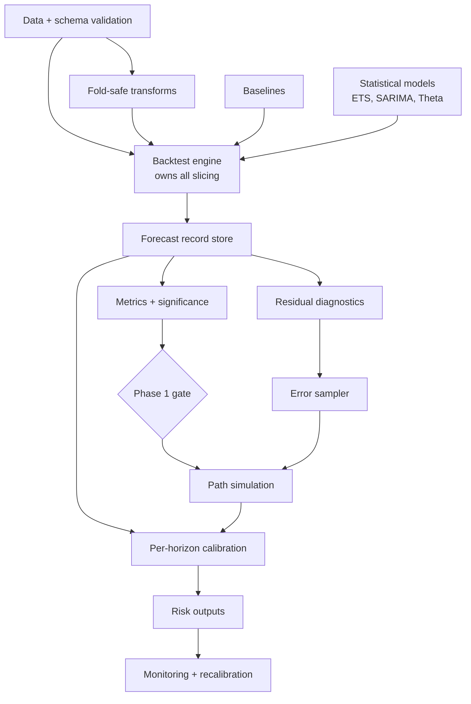

# Forecasting System: Roadmap and Phase 1 Implementation Specification

> Snapshot of the Claude Docs page https://claude.ai/code/artifact/a0e49b2a-df95-4575-9a3f-11431cdef575 (revision 28), exported 22 Sep 2026.
> The Claude Docs page is where this document is edited; refresh this file when it changes.

2026-09-22 · Kislay Kumar

## Summary

**Phase 1 ends at the first go/no-go decision: does any model beat naive baselines on your real data, measured by a backtest that is proven leak-free?** Monte Carlo is not in Phase 1. It only has value on top of a point model that has already passed that gate.

| Phase | Scope | Why the boundary sits here | Effort (focused days) |
|---|---|---|---|
| 0. Contract | Data in hand, spec written: horizons, thresholds, loss, single series vs. panel | Every later choice depends on these answers; no code yet | 0.5 |
| 1. Honest point forecast | Data layer, leak-proof backtest engine, baselines, ETS / ARIMA / Theta / combination, significance tests, analytic-interval coverage check | Smallest scope that answers "does modelling add value?" and "is uncertainty work needed?" | 9 |
| 2. Calibrated uncertainty | Error samplers, path simulation, model mixture, conformal calibration, CRPS / pinball / PIT, choosing N | Depends on a validated point model from Phase 1 | 5 |
| 3. Decision outputs | Risk metrics, fan charts, report, CLI | Needs calibrated paths and your thresholds | 2.5 |
| 4. Robustness and operations | Break detection, monitoring, recalibration, stress tests, GARCH only if diagnostics demand it | Only meaningful once there is a production-shaped forecast to protect | 4 |
| 5. Challengers (conditional) | LightGBM or a foundation model | Runs only if data is a panel or has covariates | 2-3 |

Core total: **21 focused days, about 14 weekends** at 1.5 focused days per weekend. A usable, honest forecast exists after Phase 1 (around weekend 6), and each later phase is independently shippable.

## Scope update: Nifty 50 plus a positive control

The primary target is now the **Nifty 50 index**, with the electricity series kept as a positive control. The engine stays generic: any single-number-over-time data goes through the same three-column format. This section overrides the older sections where they conflict.

### Decisions (22 Sep 2026)

| # | Decision | Why |
|---|---|---|
| U1 | Primary series: Nifty 50, daily trading days | Your home market; an index avoids survivorship bias |
| U2 | Positive control: US electric and gas utilities output (FRED IPG2211A2N), monthly | Has real seasonal structure; if clever models do not win here, the harness is broken |
| U3 | Replication target (later): S&P 500 | Checks whether Nifty findings hold in a second market |
| U4 | Forecast **returns** for stocks, not price levels; price-level forecasts are derived from returns | Prices behave close to a random walk; returns are the scale where models and tests are valid |
| U5 | Expected Phase 1 result for Nifty: nothing beats the zero-return forecast on the mean. This is treated as a valid finding, not a failure | Consistent with the research and the random-walk canary |
| U6 | GARCH becomes a **core** Phase 2 component for return series (no longer conditional) | Volatility clustering is the most reliably forecastable feature of stock returns |
| U7 | Not a trading system. No position sizing, no signals, no trading costs in scope | Keeps the project a forecasting and risk study; not financial advice |

### Generic schema: one shape, small adapters, a label per series

| Layer | What it is |
|---|---|
| Canonical table | `unique_id, ds, y`. Everything past the front door sees only this |
| Adapters | One small loader per source (CSV with column mapping, FRED, index or stock prices). Its only job is to produce the canonical table |
| Series label in config | `freq`, `season`, `target` (level or returns), `positive`, `calendar`, optional column mapping |
| Extra columns (Phase 3+) | Must be tagged `known_ahead` or `known_after`; only `known_ahead` values may be used for future dates |

```yaml
series:
  - id: nifty50
    source: csv:data/nifty50.csv        # NSE historical data download
    columns: {date: Date, value: Close}
    freq: trading_days                  # exchange closures are not missing data
    season: none
    target: returns                     # log return r_t = ln(y_t / y_{t-1}), computed inside each fold
    H: 20                               # about one trading month
    decision_horizons: [1, 5, 20]       # day, week, month

  - id: electricity
    source: fred:IPG2211A2N
    freq: monthly
    season: 12
    target: level
    positive: true
    H: 24
    decision_horizons: [1, 12, 24]
```

The horizons above are proposals for a personal research project with no external decision-maker; they are yours to change before `gate.yaml` is committed.

### What changes in each section

| Section | Change for return series |
|---|---|
| Dataset requirements | New `freq: trading_days`: gaps checked against trading days only (a weekday with no row is flagged, not imputed). Volume: initial window 500 trading days (about 2 years), 250 test origins, origin step 5. Nifty history back to the 1990s easily meets this |
| Dataset requirements | Source: NSE historical index data as a CSV. Note the price index excludes dividends; the Nifty 50 TRI (total return index) includes them. Phase 1 uses the price index, and the report states which one |
| Horizons | Horizons are counted in trading days; buckets for m = 1 apply ({1}, {2..3}, {4..H}), with decision horizons 1, 5, 20 |
| Model set | Baselines for returns: **zero return**, historical mean return (expanding), last return (naive on returns), and the price random walk. Statistical: **AR(p)** on returns, p chosen by AICc up to 5. ETS, SARIMA and Theta stay for the electricity control only; they are pointless on returns. SMA of returns is kept as the test of the original idea |
| Metrics | MAE and RMSE vs. zero-return; relative MAE; **directional accuracy** with the Pesaran-Timmermann (1992) test against chance; out-of-sample R² vs. historical mean. MAPE and sMAPE are disabled (returns cross zero) |
| Diagnostics | ARCH-LM is expected to fire; this confirms U6 rather than triggering a decision |
| Leakage | Extra sources: return computed across a gap using a future price; index or split adjustments applied with later information; timezone misalignment of close times; using survivors-only stock lists (not an issue for the index, noted for single stocks). L1 future-poisoning covers the first; the others become validation rules |
| Architecture | New module `data/adapters.py`; `validate` gains the trading-day calendar rule; `transforms.py` gains `LogReturn` (fit on slice, inverse maps return paths back to price paths) |
| Effort | Phase 1 grows by about 1 day (adapters, trading-day calendar, AR and return baselines, Pesaran-Timmermann test): about 9 days in total |

## Research synthesis

The research keeps the proposal's goals (multi-horizon forecasts, explicit long-horizon uncertainty, simulated risk) and replaces its methods (moving averages as engine, fixed MAE/MAPE targets, Monte Carlo as the source of uncertainty).

### What the original idea got right and wrong

| Got right | Got wrong |
|---|---|
| Different horizons need different treatment | Moving averages as the forecasting engine (61% worse than naive at h = 1 in the synthetic test) |
| Long-horizon uncertainty must be stated, not hidden | Fixed targets (MAE 3%, MAPE 35%) with no dataset, scale or baseline |
| Path simulation is the right tool for path-dependent risk (cumulative totals, barrier crossing) | Monte Carlo treated as a source of uncertainty; it only samples from the model it is given |
| The workflow stages (clean, extract trend, estimate, simulate) are roughly the right stages | 1,000 trials assumed sufficient for every output; tails need 10,000 to 100,000+ |
| At least 1,000 paths is a sensible floor for central quantiles | MAPE used as a measure of uncertainty; no baselines; no validation design |

### Rejected, recommended, deferred

| Status | Items |
|---|---|
| Rejected assumptions | MA as primary model; percentage targets as success criteria; MAPE as headline metric; random or unspecified train/test split; "more simulations = better uncertainty"; one model for all horizons |
| Recommended methods | Damped-trend ETS, SARIMA, Theta, equal-weight combination; rolling-origin backtest; MASE, CRPS, pinball, coverage; DM-HLN and Model Confidence Set; state-space path simulation with block-bootstrap errors; per-horizon conformal calibration |
| Explicitly deferred | GARCH (only if ARCH-LM fires), regime switching (only with repeated regimes), Bayesian / PyMC (only for short series), LightGBM / N-HiTS (only for panels with covariates), foundation models (challenger only), Prophet (daily data only) |

### Research questions versus engineering requirements

Engineering requirements are built to a spec. Research questions are answered by running that build on the data; the answers change what later phases contain.

| Research questions (answered by Phase 1 output) | Engineering requirements (built in Phase 1) |
|---|---|
| RQ1. Does any model beat the best baseline, significantly, per horizon? | Schema validation and canonical representation |
| RQ2. What is the predictable horizon h*? | Fold-safe transforms (fit on train only) |
| RQ3. Are analytic intervals calibrated per horizon? | Rolling-origin backtest engine |
| RQ4. Are residuals autocorrelated or heteroskedastic? (decides bootstrap type, GARCH) | Forecast record store and metric library |
| RQ5. Is the series stable, or does rolling beat expanding window? (decides break handling) | Reproducible runs (config hash, seeds) |
| RQ6. Is a transform needed, and which? | Leakage canary tests in CI |

### Minimal, optional, premature

| Class | Components |
|---|---|
| Necessary for a minimally valid system | Validation, fold-safe preprocessing, backtest engine, baselines, at least one strong statistical model, per-horizon metrics against baselines, significance test, leakage tests |
| Necessary but conditional on Phase 1 results | Path simulation, error sampler, calibration, CRPS, risk outputs |
| Optional enhancements | Theta and combination (cheap, likely winners, so included), PIT plots, parallelism, report HTML |
| Premature now | GARCH, regime switching, change-point detection, Bayesian models, ML / DL, dashboards, monitoring, multi-series scaling |

### Dependency graph

The research changes the proposed linear chain in three ways: preprocessing and models run **inside** the backtest rather than before it; baselines and statistical models are siblings, not a sequence; and calibration depends on out-of-sample backtest errors, so it sits beside Monte Carlo rather than after it.



Everything above the gate is Phase 1. Nothing below it is scientifically meaningful until the gate has passed, which is the core reason for the Phase 1 boundary.

## How I drew the boundaries

Four rules decided every cut:

1. **Each phase ends at a decision that could change or stop the rest.** A phase that ends in "more code exists" is not a phase.
2. **Never build on an unvalidated layer.** Build order follows validation order: harness, then point model, then uncertainty, then risk.
3. **Each phase ships something usable on its own**, so stopping early still leaves value.
4. **Test the riskiest, cheapest assumptions first.** The riskiest assumption in the research is that modelling beats naive on your data at all; it costs about 8 days to test.

### Three candidate Phase 1 scopes

| Option | Scope | Answers | Verdict |
|---|---|---|---|
| A. Harness + baselines only | Data, backtest, naive / SMA / SES | "Is the harness correct?" | Rejected. Ends with no decision about the project: baselines alone never tell you if modelling adds value |
| **B. Harness + baselines + statistical models + tests** | A, plus ETS, ARIMA, Theta, equal-weight combination, DM-HLN, analytic PI coverage | "Does modelling beat naive, at which horizons, significantly? Are simple intervals already calibrated?" | **Chosen.** statsmodels makes the models cheap (about 1.5 days); the decision it unlocks is the most valuable in the project |
| C. Full pipeline incl. Monte Carlo | B, plus simulation, risk outputs | Everything | Rejected. Doubles Phase 1 and builds uncertainty on a model that may not beat naive. This is the ordering the original proposal implied |

### Why these specific inclusions and exclusions

| Item | Phase 1? | Reason |
|---|---|---|
| Leakage canary tests (random walk, future-poisoning) | In | The whole project's credibility rests on them; cheap to write first |
| Analytic prediction intervals + coverage per horizon | In | About half a day. If coverage is already within tolerance, Phase 2 shrinks to path simulation; if it fails badly, Phase 2 needs the full calibration layer. It sizes Phase 2 |
| Predictability horizon h* estimate (point skill only) | In | Tells us which horizons Phase 2 needs to cover at all |
| Forecast combination | In | M4 evidence says it is the likeliest winner; costs almost nothing once members exist |
| Monte Carlo, bootstrap, CRPS | Out (Phase 2) | Conditional value; needs a validated point model |
| Outlier handling beyond flagging | Out (Phase 4) | Flags are enough to see if outliers matter; full treatment only if they do |
| Plots beyond the backtest report | Out (Phase 3) | Not needed for the go/no-go decision |
| Change-point detection, GARCH | Out (Phase 4) | Diagnostics in Phase 1 decide whether they are needed |

### Phase 1 exit decision

| Outcome on final-test origins | Decision |
|---|---|
| Best model or combination has MASE ratio below 1 vs. best baseline, significant at the decision horizons | Proceed to Phase 2 |
| Beats baseline only at short horizons | Proceed, but restrict Phase 2 to horizons up to h*; longer horizons become scenario outputs |
| Nothing beats naive significantly | Stop modelling. Ship naive + empirical error quantiles (a one-day Phase 2 lite) and investigate covariates or a panel before any further work |
| Suspiciously large gains (> 30% over ETS) | Leakage audit before anything else |

## Phase 1 objective

> **At the end of Phase 1, given one validated univariate series at weekly or monthly frequency, one command produces a reproducible, leakage-tested rolling-origin evaluation of 4 baselines, 4 statistical forecasters and their equal-weight combination at every horizon 1..H, and a report that answers RQ1 to RQ6 with a stated verdict for each.**

Phase 1 succeeds when the answer is **trustworthy**, not when it is positive. "No model beats naive" is a successful Phase 1 outcome.

### Acceptance checks

| # | Check | Pass condition |
|---|---|---|
| A1 | Reproducibility | Two runs with the same config and data produce byte-identical forecast stores (same `run_id`, same Parquet hash) |
| A2 | Leakage canaries | Leakage tests L1 to L5 pass in CI and pre-registration P1 is in place |
| A3 | Known-answer tests | On synthetic random walk, naive is within the MCS best set at every h; on seasonal AR, only seasonal models beat seasonal naive; on local linear trend, damped ETS MASE is below naive at h of at least m/3 |
| A4 | Coverage of models | Every (origin, model, h) in the design produces a forecast row or a logged, typed failure; failures under 1% of rows |
| A5 | RQ1 answered | Per-horizon relative MAE vs. best baseline with DM-HLN p-values and MCS membership |
| A6 | RQ2 answered | h* reported with the skill curve and its bootstrap CI |
| A7 | RQ3 answered | Empirical coverage of analytic 80% and 95% intervals per horizon bucket, with binomial tolerance bands |
| A8 | RQ4 to RQ6 answered | Ljung-Box and ARCH-LM p-values on one-step residuals; rolling-vs-expanding gap; chosen transform per fold with frequency counts |
| A9 | Runtime | Full backtest of a 10-year monthly series under 10 minutes on a laptop (single core) |
| A10 | Gate decision | A written go/no-go per the Phase 1 exit table, committed to the repo |

## Dataset requirements

Phase 1 accepts univariate, regularly spaced weekly, monthly or quarterly series with no exogenous variables, and refuses anything it cannot evaluate honestly rather than silently repairing it.

### Structure

| Item | Rule | Why |
|---|---|---|
| Required columns | `unique_id` (str), `ds` (timestamp), `y` (float) | D1: long format, panel-ready |
| Timestamp | tz-naive, one per period, converted to the period's start (`to_period(freq).start_time`) | Canonical form makes gaps and duplicates detectable |
| Target | Finite float; inf or non-numeric is an error | Every model and metric assumes a real value |
| Optional columns | Allowed in the file, ignored with a warning, never passed to models | Exogenous inputs need vintages to be leak-free; not in Phase 1 |
| Exogenous variables | **Not allowed** | Research: covariates are the trigger for Phase 5 challengers and the main source of look-ahead leakage |
| Multiple series | Schema and engine accept several `unique_id`s and evaluate each independently; acceptance tested on one | Costs a loop, avoids a later rewrite; no cross-series learning |
| Univariate only | Yes | Matches the research's recommended model set |

### Frequencies

| Frequency | Phase 1 | Seasonal period m | Note |
|---|---|---|---|
| Monthly | Yes | 12 | Primary target |
| Quarterly | Yes | 4 | Same code path |
| Weekly | Yes | 52 | Seasonal ETS and SARIMA are impractical at m = 52 (52 seasonal states, slow and unstable fits). Weekly seasonality is removed by STL **fitted inside each fold** and models run on the adjusted series (statsmodels STLForecast); seasonal naive and Theta handle it directly |
| Daily / sub-daily | **No** | 7 and 365.25 | Multiple seasonalities need MSTL / TBATS, outside the Phase 1 model set |
| Mixed frequencies in one run | No |  | One declared `freq` per run |

### Volume

The minimum follows from three needs in the research: at least 3 seasonal cycles to initialise and estimate seasonal models, enough development origins to select without touching the test set, and at least 30 test origins per horizon for coverage and DM tests to have power.

```math
T_{\min}=\underbrace{\max(3m,24)}_{\text{initial train}}+\underbrace{20}_{\text{dev origins}}+\underbrace{30}_{\text{test origins}}+H-1,\qquad T_{\text{floor}}=\max(2m,12)+H+20
```

| Frequency | H (example) | Minimum T | Preferred T | Hard floor (refuse below) |
|---|---|---|---|---|
| Monthly (m = 12) | 12 | 97 (about 8 years) | 120+ (10 years) | 56 |
| Quarterly (m = 4) | 8 | 81 (about 20 years) | 100+ | 36 |
| Weekly (m = 52) | 13 | 218 (about 4.2 years) | 260+ (5 years) | 137 |
| Non-seasonal (m = 1) | 12 | 85 | 120+ | 44 |

Between the hard floor and the minimum, Phase 1 runs in **reduced mode**: seasonal models only if at least 2 full cycles are in the first training window, dev and test origins shrink proportionally, and the report states that tests are underpowered.

### Data quality rules

| Issue | Phase 1 behaviour | Justification |
|---|---|---|
| Duplicate timestamps | **Error**, unless config sets `duplicates: sum` or `mean` | Silent choice would change the target's meaning |
| Irregular frequency | Infer with `pd.infer_freq`; must equal declared `freq` after period normalisation, else error | Every model assumes regular spacing |
| Missing timestamps | Reindex to the full calendar; gap becomes NaN | Makes gaps explicit |
| Missing values (incl. from gaps) | Allowed if each gap is at most 2 periods and total missing at most 5%; imputed **inside each fold** by linear interpolation of the training slice. An origin whose last observation is missing is skipped. Larger gaps: error, asking for a start date after the gap | Research: past-only imputation; long gaps usually mean a regime or definition change |
| Scoring on imputed values | Never: forecasts whose target was missing are excluded from metrics | Imputed truth would reward the imputer, not the model |
| Outliers | **Flag only** (trailing robust z > 4 on the training slice); no replacement. Report whether large errors cluster at flagged points | Research says flag, do not delete; replacement rules need their own validation (Phase 4) |
| Zeros | Allowed. Disable log / Box-Cox in any fold with y <= 0; skip MAPE when any actual is 0. More than 30% zeros: error (intermittent demand is out of scope) | MAPE undefined at zero; intermittent series need Croston-type models |
| Negatives | Allowed unless config declares `positive: true`, then error | Some targets (net flows) are legitimately negative |
| Structural breaks | Not corrected. Measured by rolling-vs-expanding gap and per-sub-period metrics (RQ5) | Break handling is Phase 4; Phase 1 must first show whether it is needed |

## Horizons

Phase 1 forecasts and stores every individual horizon h = 1..H, where H is supplied by you; buckets exist only in the report, and are derived from the seasonal period rather than fixed lists like 1, 3, 6, 12, 24.

| Question | Decision | Why |
|---|---|---|
| How configured | `H` (int, **required**) and `decision_horizons` (list of int, optional) in the run config | H and the decision horizons come from your use case; the research forbids inventing them |
| If you do not know H | The tool refuses to run without H. The config template suggests H = 2m and labels such runs "exploratory" in the report | Makes the missing decision visible instead of hiding it in a default |
| Values or buckets | **Values** in the store (one row per h); **buckets** only for reporting | Buckets can be redefined later from the store without refitting (D5) |
| Bucket definition | very short {1}; short {2 .. ceil(m/4)}; medium {ceil(m/4)+1 .. m}; long {m+1 .. H}. Empty buckets omitted. For m = 1: {1}, {2..3}, {4..H} | Follows the research's rule that behaviour changes within vs. across a seasonal cycle |
| Support for H | Yes, any 1 <= H <= 3m | Longer H leaves too few test origins and overlapping errors |
| Multiple horizon families | **No.** One family: iterated multi-step forecasts from each model's own recursion | Direct per-horizon models are an ML technique, outside the Phase 1 model set |
| Relation to m | Warn if H < m (seasonal behaviour not evaluated); refuse H > 3m | Seasonal effects appear only when H reaches m |
| Beyond predictable range | h* is estimated from results (skill significantly above 0 vs. best baseline). Horizons above h* stay in the store but are labelled "not forecastable by these models" in the report | We cannot know h* before running Phase 1, so H is not truncated in advance |
| Significance tests | Run at `decision_horizons` if given; otherwise at the last h of each bucket with Holm correction | Limits multiple testing to the horizons that matter |

Multi-step errors from overlapping windows are correlated: with n origins, the effective sample at horizon h is roughly n / h. The report prints n and n / h next to every horizon's statistics so long-horizon results are read with the right caution.

## Model set

Phase 1 implements 4 baselines, 4 statistical forecasters and 1 equal-weight combination; moving averages are a baseline and the explicit test of the original hypothesis, never the primary model.

| Candidate | Class | Role | Reason |
|---|---|---|---|
| Naive (last value) | **PHASE 1** | Baseline | Optimal for random walks; the floor every model must beat; MASE denominator for m = 1 |
| Seasonal naive | **PHASE 1** | Baseline | Floor for seasonal series; MASE denominator |
| Drift (random walk with drift) | **PHASE 1** | Baseline | Simplest trend extrapolation; shows whether trend models add more than a straight line |
| SMA(k), k chosen on dev origins from {3, 6, m, 2m} | **PHASE 1** | Baseline + hypothesis test | Tests the original proposal directly. Its score vs. naive is reported as a named finding |
| Weighted MA | **EXCLUDE** |  | Dominated by SES: arbitrary weights, no likelihood, no intervals. Adding it proves nothing SES does not |
| SES / EMA | **PHASE 1** | Statistical | Principled version of the moving average; ARIMA(0,1,1) equivalent; has intervals |
| Holt (undamped) | **PHASE 1, inside ETS-auto only** | Candidate variant | Not standalone: extrapolates slope forever; allowed only if AICc selects it |
| Damped Holt | **PHASE 1, inside ETS-auto** | Candidate variant | The research's most likely strong single model |
| ETS-auto (additive / multiplicative error, none / additive / damped trend, none / additive / multiplicative season; AICc selection) | **PHASE 1** | Statistical, primary | State-space form gives analytic intervals now and `simulate()` for Phase 2 |
| STL + ETS (STLForecast) | **PHASE 1, weekly only** | Replaces seasonal ETS when m > 24 | Seasonal ETS impractical at m = 52 |
| SARIMA (bounded grid, AICc) | **PHASE 1** | Statistical | Captures autocorrelation ETS misses; different error structure makes the combination useful. Seasonal part disabled when m > 24 (runs on STL-adjusted series) |
| Theta (statsmodels ThetaModel) | **PHASE 1** | Statistical | M3 winner, near-zero cost, strong combination member |
| Equal-weight combination (mean of ETS-auto, SARIMA, Theta) | **PHASE 1** | Combination | Fixed membership decided now, not by test results, so it cannot overfit. Intervals for it wait for Phase 2 (need pooled paths) |
| Optimised combination weights | **EXCLUDE** |  | Equal weights are hard to beat and do not overfit (Wang et al. 2023) |
| Kalman local linear trend (UnobservedComponents) | **EXCLUDE** |  | Near-duplicate of ETS; revisit only as the Bayesian base in Phase 3+ |
| GARCH errors | **PHASE 2 (conditional)** | Error model | Only if RQ4 shows ARCH effects |
| Bayesian structural model (PyMC) | **PHASE 3+ (conditional)** |  | Only for short series; slow in backtests |
| Regime switching | **PHASE 3+ (conditional)** |  | Only if RQ5 shows recurring regimes |
| MSTL / TBATS | **PHASE 3+ (conditional)** |  | Only if daily data comes into scope |
| Prophet | **PHASE 3+ (conditional)** | Challenger | Only for daily data with holidays |
| Croston / TSB | **EXCLUDE** |  | Intermittent series are out of scope |
| LightGBM on lags | **PHASE 3+ (conditional)** | Challenger | Only with covariates or a panel |
| Foundation model (Chronos etc.) | **PHASE 3+** | Challenger | Cheap zero-shot trial after the harness is proven |
| LSTM / GRU / TCN / Transformers / N-BEATS / N-HiTS | **EXCLUDE** |  | Need many series; research found no case for one series |
| Centred MA, STL decomposition as forecasters | **EXCLUDE as forecasters** | Diagnostic plots in Phase 3 | Two-sided: they use future data |

## Monte Carlo decision

**Production Monte Carlo is Phase 2.** The blocking dependency: every design choice in the simulator (which model to simulate, which error sampler, whether to add GARCH, how much to recalibrate) is decided by Phase 1 results. Building it first would mean guessing those answers.

### What Monte Carlo needs, and where each input comes from

| Monte Carlo requires | Provided by | Available in Phase 1? |
|---|---|---|
| A point model shown to beat baselines | Phase 1 gate (RQ1) | Only at the end of Phase 1 |
| Knowledge of the error structure: i.i.d. vs. autocorrelated vs. heteroskedastic | Residual diagnostics (RQ4) | Only at the end of Phase 1 |
| A reference for calibration: how wrong are simple intervals, per horizon? | Analytic-interval coverage (RQ3) | Only at the end of Phase 1 |
| Which horizons are worth simulating | h* (RQ2) | Only at the end of Phase 1 |
| A working state-space `simulate()` primitive | statsmodels, verified by a test | Yes: see below |

Simulating before residual modelling exists is not scientifically meaningful: with default Gaussian i.i.d. errors, simulated quantiles from ETS reproduce its analytic intervals exactly (up to Monte Carlo noise). They add compute, not information. Analytic intervals are therefore sufficient for Phase 1's purpose, which is to measure calibration, not to deliver risk numbers.

### The one piece that stays in Phase 1: a simulation conformance test

|  | Validation-only simulation (Phase 1) | Production Monte Carlo (Phase 2) |
|---|---|---|
| Purpose | Prove the path primitive is correct before Phase 2 relies on it | Deliver calibrated distributions and risk inputs |
| Scope | ETS and SARIMA `simulate()` with Gaussian errors, N = 10,000, on 3 synthetic series | All members, bootstrap / GARCH errors, parameter refits, mixture, calibration |
| Pass condition | Simulated P10 / P90 at each h match analytic bounds within 3 Monte Carlo standard errors; path mean matches point forecast within 3 SE | Coverage and CRPS criteria from the research |
| Where it lives | `tests/test_simulation_conformance.py` only | `simulation/` package |
| Cost | About half a day | About 5 days |
| Why now | The research experiment hit two statsmodels `simulate()` API pitfalls (array vs. Series input, missing seed argument). Finding such issues now keeps Phase 2 from starting with debugging |  |

Monte Carlo does **not** appear in the Phase 1 report, CLI or store.

## Technical decisions fixed before coding

These ten decisions are cheap now and expensive to reverse later; each has a trigger that would reopen it.

| # | Decision | Why | Reopen if |
|---|---|---|---|
| D1 | Long-format data everywhere: columns `unique_id, ds, y` | A single series is a panel of one. Costs nothing now, avoids a rewrite if the data turns out to be many series | Never |
| D2 | statsmodels as the model backend (ETSModel, SARIMAX, ThetaModel, STL) | Phase 2 needs `simulate()` from the fitted state-space model, which statsmodels provides. Fewer dependencies | More than about 100 series or backtests over 1 hour: switch fitting to statsforecast |
| D3 | Own model selection: ETS by AICc over allowed variants; SARIMA over a bounded grid (p, q up to 2; P, Q up to 1; d, D from KPSS and seasonal tests) | Transparent, testable, no extra auto-ARIMA dependency | Grid misses clearly better orders in diagnostics |
| D4 | Leakage prevented by the API, not by discipline: every data-dependent step is a `fit(train) / transform(x)` object; only the backtest engine slices data; models never receive the full series | Makes the most common forecasting bug structurally hard | Never |
| D5 | One forecast record store (Parquet): a row per series, origin, model, horizon, with actual, point, and later quantiles | Metrics are computed from the store, so re-scoring, new metrics or new tests never require refitting | Store exceeds memory: partition by model |
| D6 | Config is one YAML file loaded into a frozen dataclass; `run_id` = hash of config + data hash + git commit | Every result is reproducible and traceable | Never |
| D7 | Randomness: one `numpy.random.SeedSequence` per run, spawned per (origin, model) | Results are identical when parallelised or re-run in a different order | Never |
| D8 | Model on the transformed scale (log / Box-Cox per fold); back-transform paths and quantiles, never the mean | Quantiles survive monotone transforms; means do not | Series has zeros or negatives: no transform, or log1p with review |
| D9 | Horizon buckets defined relative to seasonal period m in config; h* computed from results, never hard-coded | Keeps the research's rule that horizons are chosen from data and decisions | Business adds a mandatory horizon |
| D10 | Tooling: Python 3.11+, uv, pytest, ruff, GitHub Actions; joblib over origins for parallelism; notebooks for exploration only, never imported | Standard, light, fast CI | Never |

## Phase 1 architecture

Sixteen small modules in four subpackages, about 2,000 lines plus tests. It is deliberately flat: no plugin system, no experiment framework, no database. The research layout's `simulation/` and `visualization/` packages do not exist yet.

```text
forecasting/
├── config.py                # RunConfig, load_config, run_id
├── data/
│   ├── io.py                # load_series
│   └── validate.py          # validate -> Series + ValidationReport
├── transforms.py            # BoxCox, Interpolator, OutlierFlagger
├── models/
│   ├── base.py              # Forecaster protocol, ForecastResult
│   ├── baselines.py         # Naive, SeasonalNaive, Drift, SMA
│   ├── statistical.py       # SES, ETSAuto, SARIMAAuto, Theta, STL wrapper
│   └── combination.py       # EqualWeight
├── backtest/
│   ├── splits.py            # make_origins (dev / test)
│   ├── engine.py            # run_backtest: the only code that slices data
│   └── store.py             # ForecastStore (Parquet)
├── evaluation/
│   ├── metrics.py           # MAE, RMSE, MASE, rel. MAE, WAPE, MAPE, sMAPE, coverage, Winkler
│   ├── tests.py             # DM-HLN, Holm, MCS, Kupiec, skill CI (block bootstrap)
│   ├── diagnostics.py       # Ljung-Box, ARCH-LM, rolling-vs-expanding gap
│   └── report.py            # RQ1-RQ6 verdicts, tables, 3 plots, markdown
└── cli.py                   # forecast run | report | validate
tests/
├── synthetic.py             # DGPs with known answers
├── test_leakage.py          # canaries
└── ...
```

| Module | Responsibility | Public API | Depends on | Must NOT | Extended in |
|---|---|---|---|---|---|
| `config` | Parse and validate the YAML run config; compute `run_id` | `RunConfig`, `load_config(path)` | pyyaml | Read data; hold defaults for H or decision horizons | Phase 2: N, sampler, calibration settings |
| `data.io` | Load CSV / Parquet into long format | `load_series(path, cfg) -> pd.DataFrame` | pandas | Clean, impute, or drop anything | Vintage-aware loading (Phase 4) |
| `data.validate` | Enforce every rule in Dataset requirements; canonicalise | `validate(df, cfg) -> tuple[Series, ValidationReport]` | config | Impute or transform values; fix data silently | New rules only |
| `transforms` | Data-dependent transforms with fit / transform / inverse | `BoxCox`, `Interpolator`, `OutlierFlagger` | numpy, scipy | Ever be fitted on data past an origin (enforced by the engine) | Outlier replacement (Phase 4) |
| `models.base` | Forecaster contract and result type | `Forecaster`, `ForecastResult` |  | Know about origins, folds or metrics | Phase 2 adds `simulate()` |
| `models.baselines` | 4 baselines | classes | base | Tune on test origins |  |
| `models.statistical` | Wrap statsmodels, do order / variant selection by AICc | classes | statsmodels | Catch and hide fit failures (must raise typed errors) | Phase 2: `simulate()`; conditional GARCH |
| `models.combination` | Mean of member point forecasts | `EqualWeight(members)` | base | Weight by test performance | Phase 2: pooled path intervals |
| `backtest.splits` | Generate origins; assign dev / test | `make_origins(n, cfg) -> list[Origin]` | config | Look at y values |  |
| `backtest.engine` | For each origin: slice, fit transforms, fit models, forecast, record | `run_backtest(series, cfg) -> ForecastStore` | all above | Compute metrics; pass anything beyond the origin to transforms or models | Phase 2: record quantiles and paths |
| `backtest.store` | Persist and query forecast rows | `ForecastStore.write / read / frame()` | pyarrow | Contain logic | New columns (quantiles, CRPS) |
| `evaluation.metrics` | Pure functions over arrays | `mae, rmse, mase, ...` | numpy | Read files; know models | CRPS, pinball (Phase 2) |
| `evaluation.tests` | Statistical comparison and calibration tests | `dm_hln, holm, mcs, kupiec, skill_ci` | scipy, numpy | Choose models | Christoffersen, PIT (Phase 2) |
| `evaluation.diagnostics` | Answer RQ4, RQ5 | `residual_tests, window_gap` | statsmodels | Change the pipeline | Break detection (Phase 4) |
| `evaluation.report` | Turn the store into the RQ verdicts and the gate decision | `build_report(store, cfg) -> Report` | metrics, tests, diagnostics, matplotlib | Refit anything | Fan charts, risk tables (Phase 3) |
| `cli` | Entry points | `forecast validate / run / report` | click or argparse | Contain logic | `simulate`, `risk` commands |

**Dependencies (runtime):** pandas, numpy, scipy, statsmodels, pyarrow, pyyaml, matplotlib, joblib. Dev: pytest, ruff. Nothing else.

## Python interfaces

Six interfaces are public and stable; everything else is internal and may change without notice. Two protocols (`Transform`, `Forecaster`) are the only abstractions; everything else is a dataclass or a function.

```python
# config.py
@dataclass(frozen=True)
class RunConfig:
    data_path: Path
    freq: Literal["W", "MS", "QS"]
    H: int                                   # required, no default
    m: int | None = None                     # None -> derived from freq (52, 12, 4)
    decision_horizons: tuple[int, ...] = ()
    positive: bool = False
    duplicates: Literal["error", "sum", "mean"] = "error"
    transform: Literal["none", "log", "boxcox", "auto"] = "auto"
    window: Literal["expanding", "rolling", "both"] = "both"
    rolling_length: int | None = None        # None -> max(3m, 24)
    origin_step: int = 1
    n_dev_origins: int = 20
    n_test_origins: int = 30
    models: tuple[str, ...] = DEFAULT_MODELS
    levels: tuple[float, ...] = (0.80, 0.95)
    seed: int = 20260922
    n_jobs: int = 1
    output_dir: Path = Path("runs")

def load_config(path: Path) -> RunConfig: ...          # raises ConfigError
def run_id(cfg: RunConfig, data_hash: str, git_sha: str) -> str: ...

# data/validate.py
@dataclass(frozen=True)
class Series:
    unique_id: str
    y: pd.Series                 # PeriodIndex, full calendar, NaN where missing
    m: int
    data_hash: str

@dataclass(frozen=True)
class ValidationReport:
    n_obs: int; n_missing: int; max_gap: int; n_zero: int; n_negative: int
    mode: Literal["full", "reduced"]
    warnings: tuple[str, ...]

def validate(df: pd.DataFrame, cfg: RunConfig) -> list[tuple[Series, ValidationReport]]: ...

# transforms.py
class Transform(Protocol):
    def fit(self, y: pd.Series) -> Self: ...
    def transform(self, y: pd.Series) -> pd.Series: ...
    def inverse(self, x: np.ndarray) -> np.ndarray: ...   # applied to points and interval bounds

# models/base.py
@dataclass(frozen=True)
class ForecastResult:
    mean: np.ndarray                          # shape (h,)
    lower: dict[float, np.ndarray]            # level -> (h,), empty if model has no intervals
    upper: dict[float, np.ndarray]
    info: dict[str, Any]                      # selected variant, AICc, params

class Forecaster(Protocol):
    name: str
    def fit(self, y: pd.Series) -> Self: ...                       # y: PeriodIndex, no NaN
    def predict(self, h: int, levels: Sequence[float] = ()) -> ForecastResult: ...
    def residuals(self) -> np.ndarray: ...                         # one-step, in-sample

ModelFactory = Callable[[int], Forecaster]    # m -> fresh, unfitted instance

# backtest/engine.py
@dataclass(frozen=True)
class Origin:
    t: int                                    # position of the last training observation
    role: Literal["dev", "test"]

def make_origins(n: int, cfg: RunConfig, m: int) -> list[Origin]: ...
def run_backtest(series: Series, cfg: RunConfig,
                 factories: Mapping[str, ModelFactory]) -> ForecastStore: ...
```

### Behaviour and errors

| Interface | Required behaviour | Error behaviour | Stability |
|---|---|---|---|
| `load_config` | Reject unknown keys; derive m; check 1 <= H <= 3m and decision horizons <= H | `ConfigError` with the offending key | **Stable** |
| `validate` | Apply every data rule; return canonical Series; never modify values except duplicate aggregation when configured | `DataValidationError(rule, detail)`; below hard floor is an error, between floor and minimum is `mode="reduced"` + warning | **Stable** |
| `Transform` | `fit` sees only the training slice; `inverse(transform(y)) == y` to 1e-9 | `TransformError` if fit data invalid (e.g. y <= 0 for log); engine then falls back to no transform and records it | Internal |
| `Forecaster.fit / predict` | Deterministic given input; `predict` before `fit` raises; `mean` finite; interval bounds ordered lower <= mean <= upper | `FitError(model, reason)`; never returns NaN silently | **Stable** (Phase 2 adds `simulate`) |
| `ModelFactory` | Returns a **fresh** instance each call |  | **Stable** |
| `run_backtest` | Only function that slices data; fresh model per (origin, model); records failures as rows with `status="failed"` | Aborts only on programming errors; model failures are data | **Stable** |
| `ForecastStore` | Append-only Parquet; schema below | `SchemaError` on write mismatch | **Stable schema** |
| metrics / tests | Pure, vectorised, NaN-free input required | `ValueError` on NaN or shape mismatch | **Stable** |
| selection grids, statsmodels wrappers, report layout |  |  | Internal |

### Forecast store schema (one row per series, window, origin, model, h)

| Column | Type | Note |
|---|---|---|
| run_id, unique_id, model, window | str | window = expanding or rolling |
| origin_t, origin_period, origin_role | int, period, str | role = dev or test |
| h, target_period | int, period |  |
| y_true, y_true_missing | float, bool | missing targets excluded from scoring |
| y_pred | float | on original scale |
| lo_80, hi_80, lo_95, hi_95 | float, nullable | null for models without intervals (SMA, combination) |
| transform, variant, fit_seconds | str, str, float | variant = e.g. ETS(A,Ad,A) or SARIMA order |
| status, error | str, str | ok or failed + message |

## Algorithms

Every algorithm below is deterministic given config, data and seed; anything estimated from data runs inside a fold.

### Data validation (once, before any fold)

```text
validate(df, cfg):
  1. schema      : columns unique_id, ds, y exist; y numeric and finite            -> else DataValidationError
  2. canonical   : ds -> Period(freq) ; sort by (unique_id, ds)
  3. duplicates  : any repeated (unique_id, period)? aggregate if cfg.duplicates else error
  4. frequency   : infer_freq on periods == cfg.freq                               -> else error
  5. calendar    : reindex to full period range per series; record missing mask
  6. gaps        : max consecutive NaN <= 2 and share NaN <= 5%                    -> else error
  7. sign/zeros  : positive flag vs. negatives; share of zeros <= 30%              -> else error
  8. volume      : T >= floor (error), T >= minimum (full) else reduced mode + warning
  9. H vs m      : H <= 3m (error), H < m (warning)
 10. emit Series(y with NaN, m, data_hash=sha256 of canonical bytes) + ValidationReport
```

No values are changed here. Validation decides whether the data can be evaluated honestly; repair is a fold-level concern.

### Preprocessing (inside each fold, on the training slice only)

| Step | Algorithm | Output |
|---|---|---|
| 1. Imputation | Linear interpolation between observed neighbours within the slice; never extrapolates past the last observed point (origins whose last point is missing are skipped) | Gap-free training slice |
| 2. Outlier flags | Trailing robust z: z_t = (y_t - median_{t-2m..t-1}) / (1.4826 x MAD); flag if above 4. Recorded, not used | Flag count per fold for the report |
| 3. Transform selection (`auto`) | If min(y) <= 0: none. Else regress log of rolling SD on log of rolling mean (window m, or 8 if m < 8); slope above 0.5 means variance grows with level: log. Else none. `boxcox`: lambda by MLE (`scipy.stats.boxcox_normmax`) on the slice | Fitted transform |
| 4. Seasonal adjustment (m > 24 only) | STL(period = m, robust) fitted on the slice via STLForecast; seasonal component continued with seasonal naive | Adjusted series for ETS / SARIMA |

### Forecasting models

Notation: training slice y_1..y_T (after transform), horizon h, k_h = floor((h - 1)/m), sigma from one-step in-sample residuals.

```math
\begin{aligned}
\text{Naive:}\quad&\hat y_{T+h}=y_T, &&\sigma_h=\sigma\sqrt h\\
\text{Seasonal naive:}\quad&\hat y_{T+h}=y_{T+h-m(k_h+1)}, &&\sigma_h=\sigma\sqrt{k_h+1}\\
\text{Drift:}\quad&\hat y_{T+h}=y_T+h\,\frac{y_T-y_1}{T-1}, &&\sigma_h=\sigma\sqrt{h\,(1+h/(T-1))}\\
\text{SMA}(k):\quad&\hat y_{T+h}=\tfrac1k\textstyle\sum_{j=0}^{k-1}y_{T-j}, &&\text{no interval}\\
\text{SES:}\quad&\ell_t=\alpha y_t+(1-\alpha)\ell_{t-1},\ \hat y_{T+h}=\ell_T, &&\sigma_h^2=\sigma^2[1+(h-1)\alpha^2]
\end{aligned}
```

| Model | Fitting and selection | Intervals |
|---|---|---|
| SMA(k) | k from {3, 6, m, 2m} (bounded by T), chosen once by mean MASE over all h on **dev** origins, then frozen for test | None: SMA has no model-based variance, so it is scored on points only |
| SES | MLE via statsmodels ETSModel(error=add, trend=None) | Analytic (formula above) |
| ETS-auto | Fit every allowed variant by MLE; choose minimum AICc = AIC + 2p(p + 1)/(n - p - 1). Allowed: error {A, M}, trend {N, A, Ad}, season {N, A, M} when 2m <= T and m <= 24. Multiplicative components only if y > 0. Multiplicative trend excluded (unstable, per fpp3) | statsmodels `get_prediction` (analytic for additive, simulated internally for multiplicative) |
| SARIMA | d by KPSS (up to 2), D by seasonal-strength test (up to 1); grid p, q in {0, 1, 2}, P, Q in {0, 1}; include drift only if d + D <= 1; minimum AICc; seasonal part off when m > 24 | statsmodels `get_forecast` |
| Theta | statsmodels ThetaModel, theta = 2, deseasonalise if seasonal test passes (multiplicative decomposition if y > 0, else additive) | statsmodels `prediction_intervals` |
| Equal-weight combination | Mean of ETS-auto, SARIMA, Theta point forecasts on the transformed scale, then back-transformed; if a member fails at an origin, mean of the remaining members, recorded | None in Phase 1 |

All forecasts and interval bounds are back-transformed through `inverse` (D8). For log, the back-transformed point is the median, which is the right target for MAE.

### Backtest mechanics

| Setting | Rule | Why |
|---|---|---|
| Origins | Positions t where the training slice ends. Last origin t = T - H so every origin has all H targets | Every horizon is scored on the same origins, so the skill curve and DM tests compare like with like |
| Incomplete final horizons | Origins T - H + 1 .. T - 1 are not used in Phase 1 | Adds short-horizon data at the cost of comparability; revisit if data are short |
| Roles | Last `n_test_origins` origins: test. The `n_dev_origins` before them: dev. Earlier origins (if any): warm-up, stored but not scored | Selection uses dev only; the gate uses test only |
| Origin step | 1 by default. If estimated runtime > 10 min, step = smallest integer meeting budget; report it | More origins, more test power |
| Training window | Expanding: y[0..t]. Rolling: y[t - L + 1 .. t], L = `rolling_length` (default max(3m, 24)). Both run when `window = both` | Their gap answers RQ5 |
| Refit | Full refit (transform, selection, parameters) at every origin | Mirrors a system that retrains each period; no stale parameters |
| Isolation | Fresh transform and model instances per (window, origin, model) from factories | No state carries across folds |
| Parallelism | joblib over origins, child seeds from SeedSequence(cfg.seed).spawn | Order-independent results (D7) |

### Metrics and statistics (test origins only)

| Metric | Definition | Reported |
|---|---|---|
| MAE, RMSE | Per model, per h | Yes |
| MASE | MAE scaled by the in-sample seasonal-naive MAE **of each origin's training slice** (m = 1: naive) | Primary point metric |
| Relative MAE | MAE_model(h) / MAE_best-baseline(h), best baseline chosen on dev origins | Primary skill measure |
| WAPE, sMAPE | As in the research | Secondary, for comparability |
| MAPE | Only if every test actual > 0 | Secondary; flagged as biased toward under-forecasts |
| Bias | Mean signed error per h | Yes |
| Coverage 80 / 95% | Share of actuals inside analytic intervals, with binomial 95% band (n / h effective) | RQ3 |
| Winkler score | Width + (2 / a) x miss distance | Compare interval quality |
| Skill and h* | SS(h) = 1 - relative MAE; CI from moving-block bootstrap over origins (block length h, 2,000 reps). h* = last h before the first h whose lower CI bound <= 0 | RQ2 |

Diebold-Mariano with the Harvey-Leybourne-Newbold correction, on absolute-error differentials d_t, with autocovariances gamma_k up to lag h - 1, compared to Student-t with n - 1 degrees of freedom:

```math
DM=\frac{\bar d}{\sqrt{\left(\hat\gamma_0+2\sum_{k=1}^{h-1}\hat\gamma_k\right)/n}},\qquad DM^{*}=DM\sqrt{\frac{n+1-2h+h(h-1)/n}{n}}
```

Kupiec unconditional coverage test for x misses in n forecasts at nominal miss rate p (chi-squared with 1 degree of freedom):

```math
LR_{uc}=-2\ln\frac{(1-p)^{n-x}p^{x}}{(1-\hat p)^{n-x}\hat p^{x}},\qquad \hat p=x/n
```

Model Confidence Set: Hansen-Lunde-Nason T_max statistic on absolute-error losses, moving-block bootstrap (1,000 reps), alpha = 0.10, per horizon bucket. Residual diagnostics (RQ4): Ljung-Box at lags m and 2m (10 if m = 1) and ARCH-LM (lags max(m, 4)) on each test origin's one-step residuals; the report gives the share of origins with p < 0.05.

## Leakage prevention

Leakage is prevented structurally (only the engine slices data; every data-dependent step is fitted on the slice) and then verified by five automated tests plus one process control. A result is not reported unless all pass.

### Every leakage source and its guard

| # | Source | How it would leak | Phase 1 guard |
|---|---|---|---|
| 1 | Future observations | Model or feature reads y after the origin | Engine passes only `y[..t]` (or rolling slice) to transforms and models; test L1 |
| 2 | Target misalignment | Off-by-one: forecast for t+h scored against t+h-1 | `target_period` computed once in the engine; test L4 |
| 3 | Centred moving averages | Uses (k-1)/2 future points at the end | Not implemented as forecaster or feature; SMA is trailing only |
| 4 | Global normalisation / transform | Box-Cox lambda or log decision estimated on full data | `Transform.fit` on slice only; `auto` rule applied per fold; L1 |
| 5 | Global outlier detection | Thresholds from full-sample median / MAD | Trailing window inside the slice |
| 6 | Global imputation | Interpolation uses the next observed point after the origin | Interpolation confined to the slice; origins whose last point is missing are skipped; L1 with NaN-poisoned future |
| 7 | STL on the entire series | Seasonal estimates near the origin use future cycles | STLForecast fitted inside each fold |
| 8 | Seasonality / stationarity tests on full data | d, D, seasonal on/off chosen with future data | KPSS and seasonal tests run on the slice inside model selection |
| 9 | MASE scale on full data | Denominator uses future variation | Scale computed from each origin's training slice |
| 10 | Hyperparameters tuned on test | SMA window k chosen by test error | k chosen on dev origins only; test L5 |
| 11 | Model selection on final origins | Best baseline, combination membership, or "winner" chosen by test results | Best baseline chosen on dev; combination membership fixed in config before running; L5 |
| 12 | Researcher degrees of freedom | Changing gate criteria or config after seeing test results | Pre-registration (P1) |
| 13 | Future exogenous variables | Using realised values of drivers | Exogenous columns rejected in Phase 1 |
| 14 | Random train / test split | Shuffled folds mix past and future | No random splitting exists in the code |
| 15 | State carried across folds | Reused fitted object or cache sees later data | Fresh instances from factories per fold; no caching of fits |
| 16 | Data revisions (vintages) | Today's revised history differs from what was known then | Not solvable without vintage data; documented as a limitation in every report |

### Deliberate leakage tests

| Test | Procedure | Pass condition |
|---|---|---|
| **L1 Future-poisoning invariance** | For 10 random origins per model and window: run once on real data; run again with every value after the origin replaced by (a) 1e9, (b) NaN, (c) a random permutation | Forecast rows identical across all four runs (timing columns excluded) |
| **L2 Planted-leak positive control** | Register two deliberately leaky components only in the test suite: `GlobalZScore` (a transform fitted on the full series) and `PeekModel` (predicts y at t+1 via a back door to the full array) | L1 **fails** for both. Proves L1 can detect leakage rather than passing vacuously |
| **L3 Random-walk canary** | 200 simulated random walks (T = 150, m = 12); full backtest | Share of series where any model beats naive with DM-HLN p < 0.05 at any decision horizon is not significantly above the Holm-adjusted false-positive rate. Systematic wins over a random walk signal leakage |
| **L4 Alignment** | Deterministic series y_t = t | Naive forecast at origin t equals t for all h; drift errors exactly 0; `target_period` = origin period + h |
| **L5 Test quarantine** | Call SMA-k selection and best-baseline selection on a store whose test rows are poisoned (NaN / 1e9) | Selections identical to unpoisoned run |
| **P1 Pre-registration (process)** | Before the first run that includes test origins, commit `gate.yaml` (thresholds, decision horizons, model list); report prints its git hash | Report refuses to issue a gate decision if `gate.yaml` changed after the first test-origin run |

L1 and L2 together are the core: one proves the pipeline is blind to the future, the other proves the check itself works.

## Delivery plan

Phase 1 is 8 milestones and about 8 focused days; each milestone ends with green tests, so work can stop at any weekend boundary without leaving broken code.

### Phase 1 milestones

| # | Milestone | Done when | Effort (days) |
|---|---|---|---|
| M1 | Repo, config, data validation | `forecast validate` accepts a good file and rejects each bad-data fixture with the right error | 1 |
| M2 | Transforms, baselines, origins, engine, store | Naive / seasonal naive / drift / SMA backtest runs end to end; store written | 1.5 |
| M3 | Leakage tests L1, L2, L4, L5 | All pass on baselines; L2 correctly fails the planted leaks | 0.5 |
| M4 | SES, ETS-auto, SARIMA, Theta, STL wrapper, combination | All models pass L1 and the fit / predict contract tests | 1.5 |
| M5 | Metrics, DM-HLN, Holm, Kupiec, MCS, skill bootstrap | Unit tests against hand-computed values and published examples | 1.5 |
| M6 | Diagnostics, report, CLI | Report answers RQ1 to RQ6 on synthetic data | 1 |
| M7 | Known-answer acceptance (A3), L3 canary, simulation conformance test | All acceptance checks A1 to A9 pass on synthetic data | 0.5 |
| M8 | Real data run and gate decision | `gate.yaml` committed first (P1); A10 decision written | 0.5 |

### Test strategy

| Layer | What | When it runs |
|---|---|---|
| Unit | Metrics and statistical tests vs. hand-computed values; transform round-trips; forecast formulas on tiny arrays | Every push, under 30 s |
| Contract | Every `Forecaster`: deterministic, ordered intervals, finite output, raises before fit, fresh-instance factory | Every push |
| Leakage | L1, L2, L4, L5 on small synthetic series | Every push |
| Known-answer | Synthetic DGPs (random walk, local linear trend, seasonal AR, break) with expected rankings (A3) | Nightly / before merge to main |
| Canary | L3 random-walk canary (200 series, slow because of SARIMA grids) | Nightly |
| Conformance | Simulation vs. analytic interval check (Monte Carlo section) | Nightly |
| Reproducibility | Run twice, compare Parquet hashes (A1), excluding timing columns | Nightly |

### Schedule

| Phase | Effort (days) | Weekends (at 1.5 days each) | Cumulative |
|---|---|---|---|
| 0. Contract | 0.5 | 1 (shared with M1) | Weekend 1 |
| 1. Honest point forecast | 8 | 5-6 | Weekend 6 |
| 2. Calibrated uncertainty | 5 | 3-4 | Weekend 9 or 10 |
| 3. Decision outputs | 2.5 | 2 | Weekend 11 or 12 |
| 4. Robustness and operations | 4 | 3 | Weekend 14 or 15 |

Phase 1 scope grew from the first estimate (6 days) to 8 once weekly support, the Model Confidence Set and the full leakage suite were specified. Phase 2 may shrink to about 2 days if RQ3 shows analytic intervals are already calibrated.

### Risks

| Risk | Likelihood | Impact | Mitigation |
|---|---|---|---|
| No real dataset chosen yet | High | Blocks M8 and the gate | M1 to M7 run entirely on synthetic data; Phase 0 must name the series before M8 |
| Real series shorter than the minimum | Medium | Underpowered tests | Reduced mode; state CI widths; consider quarterly-to-monthly source or a panel |
| SARIMA grid too slow for L3 and backtests | Medium | CI time, iteration speed | Grid cap, origin step, joblib; D2 trigger to switch fitting to statsforecast |
| statsmodels fit failures or warnings on edge variants | Medium | Missing rows | Typed failures recorded as data; A4 caps them at 1% |
| Scope creep into Monte Carlo early | Medium | Phase 1 slips | Monte Carlo code only in the conformance test until the gate passes |
| Weekend-only cadence breaks context | High | Slow restarts | Each milestone is self-contained with green tests; decisions written to the repo's `DECISIONS.md` |

### Deliberately cut from Phase 1

Monte Carlo and bootstrap samplers, CRPS and pinball loss, PIT histograms, fan charts, risk metrics, outlier replacement, change-point detection, GARCH, exogenous variables, daily data, dashboards, monitoring, and any ML model. Each has a named phase and a trigger above.

### First weekend

- [ ] Phase 0: name the series, its frequency, length, H, decision horizons and whether it is a single series or a panel
- [ ] Create the repo with uv, ruff, pytest, GitHub Actions skeleton
- [ ] Write `RunConfig` and `load_config` with tests for every rejection rule
- [ ] Write `validate` and one fixture per data-quality rule (duplicates, gaps, irregular freq, zeros, negatives, too short)
- [ ] Write `tests/synthetic.py` with the four DGPs
- [ ] Start `DECISIONS.md` with D1 to D10 from this doc

### Kickoff prompt for the M1 session

A fresh session starts with no memory of this chat. Paste this as its first message; it points to the two docs and pins the exact scope.

```text
Build milestone M1 of my forecasting project in ~/Documents/GitHub/forecasting (request folder access).

Source of truth, read both before writing code:
- Spec: https://claude.ai/code/artifact/a0e49b2a-df95-4575-9a3f-11431cdef575
  (the "Scope update: Nifty 50" section overrides older sections)
- Research: https://claude.ai/code/artifact/0c667958-fdfe-4001-a11e-2fba23f66803

M1 scope, nothing beyond it:
1. Repo: uv project, Python 3.11+, ruff, pytest, GitHub Actions running lint + tests.
2. forecasting/config.py: RunConfig + load_config from YAML, per-series labels
   (freq: monthly|quarterly|weekly|trading_days, season, target: level|returns,
   positive, columns mapping, H, decision_horizons). Refuse to run without H.
   Reject unknown keys. run_id = hash(config, data hash, git sha).
3. forecasting/data/adapters.py: CSV adapter with column mapping; FRED adapter
   (stub is fine if no network). Output is the canonical table unique_id, ds, y.
4. forecasting/data/validate.py: every rule in "Dataset requirements" plus the
   trading-day calendar rule. Returns Series + ValidationReport. Never changes values.
5. tests/fixtures: one small bad CSV per rule (duplicates, irregular freq, long gap,
   too short, >30% zeros, negatives with positive: true, non-numeric y).
6. tests/synthetic.py: random walk, local linear trend, seasonal AR(1),
   trend reversal with variance jump; seeded.
7. DECISIONS.md with D1-D10 and U1-U7 from the spec; README with how to run.
8. CLI: `forecast validate config.yaml` prints the ValidationReport.

Done when: all tests pass locally and in CI, and each bad fixture fails with
the right typed error. No models, no backtest yet (that is M2).
No em dashes in any file. End by summarising what was built and what M2 needs.
```

From M1 onward, the repo itself carries continuity: `DECISIONS.md` and the README tell each later session where things stand, so later kickoff prompts can be one line ("Build M2 per the spec; read DECISIONS.md first").
